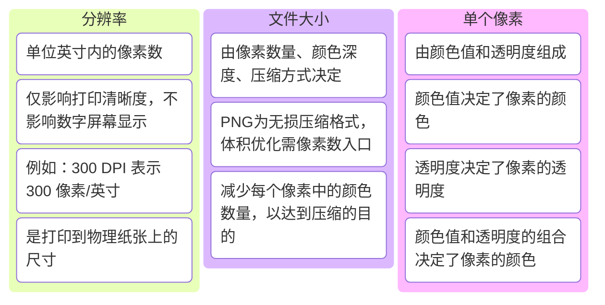

**如何缩小PNG文件的尺寸？是否可通过调整分辨率实现？**

要缩小PNG文件的尺寸（文件体积而非物理尺寸），需明确目标：**减少文件存储空间**（KB/MB）而非仅改变像素宽高。调整分辨率（如DPI）通常**无法直接缩小PNG体积**，但结合其他方法可实现。以下是系统化解决方案：

---

### **一、关键概念澄清**
1. **分辨率（DPI/PPI） vs 文件体积**  
   - **分辨率**：单位英寸内的像素数（如300 DPI），仅影响打印清晰度，**不影响数字屏幕显示**（屏幕显示仅看像素宽高）。  
   - **文件大小**：由像素数量、颜色深度、压缩方式决定。PNG为无损压缩格式，体积优化需从以下方向入手。

2. **PNG的体积影响因素**  
   - **像素总数**（宽×高）：直接决定基础体积。  
   - **颜色复杂度**：颜色越多，索引表越大。  
   - **透明度通道**：含透明度的PNG比纯色PNG更大。  
   - **压缩算法**：PNG的压缩级别（0-9）影响最终体积。

---

### **二、有效缩小PNG文件体积的方法**

#### **方法1：降低像素尺寸（物理尺寸）**
- **操作步骤**：  
  1. 在Photoshop中打开PNG文件（`Ctrl/Cmd + O`）。  
  2. 点击菜单 `图像 > 图像大小`（`Alt + Ctrl + I`）。  
  3. 取消勾选 **重新采样**（若需保持宽高比缩放）或勾选后选择 **保留细节2.0**（Photoshop 2021+）或 **两次立方（较锐利）** 算法。  
  4. 调整宽度/高度（如从1920×1080改为1024×576），点击确定。  
  5. 保存为PNG（`Ctrl/Cmd + Shift + S`），选择 **最佳压缩**。

- **效果**：  
  - 像素数减少 → 文件体积显著降低（如原图5MB → 缩放后500KB）。  
  - **适用场景**：网页、移动端显示（无需高分辨率）。

#### **方法2：优化颜色深度（减少颜色数量）**
- **原理**：PNG支持索引颜色模式（最多256色），减少颜色数可大幅压缩体积。  
- **操作步骤**：  
  1. 在Photoshop中，点击 `图像 > 模式 > 索引颜色`。  
  2. 在弹出窗口中：  
     - **调板**：选择 **局部（感知）** 或 **局部（可选）**。  
     - **颜色**：将颜色数从默认256调低（如128色），观察质量损失。  
     - **仿色**：勾选可减少色带（但可能增加噪点）。  
  3. 保存为PNG-8（仅限纯色或渐变简单的图片，复杂图片慎用）。

- **效果**：  
  - 颜色数减少 → 体积降低（如256色PNG-8比24位PNG-24小30%~70%）。  
  - **注意**：复杂渐变或照片级图片会出现色阶断裂。

#### **方法3：调整PNG压缩级别**
- **操作步骤**：  
  1. 保存PNG时，在Photoshop的 **PNG选项** 对话框中：  
     - **交错**：取消勾选（减少体积，但牺牲渐进加载效果）。  
     - **压缩**：选择 **最佳**（最高压缩率，保存速度稍慢）。  
  2. 或使用第三方工具（如 **ImageOptim**、**TinyPNG**）进一步压缩。

- **效果**：  
  - 压缩级别越高 → 体积越小（如从1.2MB压缩至800KB），但耗时更长。

#### **方法4：移除透明度（若无需透明）**
- **操作步骤**：  
  1. 若图片无透明部分，点击 `图层 > 新建 > 背景图层` 填充纯色背景。  
  2. 保存为JPG（若允许有损压缩）或PNG-8（无透明通道）。  

- **效果**：  
  - 移除透明通道 → 体积减少约20%~40%（PNG-8比PNG-24更小）。

#### **方法5：裁剪多余区域**
- **操作步骤**：  
  1. 使用裁剪工具（`C`）删除图片中不必要的空白或重复部分。  
  2. 保存为PNG。  

- **效果**：  
  - 像素数减少 → 体积降低（尤其适合留白较多的设计稿）。

---

### **三、调整分辨率是否有效？**
- **结论**：**仅调整分辨率（DPI）无法缩小PNG体积**，原因如下：  
  - 分辨率（DPI）仅影响打印尺寸，**不影响屏幕显示的像素总数**。  
  - 例如：将1920×1080@72DPI的图片改为1920×1080@300DPI，像素数不变，体积不变。  
  - **例外**：若调整分辨率时勾选 **重新采样**，实际会改变像素尺寸（等同于方法1），此时体积会变化。

---

### **四、推荐工具与自动化方案**
1. **Photoshop批量处理**：  
   - 使用 `文件 > 自动 > 批处理` 脚本，对多张图片应用统一缩放、压缩参数。  
2. **在线工具**：  
   - [TinyPNG](https://tinypng.com/)：智能压缩PNG/JPG，支持批量处理。  
   - [Squoosh](https://squoosh.app/)：Google开源工具，可实时预览压缩效果。  
3. **命令行工具**：  
   - `pngquant`（开源）：支持批量将PNG-24转为PNG-8，压缩率极高。  
   - `oxipng`（Rust编写）：多线程优化PNG压缩。

---

### **五、总结与选择建议**
| **需求场景**               | **推荐方法**                          | **效果**                          |  
|----------------------------|---------------------------------------|-----------------------------------|  
| 网页/移动端显示（需小体积） | 降低像素尺寸 + 最佳压缩               | 体积减少70%~90%                  |  
| 纯色图标/简单图形          | 转换为PNG-8 + 索引颜色优化           | 体积减少50%~80%                  |  
| 复杂渐变/照片级图片        | 保持PNG-24 + 裁剪 + 第三方工具压缩   | 体积减少10%~30%（平衡质量与体积）|  
| 需保留透明通道             | 降低像素尺寸 + 移除多余透明区域       | 体积减少20%~50%                  |  

**核心原则**：  
- **优先减少像素总数**（方法1），其次优化颜色/压缩（方法2-4）。  
- **避免过度压缩**：PNG-8可能导致渐变断裂，需根据图片内容选择。  
- **测试对比**：保存前使用Photoshop的 **保存为Web所用格式（旧版）** 预览不同参数下的体积与质量。