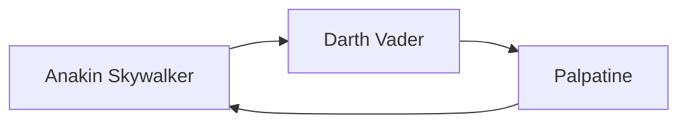
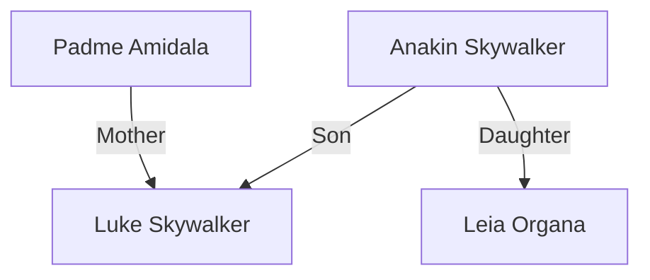
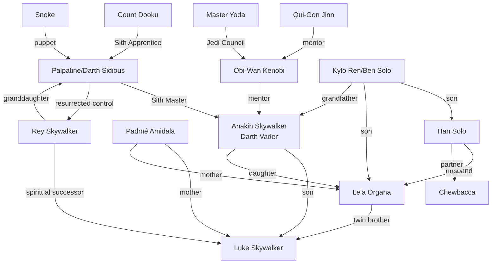
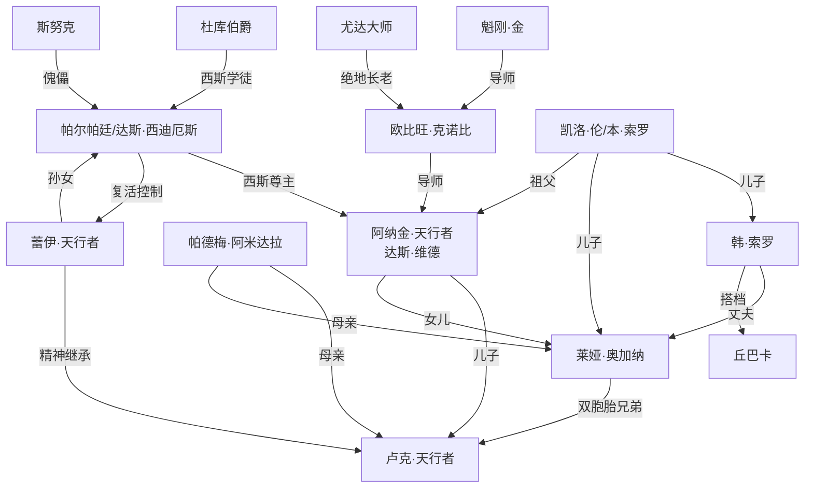

星球大战正片一共三部九集，分别是正传、前传和后传，每一部又分为三集，每集都有一个主题，是难得的美国大片中的经典。随着去年底后传第三集的上映，星球大战的时间线也逐渐清晰起来，整个故事也画了完美的句号。

> Star Wars Series Timeline 星球大战系列时间线
> Star Wars Characters and their Relationships 星球大战人物及其关系
> Star Wars Characters 星球大战人物
> Star Wars Films 星球大战电影
> Chronological Order 时间顺序
> Anakin Skywalker 阿纳金·天行者
> Luke Skywalker 卢克·天行者
> Leia Organa 莱娅·奥加纳
> Padme Amidala 帕德梅·阿米达拉
> Obi-Wan Kenobi 欧比旺·克诺比
> Qui-Gon Jinn 魁刚·金
> Yoda Master 尤达大师
> Palpatine Darth Sidious 帕尔帕廷·达斯·西迪厄斯
> Rey Skywalker 蕾伊·天行者
> Han Solo 韩·索罗
> Chewbacca 丘巴卡
> Kylo Ren 凯洛·伦
> Darth Vader 达斯·维德
> Count Dooku 杜库伯爵
> Snoke 斯努克
> Palpatine Darth Sidious 达斯·西迪厄斯
> Darth Maul 达斯·麦鲁
> Boba Fett 博巴·费特

The relationship among the three Star Wars films is a bit of a mystery. There is no clear chronological order to them, but they are all based on the same premise: the Jedi are trying to stop the Separatist forces from taking over the galaxy. The first two films are prequels to the third, and the third is the sequel to the first two.

The character of Anakin Skywalker is a bit of a mystery, but he is a very powerful Jedi, and he is also trying to stop the Separatist forces from taking over the galaxy, but he is captured by dark side and then becomes a Sith Lord.

The following is a mermaid graph of the Star Wars characters and their relationships.

And this is more complex graph of the Star Wars characters and their relationships.

I will show it in Chinese.

And now let us review the three Star Wars films in chronological order.

## 1. Star Wars: Episode I – The Phantom Menace

*Release date: May 19, 1999*

If you want to watch all the Star Wars movies in chronological order then sadly your marathon starts with the very first (and pretty awful) prequel movie. And it doesn't get much more prequel than Darth Vader as a 10-year-old kid. This film sees Jedi Qui-Gon Jinn and his Padawan Obi-Wan Kenobi discover a slave boy on Tatooine called Anakin Skywalker who's chock full of Midi-chlorians.

Unfortunately, the Jedi council isn't keen on training the child as a Jedi. But, while trying to protect Queen Padmé Amidala, Qui-Gon Jinn is killed by Sith Darth Maul and in honor of his memory Obi-Wan Kenobi promises to train the kid. **Biiiiig mistake**.

## 2. Star Wars: Episode II – Attack of the Clones

Release date: May 16, 2002

A few years later, Anakin is training as a Padawan under Obi-Wan Kenobi when the now Senator Padmé Amidala’s life is threatened once again. While Obi-Wan investigates, Anakin and Padmé fall in love, despite the Jedi Code which forbids attachments. Meanwhile, Obi-Wan Kenobi discovers an army of clones being created for the Republic, as well as an attempt by the Separatist group led by Count Dooku to overthrow the Republic using a droid army.

几年后，阿纳金在欧比旺·克诺比的指导下作为一名学徒进行训练，这时现任参议员帕德梅·阿米达拉的生命再次受到威胁。在欧比旺进行调查期间，阿纳金和帕德梅相爱了，尽管绝地信条禁止产生感情羁绊。与此同时，欧比旺·克诺比发现了一支为共和国创建的克隆人军队，以及由杜库伯爵领导的分离主义团体试图使用机器人军队推翻共和国的企图。

Obi-Wan is captured, along with Anakin and Padmé who try to save him, and all three are eventually rescued by the clone army, authorized by the newly powerful Chancellor Palpatine.

欧比万被俘虏，还有试图救他的阿纳金和帕德梅，这三个人最终都被克隆人军队营救，克隆人军队得到了新掌权的帕尔帕廷议长的授权。

## 3. Star Wars: Episode III – Revenge of the Sith

*Release date: May 19, 2005*

After Anakin rescues him, Chancellor Palpatine appoints him to the Jedi Council, but the Jedi are suspicious and order Anakin to spy on Palpatine. Padmé reveals she's pregnant and Anakin starts to have nightmares of her dying in childbirth. Palpatine lures Anakin to the dark side with the promise of saving Padmé's life, and orders the clone army to kill the Jedi, declaring himself Emperor.

Padmé and Obi-Wan try to convince the new Darth Vader to return to the light side, but they fight which leaves Vader mortally wounded. Meanwhile, Padmé dies giving birth to twins, Luke and Leia, and Obi-Wan decides to go into hiding with the children. Palpatine rescues Vader, giving him a suit to keep him alive, and telling him that he killed Padmé.

## 4. Star Wars: Episode IV – A New Hope

*Release date: May 25, 1977*

Not long after, Darth Vader captures Princess Leia, but not before she hides the plans in an R2-D2 droid who escapes to the planet Tatooine in search of Obi-Wan Kenobi. He's found by Luke Skywalker and takes him to Obi-Wan who reveals he knew Luke's father, claiming he was killed by Darth Vader.

Luke convinces Obi-Wan to let him help rescue the princess and the pair team up with smuggler Han Solo and his co-pilot, Chewie. They rescue Princess Leia and escape, but Obi-Wan is killed by Darth Vader in the process. After delivering the plans to the Alliance, Luke becomes a rebel pilot and helps destroy the Death Star.

## 5. Star Wars: Episode V – The Empire Strikes Back

*Release date: May 16, 1980*

> Luke and Han Solo are sent to the planet Alderaan to rescue the captive Luke Skywalker. But the Jedi are not impressed and order the Jedi Council to destroy the Death Star.

> Luke and Han are sent to the planet Alderaan to rescue the captive Luke Skywalker. But the Jedi are not impressed and order the Jedi Council to destroy the Death Star.

Three years later, Darth Vader locates Luke, Leia, and Han on a rebel base on Hoth and sends his forces to destroy it. They escape, with Luke traveling to Dagobah to train as a Jedi under Yoda as Obi-Wan wanted, and Leia, Han, and Chewie taking the Millennium Falcon to Cloud City to ask Lando Calrissian for help. Unfortunately, Darth Vader is waiting for them and captures Leia and Chewie, giving Han to a bounty hunter who plans to sell him to Jabba the Hutt who's been after him for a while.

Luke realizes his friends are in trouble and tries to rescue them, but ends up dueling Darth Vader who reveals he’s Luke's father before cutting his hand off. Luke is rescued by Leia, Chewie, and Lando, and they all escape together.

## 6. Star Wars: Episode VI – Return of the Jedi

*Release date: May 19, 1983*

Luke, Leia, Chewie, and Lando rescue Han from Jabba the Hutt, and Luke returns to Dagobah to complete his training only to discover Yoda is dying. Before he dies, Yoda confirms that Darth Vader is Luke's dad and then Obi-Wan’s Force ghost reveals that Leia is Luke's sister. Meanwhile, on the Forest Moon of Endor, Han and Leia destroy the shield protecting a second Death Star with the help of the native Ewoks.

Luke surrenders himself to Vader who takes him to the Emperor, but when the Emperor cannot turn Luke to the dark side he tries to kill him. Vader, unable to watch his son die, kills the Emperor before dying of his wounds. With the Death Star unprotected, Lando and the rebel fighters destroy it and then everyone has a big party.

## 7. Star Wars: Episode VII – The Force Awakens

*Release date: December 18, 2015*

30 years later on Jakku, scavenger Rey finds droid BB-8 who claims to have a map to the missing Luke Skywalker. Along with defected stormtrooper Finn, they escape aboard the abandoned Millennium Falcon and are eventually found by Han and Chewie. Traveling to Takodana to make contact with the Resistance, Rey is captured by the First Order's Kylo Ren (actually Han and Leia's son who's been seduced by the dark side) and taken aboard Starkiller base.

中文解释：

30年前，在 Jakku 星球上，一个名为 Rey 的 scavenger 发现了一个名为 BB-8 的 droids，声称它有一张通往失踪的 Luke Skywalker 的地图。与被遗忘的风暴trooper Finn 一起，他们在被 abandon 的 Millennium Falcon 上逃脱，最终被 Han 和 Chewie 发现。

Han, Chewie, and Finn try to rescue Rey, but Kylo Ren kills Han before battling Rey, who discovers she's strong with the Force. Starkiller base is eventually destroyed and Rey goes in search of Luke.

## 8. Star Wars: Episode VIII – The Last Jedi

*Release date: December 15, 2017*

Rey finds Luke in isolation, but he's not in the mood to help the Resistance, despite reluctantly giving her some Jedi training. Kylo and Rey realize they have a Force connection and Rey goes to him, believing there's still some good inside him.

Meanwhile, during a dramatic space battle, Vice Admiral Holdo sacrifices herself to save what's left of the Resistance, who escape to Crait. Kylo's master, Supreme Leader Snoke, orders him to kill Rey, but Kylo kills him instead and becomes Supreme Leader, as Rey escapes. He then attacks the Resistance only to be stopped by Luke who shows up at the last minute. The pair battle and Luke ultimately dies, but Rey manages to save everyone else.

## 9. Star Wars: Episode IX – The Rise of Skywalker

*Release date: December 19, 2019*

Rey is continuing her Jedi training with Leia when they discover Palpatine has been resurrected. Rey, Finn, and Poe try to find him, with Kylo Ren in pursuit who eventually reveals to Rey that she's actually Palpatine's granddaughter. Meanwhile, Leia dies and feeling it, Kylo Ren finds his way back to the light side of the Force, reclaiming his identity as Ben Solo.

Rey goes to confront Palpatine, who demands Rey kill him so his spirit can transfer to her, but when she refuses he tries to drain her lifeforce. With the help of Ben, Rey eventually destroys Palpatine, but Ben dies saving her life.

