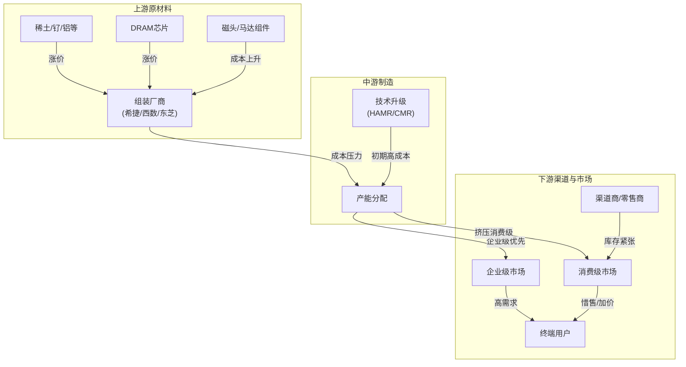

近年来，机械硬盘（HDD）价格持续上涨，引发市场广泛关注。其背后的原因并非单一因素所致，而是AI需求爆发、生产成本增加、供应链策略调整等多重因素叠加的结果。本文将通过解析产业链各环节的成本传递关系，揭示机械硬盘涨价的深层逻辑，并用流程图直观呈现这一过程。

**一、机械硬盘涨价的核心驱动因素**

**1. AI需求驱动：产能“虹吸效应”**
人工智能（AI）的快速发展，尤其是大模型训练和推理对存储容量的需求呈指数级增长。AI数据中心需要海量低成本存储来处理训练数据、模型参数和结果文件。这导致：

- **企业级订单挤压消费级市场**：希捷、西部数据等主要厂商的产能被云服务提供商和AI企业优先锁定，消费级市场供应大幅缩减，渠道商库存紧张，推高零售价。

- **大容量硬盘需求激增**：AI场景偏好高容量HDD（如16TB、20TB），进一步推高企业级产品需求，带动整个市场均价上涨。

**2. 生产成本显著上升：多重压力叠加**

- **核心组件涨价**：硬盘所需的DRAM缓存芯片受AI需求影响价格飙升，直接增加硬盘BOM成本。

- **原材料短缺与涨价**：关键材料如稀土永磁体（钕铁硼）、高纯度铝、磁性层材料“钌”等需求激增，价格攀升。例如，钌作为热辅助磁记录（HAMR）技术的核心材料，其短缺直接推高高端硬盘成本。

- **技术升级成本**：新一代技术（如CMR、HAMR）研发和量产初期成本较高，部分成本转嫁至终端产品。

- **供应链波动**：原材料价格波动、地缘政治影响（如关键材料供应受限）及物流成本上升，进一步挤压利润空间。

**3. 供应链策略与市场结构变化**

- **产能扩张谨慎**：厂商未大规模新建工厂，而是通过技术提升单碟容量满足需求，导致供应增量有限。

- **业务重心转移**：厂商优先服务高利润的企业级客户，消费级市场成为“次优先级”，渠道商议价能力减弱。

- **库存与渠道博弈**：消费级市场库存紧张下，渠道商惜售或加价，加剧涨价现象。

**二、机械硬盘产业链成本与价格传递关系**

**流程图解析：**

1. **上游成本传导**：
    - 稀土、钌、铝等原材料因AI需求激增和地缘因素涨价，直接推高磁头、盘片等组件成本。
    - DRAM芯片被AI服务器抢占产能，价格飙升，增加硬盘缓存成本。
2. **中游制造压力**：
    - 组装厂商（希捷、西数）面临原材料和DRAM双重成本压力。
    - 技术升级（如HAMR）虽提升容量，但初期量产成本较高，部分成本转嫁至产品。
    - 产能分配向企业级倾斜，挤压消费级供应。
3. **下游市场博弈**：
    - 企业级市场因AI需求维持高景气，支撑价格。
    - 消费级市场因供应缩减，渠道商库存紧张，通过惜售或加价应对，最终推高终端用户购买成本。

**三、涨价趋势展望与应对策略**

- **短期趋势**：AI需求持续高企，供应链调整需时，硬盘涨价或延续至2027年。
- **厂商策略**：加速技术迭代（如40TB+ HAMR）以平衡成本，优化产能分配。
- **消费者建议**：刚需用户可择机购买，非刚需者可考虑替代方案（如归档用磁带库或混合存储策略）。

**结论**
机械硬盘涨价是技术变革、产业链重构和市场供需失衡共同作用的结果。AI时代对数据存储的巨量需求，正重塑传统存储市场的成本结构与定价逻辑。理解产业链各环节的成本传递关系，有助于把握未来存储市场的发展脉络与应对策略。

