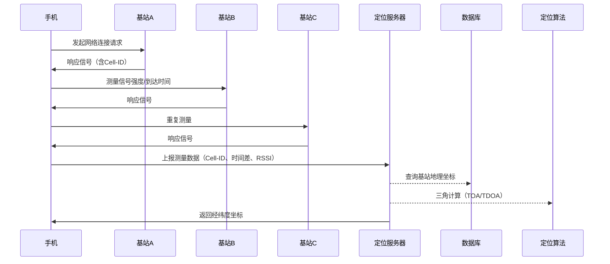

**蜂窝网络定位技术原理与位置泄露风险分析**

蜂窝网络定位技术是移动通信系统中重要的位置服务能力，通过基站信号交互实现用户设备定位。然而，这种技术也带来了显著的位置泄露风险，尤其在战争和武装冲突中可能成为安全隐患。本文将解析蜂窝定位的技术原理，并通过时序图展示其过程，同时探讨相关风险及应对措施。

## 一、蜂窝网络定位技术原理

蜂窝网络定位主要基于**基站信号交互与三角测量技术**，核心原理是通过分析移动设备与多个基站之间的信号特征（如时间差、信号强度）计算设备位置。主要方法包括：

1. **Cell-ID定位 (Cell of Origin, COO)**
    - 根据设备当前连接的蜂窝基站ID确定位置，精度取决于基站覆盖范围（城市约50-300米，郊区可达数公里）。
2. **增强型定位技术**
    - **到达时间差 (TDOA)**：测量信号到达不同基站的时间差，通过双曲线定位计算位置。
    - **信号强度 (RSSI)**：分析信号衰减估算距离，辅助定位。

## 二、蜂窝定位过程时序图（mermaid）

## 三、位置泄露风险与战争中的应用

**风险分析**：

- **被动追踪**：仅需手机开机并接入蜂窝网络，运营商即可实时获取位置，无需用户授权。
- **高精度定位**：结合多基站数据，城市区域精度可达数十米，足以暴露具体活动轨迹。
- **穿透性强**：信号可穿透建筑物，室内定位同样有效。

**战争与冲突中的实际案例**：

1. **军事目标定位**：
    - 敌方可通过分析特定区域基站信号，识别军事人员聚集地或指挥部位置。
    - 案例：某冲突地区通过基站数据追踪指挥官行踪，实施精准打击。
2. **情报收集**：
    - 部署伪基站（如IMSI捕捉器）可强制手机连接并获取位置，甚至拦截通信内容。
3. **平民风险**：
    - 大规模监控可通过基站定位识别抗议者或特定群体，侵犯隐私与安全。

## 四、应对措施与安全防护

1. **物理隔离**：
    - 在敏感区域关闭手机或使用飞行模式，切断蜂窝网络连接。
    - 禁用2G网络（易受伪基站攻击）。
2. **技术防护**：
    - 使用加密通信工具（如Signal），避免内容被拦截。
    - 部署反定位设备（如信号干扰器，但需合法授权）。
3. **隐私意识**：
    - 避免在冲突区发布含位置信息的社交媒体内容。
    - 定期检查设备权限，禁用不必要的定位服务。

## 五、三角计算的数学原理

**三角计算通过三个基站定位用户的原理**

在蜂窝网络定位中，**三角计算**主要通过**到达时间差(TDOA)**技术实现，利用三个基站接收信号的时间差异来确定用户位置，无需精确的时间同步，比到达时间(TOA)方法更实用。

**TDOA定位原理**

当用户设备发送信号时，三个基站(A、B、C)会以不同时间接收到该信号，**TDOA技术测量的是信号到达不同基站的时间差**，而非绝对时间：

- 基站A与B之间的时间差 Δt = t - t
- 基站A与C之间的时间差 Δt = t - t

这些时间差反映了用户设备到各基站的**相对距离差**，而非绝对距离。

**数学模型与计算过程**

### 1 基本公式

设三个基站坐标分别为：
- 基站A: (x, y)
- 基站B: (x, y)
- 基站C: (x, y)

用户设备坐标为 (x, y)，信号传播速度为 c（光速，约 3×10 m/s）

### 2 TDOA方程组

根据时间差可建立以下方程组：

$$
\sqrt{(x - x_2)^2 + (y - y_2)^2} - \sqrt{(x - x_1)^2 + (y - y_1)^2} = c \cdot \Delta t_{AB}
$$

$$
\sqrt{(x - x_3)^2 + (y - y_3)^2} - \sqrt{(x - x_1)^2 + (y - y_1)^2} = c \cdot \Delta t_{AC}
$$

### 3 求解过程

1. **双曲线定位**：每个时间差方程表示用户位于以两个基站为焦点的双曲线上
2. **交点确定**：两组时间差形成两条双曲线，它们的交点即为用户位置
3. **坐标计算**：通过数值方法（如最小二乘法）求解方程组，得到精确坐标

**与TOA方法的对比**

| 定位方法 | 原理 | 同步要求 | 精度 | 实用性 |
|---------|------|---------|------|-------|
| **TDOA** | 测量信号到达不同基站的时间差 | **无需严格时间同步** | 中高 | **蜂窝网络首选**，实现简单 |
| **TOA** | 测量信号到达基站的绝对时间 | 需要精确时间同步 | 高 | 实现复杂，需GPS同步 |

**实际应用中的优化**

在实际蜂窝网络中，三角计算会进行以下优化：
- **多基站融合**：使用超过三个基站的数据，提高定位精度
- **信号强度补偿**：结合RSSI值修正因环境导致的误差
- **地图匹配**：将计算结果与地理信息系统(GIS)结合，提高实用性
- **滤波算法**：使用卡尔曼滤波等技术平滑位置数据，减少波动

**关键点**：TDOA技术之所以在蜂窝网络中广泛应用，是因为它**不需要所有基站严格时间同步**，只需测量相对时间差，大大降低了系统实现的复杂度，同时仍能提供足够精确的位置信息（城市区域通常50-300米精度）。

## 六、总结

蜂窝网络定位技术虽为日常生活带来便利，但其强制性、高精度和隐蔽性使其成为高风险工具。在战争或冲突环境中，智能手机可能转化为“追踪器”，威胁个人与国家安全。因此，必须强化技术防护意识，通过物理隔离与合规操作规避位置泄露风险。

