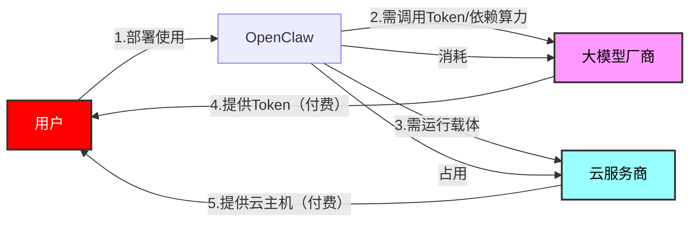
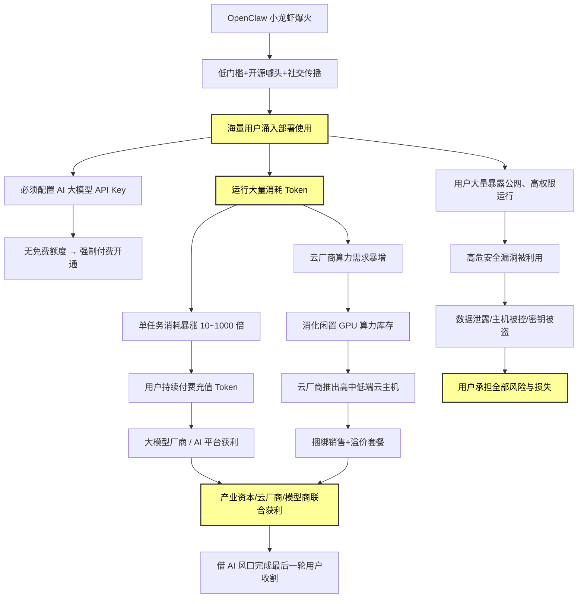

<!--
“小龙虾热” 背后的冷思考：狂欢之下，警惕算力收割与安全深渊
# “小龙虾热”背后的冷思考：狂欢之下，警惕算力收割与安全深渊
-->

近期，AI圈被一只红色“小龙虾”彻底点燃。这款名为**OpenClaw**的开源AI智能体，凭借“能干活、会执行、可本地部署”的硬核能力，在开发者社区与普通用户间迅速破圈，成为现象级爆款。但热潮之下，隐藏着算力消耗、商业收割与信息安全的多重隐忧。当全民“养虾”成为潮流，我们更需要冷静审视这场狂欢背后的代价与风险。

OpenClaw并非传统聊天AI，而是一款**本地优先、模型无关的AI执行智能体**，由奥地利程序员开发，因红色龙虾图标被网友亲切称为“小龙虾”。它彻底打破了传统AI“只答疑、不执行”的局限，用户只需下达自然语言指令，它便能自主完成任务拆解、工具调用、系统操作、文件处理、邮件收发等全流程工作，真正实现“AI替人干活”。其开源属性、低部署门槛、兼容主流大模型的特性，让普通用户无需深厚技术背景即可上手，加之社交媒体的传播放大，迅速掀起全民“养虾”热潮，GitHub星标短时间内飙升，下载量创下开源项目新纪录，成为AI平民化浪潮的标志性产品。

OpenClaw的爆红绝非偶然，其背后是清晰的商业逻辑与产业推手。这款工具看似免费开源，运行却有**刚性成本门槛**：部署初期必须配置多家AI平台的API Key，而这些密钥几乎无免费渠道，用户需提前付费开通；运行过程中，OpenClaw因任务拆解、多轮推理、历史记忆加载，会产生海量Token消耗，单次复杂任务可消耗数百万Token，被业内称为“Token黑洞”。对云厂商而言，这波热潮恰好成为**算力库存消化的绝佳契机**。近年来云服务商积累的大量GPU算力与闲置资源，借OpenClaw的普及快速释放，如同“精准打导弹”般完成算力去库存。与此同时，云厂商顺势推出“一键部署”“专属主机”等套餐，将高、中、低端云主机与OpenClaw使用场景深度捆绑，以“AI赋能”为噱头吸引用户付费升级。表面是技术普惠，实则是借风口收割互联网用户，将技术热潮转化为商业利润，让普通用户为算力与Token买单。

比商业收割更致命的是，OpenClaw的**安全漏洞已被官方预警**。工业和信息化部、国家网络与信息安全信息通报中心相继发布警示，明确指出OpenClaw存在多重高危风险：一是**信任边界模糊**，默认配置下拥有系统最高权限，可访问全部文件，易被恶意提示词诱导窃取敏感数据；二是**漏洞易被利用**，多个公开高中危漏洞可被攻击者操控，导致系统被控、密钥泄露、数据删除；三是**插件投毒风险**，第三方恶意插件可窃取信息、植入后门，将用户设备变为“肉鸡”；四是**提示词注入攻击**，攻击者通过构造恶意网页，诱导OpenClaw读取并泄露API密钥与隐私信息。这些漏洞并非小概率问题，而是设计层面的先天缺陷，普通用户难以通过简单设置规避，一旦遭遇攻击，将面临数据泄露、财产损失、系统瘫痪的严重后果。

以下是基于“小龙虾热”的产业链深度分析：

热潮终会退去，理性才是长久之道。OpenClaw作为AI智能体的创新探索，确实推动了技术落地与效率提升，但其背后的**算力收割逻辑**与**致命安全隐患**，值得每一位用户警惕。我们不应盲目追逐技术风口，被“免费开源”的表象迷惑，更要认清工具背后的商业规则与安全风险。对个人而言，需谨慎部署、严控权限、保护API密钥；对企业而言，应坚守安全底线，合规使用；对行业而言，需在创新与监管间找到平衡，让技术真正服务于人，而非成为收割与风险的温床。“小龙虾热”终将冷却，唯有守住安全与理性的底线，才能让AI技术行稳致远。

