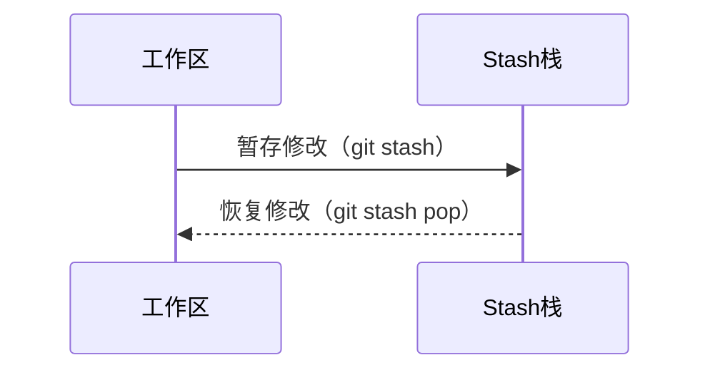
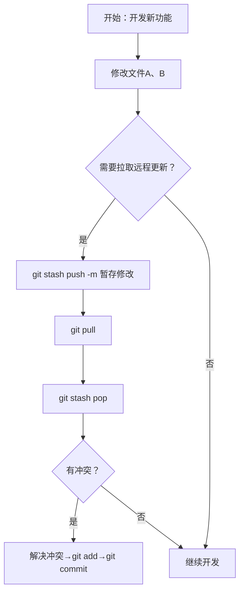

# Git Stash：代码的"临时储物柜"，高效管理开发中的临时修改  

在Git版本控制的日常开发中，常会遇到这样的场景：开发者在`feature`分支开发复杂功能时，代码编写到一半需要切换到`main`分支修复紧急问题；准备执行`git pull`拉取远程更新时，因本地未提交修改而收到"冲突覆盖"警告；为避免污染提交历史，不愿为临时切换创建"半成品"提交记录。  

**`git stash`** 正是为解决这类问题而生的本地临时存储机制。它能将工作区和暂存区的未提交修改安全封存，让仓库恢复到最近一次提交的干净状态，切换任务后可轻松取回继续开发。  


## 一、Git Stash的核心价值与应用场景  

### 1. 临时切换任务的桥梁  
当需要从当前开发分支切换到其他分支时，`git stash`可将本地修改暂存，避免"带着半成品切换分支"导致的代码混乱。  

### 2. 拉取远程更新的前置条件  
执行`git pull`前，若本地存在未提交修改，Git会因"远程更新可能覆盖本地修改"而拒绝执行。通过`git stash`暂存修改，可先拉取远程代码，再恢复本地修改。  

### 3. 保持提交历史的整洁  
相比为临时切换创建"WIP（Work In Progress）"提交记录，`git stash`提供了更优雅的解决方案，用临时存储代替无效提交，维护清晰的提交历史。  


## 二、Git Stash典型工作流程与可视化解析  

### 1. Mermaid时序图：stash核心交互逻辑  


### 2. Mermaid流程图：stash操作全流程  



## 三、Git Stash使用步骤与冲突解决详解  

### 1. 基础命令速查表  
| 命令 | 作用 |  
|------|------|  
| `git stash push -m "描述"` | 暂存所有修改（含暂存区），添加备注 |  
| `git stash list` | 查看所有stash条目（如`stash@{0}`为最近一次） |  
| `git stash pop` | 应用最近stash并从栈中删除 |  
| `git stash apply stash@{n}` | 应用指定stash（不删除，可重复用） |  
| `git stash drop stash@{n}` | 删除指定stash |  
| `git stash clear` | 清空所有stash（谨慎使用） |  


### 2. 实战案例：用stash解决"pull冲突"与冲突处理  

#### 场景描述  
假设在`feature/updateui`分支开发时，需拉取远程更新，涉及文件包括：  
- `src/main.js`（已修改并`git add`到暂存区）  
- `src/utils/helper.js`（已修改但未`git add`）  
- `README.md`（新增未跟踪文件）  

#### 操作步骤  

**Step 1: 暂存本地修改**  
```bash
# 暂存所有修改（含未跟踪文件，需加-u参数）
git stash push -u -m "WIP: 开发 updateui 功能，涉及main.js/helper.js/README.md"
```  
*说明*：`-u`参数确保新增的`README.md`也被暂存。  

**Step 2: 拉取远程更新**  
```bash
git pull origin feature/updateui
```  
此时工作区干净，可顺利同步远程代码。  

如果遇到代码冲突，可以选择merge和rebase两种处理方式，当然 fast forward也可以：

```bash
# 使用 merge
git pull --no-rebase origin main

# 或使用 rebase
git pull --rebase origin main

# 或仅快进
git pull --ff-only origin main
```

执行以上操作后，git会自动跳转到一个vi编辑器中，补充此次合并的注释说明，通过“:wq”保存后即可继续。


**Step 3: 恢复修改并处理冲突**  
```bash
git stash pop
```  

**冲突解决示例**  
若恢复时`src/main.js`出现冲突，文件内容会显示：  
```javascript
<<<<<<< Updated upstream  // 远程更新内容
function fetchData() {
  return axios.get('/api/data');
}
=======  // 本地修改内容
function fetchData(param) {
  return axios.get(`/api/data?param=${param}`);
}
>>>>>>> Stashed changes
```  

**解决步骤**：  
1. 编辑`src/main.js`，保留正确逻辑（如合并参数）：  
   ```javascript
   function fetchData(param) {
     return axios.get(`/api/data?param=${param}`);
   }
   ```  
2. 标记冲突已解决：  
   ```bash
   git add src/main.js  # 将解决后的文件加入暂存区
   ```  
3. 若多个文件冲突（如`helper.js`也冲突），重复上述步骤：  
   ```bash
   # 编辑src/utils/helper.js解决冲突后
   git add src/utils/helper.js
   ```  
4. 所有冲突解决后，完成恢复：  
   - 若使用`git stash pop`后无自动提交，需手动提交（仅当恢复产生新修改时）：  
     ```bash
     git commit -m "解决stash pop冲突：合并main.js/helper.js修改"
     ```  
   - 若使用`git stash apply`，可通过`git status`确认状态后决定是否提交。  


## 四、注意事项与最佳实践  

1. **本地存储特性**：stash仅存储在本地，不会推送到远程仓库，换设备后无法访问。  
2. **未跟踪文件处理**：默认不存储新增未跟踪文件，需加`-u`参数（`git stash -u`）。  
3. **及时清理**：stash适合临时存放，任务完成后用`git stash drop`或`clear`清理，避免堆积。  
4. **冲突处理原则**：恢复时冲突需手动解决（同merge冲突），解决后用`git add`标记，无需额外commit（除非需记录冲突解决过程）。  


## 五、总结  

`git stash`作为提升开发效率的工具，通过"暂存-恢复"机制，解决了分支切换与远程同步中的临时修改管理难题。其核心价值在于：既避免提交半成品污染历史，又不丢失开发进度。掌握stash的使用，尤其是冲突解决中`git add`与`git commit`的配合，能让开发流程更流畅。  

当面临"本地修改未提交，却需拉代码/切分支"的场景时，`git stash`提供了高效解决方案，实现开发任务的"无缝衔接"。

