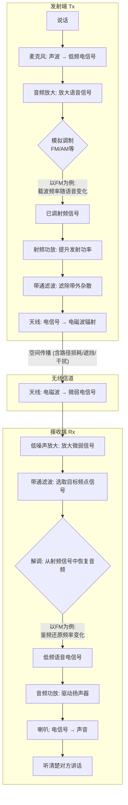
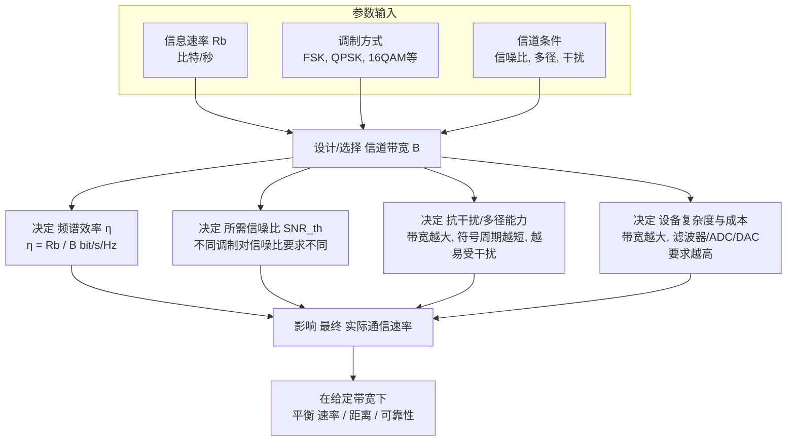
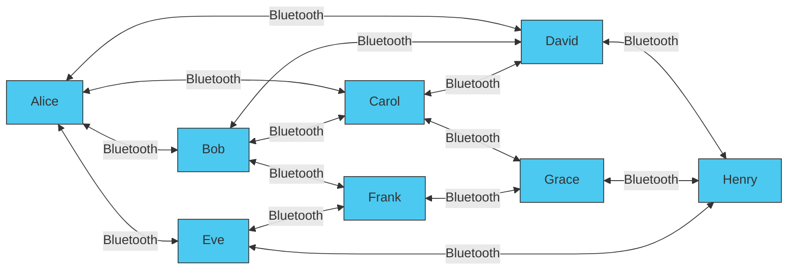

本文将深度解析无线对讲技术全景对比与无线电对讲机。

**核心结论**：
 - 不同无线对讲技术在**传输距离、信号稳定性、功耗**上各有侧重；
 - **特定频段无线电**（如409/406MHz）兼顾中距离与低功耗，**5G/卫星通信**突破地理限制但依赖基础设施，**蓝牙/WiFi**则胜在短距便捷；
 - 无线电对讲机通过“**频率+协议**”实现通信，数字对讲机以**数字化编码+规则协同**显著提升稳定性与距离适应性。  

## 一、主流无线对讲技术对比：距离、稳定性与场景适配  

| 技术类型               | 传输距离          | 信号稳定性       | 功耗   | 核心优势                  | 典型场景                     |  
|------------------------|-------------------|------------------|--------|---------------------------|------------------------------|  
| **经典蓝牙**           | ≤10米             | 中等（易受遮挡） | 极低   | 即连即用、成本低          | 耳机、小型设备对讲           |  
| **BLE+BLE Audio**      | ≤30米（BLE 5.3）  | 较高（多流抗干扰）| 低     | 支持多人音频同步          | 运动耳机群组、轻量对讲       |  
| **WiFi对讲**           | 50-200米（局域网）| 高（依赖路由器） | 中     | 高清语音、视频传输        | 室内办公、商场调度           |  
| **特定频段无线电**     | 0.5-5公里（UHF）  | 高（数字抗干扰） | 低     | 无网直连、中距离稳定      | 户外团队、物业安保（✅本文重点）|  
| **5G移动网络对讲**     | 全域覆盖          | 极高（基站保障） | 中高   | 超远距离、多媒体融合      | 应急指挥、跨区域调度         |  
| **卫星通信对讲**       | 全球覆盖          | 中等（延迟高）   | 高     | 极端环境（沙漠/海洋）     | 探险、远洋作业               |  

> **方案比对结论**：  
> - **短距场景**（<50米）选蓝牙/WiFi，便捷优先；  
> - **中距刚需**（0.5-5公里）选**特定频段无线电**（如409/406MHz），无网直连不可替代；  
> - **超远/复杂环境**选5G/卫星，依赖基础设施但覆盖无死角。  
> - 

## 二、无线电对讲机原理 

无线电对讲机是**特定频段无线电通信**的典型应用，核心依赖三层要素：  

### 1. **载体：无线电波**  
- 工作在**UHF（400-470MHz）/VHF（136-174MHz）** 频段，如409MHz（公众免执照）、406MHz（共用需执照）；  
- 无需基站，通过**空间电磁波**直连，适合无网络环境。  

### 2. **通道：频率=“马路”**  
- 同频是互通前提（如409.75MHz），信道间隔多为**12.5kHz**（模拟）或**6.25kHz**（数字）；  
- 功率决定基础距离：0.5W（公众频段）→1-5公里，5W（共用频段）→3-8公里（空旷）。  

### 3. **规则：协议=“语言”**  
- **模拟对讲机**：仅FM调制+亚音信令（CTCSS），易串台、抗干扰差；  
- **数字对讲机**：DMR/P25/TETRA等协议，含**语音编码、纠错、群组管理**，稳定性提升80%+ 😊。  

> **金句**：**无线电是血液，频率是血管，协议是神经——三者协同决定通信质量**。  

### 4. **中国境内的频段**

频率范围常见有：
- VHF：136–174 MHz
- UHF：400–470 MHz（或扩展到 480–520 MHz 等）

工作在 406.2125–407.7 MHz​ 的UHF“共用对讲机”专用频段。此频段在中国无需个人申请频率执照，适合商场、酒店、餐饮等商业场景。

**12.5 kHz** 指的是“信道带宽”，也就是：
在这个频率点上，设备占用 ±6.25 kHz 左右​ 的频谱资源用来承载一路模拟 FM 语音（或一路 DMR 时隙）。

**类比一下：**
频率​ = 马路上的某一条车道
12.5 kHz 带宽​ = 这条车道有多宽
语音信号​ = 车本身
在模拟对讲机时代，国际主流就是 12.5 kHz / 25 kHz​ 信道间隔。

在中国，典型例子就是：

409–410 MHz 民用对讲机频段

406.2125–407.7 MHz 共用对讲机频段

特点：

不用自己去申请频点

设备出厂就锁死在这些频率上

对发射功率、天线等有严格限制

一般限 0.5W / 2W / 3W e.r.p.​ 等低功率

| 频段       | 频率范围             | 带宽   | 发射功率 | 频段使用 |  
|------------|---------------------|--------|----------|----------|
| 409-410MHz     | 按照12.5kHz信道间隔划分    | 5MHz    | 0.5W |   公用频段     |
| 406.2125-407.7MHz     | 406.2125 406.2250 等     | 5MHz    | 2W 3W 等 |  公用频段      |

### 无线电说话到 接收的全过程

## 三、数字对讲机工作过程：数模转换、调制与解调

以**DMR数字对讲机**（主流商用协议）为例，工作全流程聚焦**传输距离优化**与**信号稳定性增强**：  

### 1. **信源数字化：抗干扰从源头开始**  
- **语音→二进制流**：麦克风采样（8kHz）→AMBE编码压缩（9.6kbps），剔除冗余噪声；  
- **加校验位**：数据包嵌入同步头、地址、CRC校验码，防传输误码。  

### 2. **数字调制：高效利用频谱**  
- **TDMA时分多址**：1个12.5kHz信道拆分为**2个时隙**，同时传2路通话（频谱效率翻倍）；  
- **FSK/GFSK调制**：用频率变化表0/1，比模拟FM抗干扰性强3倍。  

### 3. **传输：距离与环境的博弈**  
- **功率与天线**：1-5W功率+高增益天线（如橡胶鞭状天线），空旷地可达5公里；  
- **环境适配**：市区建筑遮挡→距离缩至1-2公里，山区多径效应→用**跳频技术**规避干扰。  

### 4. **接收解调：从“听得到”到“听得清”**  
- **锁相环（PLL）**：精准锁定目标频率，滤除邻频干扰；  
- **纠错解码**：通过协议内置FEC（前向纠错），弱信号下仍能还原语音。  

### 5. **协议交互：群组通信的“大脑”**  
- **时隙+色码**：DMR用“时隙1/2+色码0-15”区分群组，防误呼；  
- **单呼/组呼/广播**：调度中心一键呼叫全员，响应速度<1秒。  

> **稳定性对比**：数字对讲机在-110dBm弱信号下仍可通话，模拟机在-100dBm即断音。  

下图表示调制与解调（数模转换）的处理过程

## 四、关键考量：传输距离与稳定性的平衡术  

| 影响因素       | 对距离的影响                          | 对稳定性的影响                          | 优化方案                                  |  
|----------------|---------------------------------------|-----------------------------------------|-------------------------------------------|  
| **发射功率**   | 0.5W→1-2公里，5W→3-5公里（空旷）      | 功率↑抗干扰略↑，但易干扰他人            | 选共用频段（406MHz）+合规功率（≤5W）      |  
| **频段特性**   | UHF（400MHz）穿透力强于VHF（150MHz）   | UHF多径反射多，需TDMA/FHSS抗干扰         | 城市用UHF，野外用VHF                       |  
| **环境遮挡**   | 建筑/山体→距离缩50%-80%                | 反射导致信号叠加，用数字纠错抵消        | 避开高楼群，或配中继台（合法部署）        |  
| **协议效率**   | DMR时隙复用→等效距离翻倍               | 数字编码+纠错→误码率降低90%              | 选DMR/dPMR数字协议，弃用纯模拟机          |  

## 五、蓝牙Mesh组网传输技术

蓝牙Mesh网络的传输距离**不是固定值**，而是由**单跳距离、中继配置、环境因素**共同决定的动态范围——**单点间30-60米是常态，通过多跳中继理论上可达数公里**。

---

### 📊 蓝牙Mesh传输距离全景

| 距离类型         | 典型范围                | 关键影响因素                          | 适用场景                     |
|------------------|-------------------------|---------------------------------------|------------------------------|
| **单跳直连距离** | 30-60米（空旷）         | 蓝牙版本（5.0+）、发射功率、天线增益  | 智能家居（灯-开关）、室内定位 |
| **理论最大值**   | 200-300米（蓝牙5.0+）   | 高功率模式、定向天线、无遮挡环境      | 工业监控、户外设备通信       |
| **实际室内距离** | 10-30米（隔墙/楼层）    | 墙体材质（混凝土/金属衰减大）、干扰源 | 家庭自动化、办公环境         |
| **多跳中继距离** | 可达5公里（理论极限）   | 节点密度、中继算法、网络拓扑          | 智慧园区、农业物联网         |

> **核心机制**：蓝牙Mesh通过**多跳中继（Flooding）** 扩展覆盖——每个节点既是终端也是路由器，数据像“接力赛”一样逐跳传递。

---

### 🔍 影响距离的关键因素

#### 1. **蓝牙版本与功率**
- **蓝牙5.0+**：理论单跳距离可达**300米**（高功率模式）
- **蓝牙5.2**：实测可达**200米**（LE Coded PHY模式）
- **功率权衡**：提高发射功率可延长距离，但会增加功耗与干扰风险

#### 2. **环境与遮挡**
- **空旷户外**：70-100米（如智能路灯间距）
- **室内隔墙**：10-30米（混凝土墙衰减约20-30dB）
- **金属遮挡**：信号衰减可达40dB以上，需增加中继节点

#### 3. **网络拓扑与中继**
- **节点密度**：每30-60米部署一个中继节点，可构建连续覆盖
- **中继效率**：每跳增加10-50ms延迟，需平衡距离与实时性
- **路由算法**：Flooding（泛洪）确保可靠性，但可能产生冗余流量

#### 4. **特殊优化案例**
- **OMO系统**：通过定制协议+高增益天线，实现**4公里**点对点连接
- **工业Mesh**：采用有线供电+外置天线，单跳距离可达**1000米**

正常情况下的蓝牙mesh组网如下

最理想情况的蓝牙mesh组网

---

### ⚖️ 蓝牙Mesh vs. 其他无线技术（距离维度）

| 技术           | 典型单跳距离 | 扩展方式     | 距离极限       | 适用场景               |
|----------------|--------------|--------------|----------------|------------------------|
| **蓝牙Mesh**   | 30-60米      | 多跳中继     | 5公里（理论）  | 智能家居、园区覆盖     |
| **WiFi Mesh**  | 50-100米     | 多跳中继     | 500米（实际）  | 家庭全屋覆盖           |
| **LoRa**       | 2-5公里      | 星型网络     | 15公里（空旷） | 广域物联网             |
| **Zigbee**     | 10-20米      | 多跳中继     | 300米（理论）  | 工业传感器网络         |
| **UHF无线电**  | 1-5公里      | 直连/中继台  | 50公里（中继） | 对讲机、应急通信       |

> **关键差异**：蓝牙Mesh的**多跳中继**特性使其在**中等密度节点网络**中具备距离扩展优势，但相比LoRa/UHF等专为远距离设计的技术，单跳距离仍是短板。

---

### 🛠️ 如何最大化蓝牙Mesh传输距离？

1. **选蓝牙5.0+设备**：支持LE Coded PHY，比传统BLE距离提升4倍
2. **优化节点布局**：按**30米间隔**部署中继节点，避免信号盲区
3. **减少遮挡干扰**：
   - 避开混凝土承重墙、金属柜体
   - 远离WiFi路由器、微波炉等2.4GHz干扰源
4. **使用外置天线**：定向天线可将单跳距离提升至200米+
5. **功率动态调整**：根据链路质量自适应调整发射功率（需协议支持）

---
