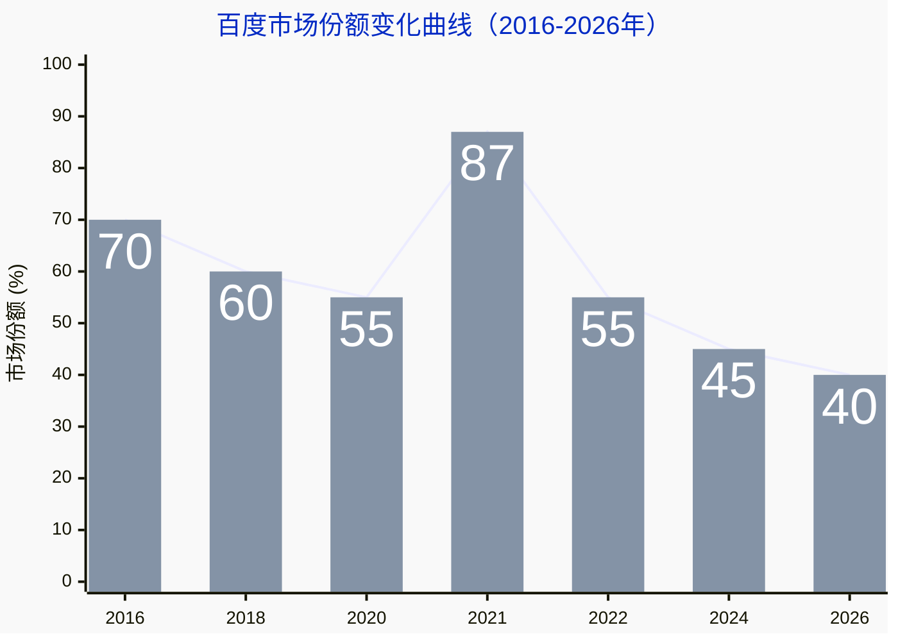
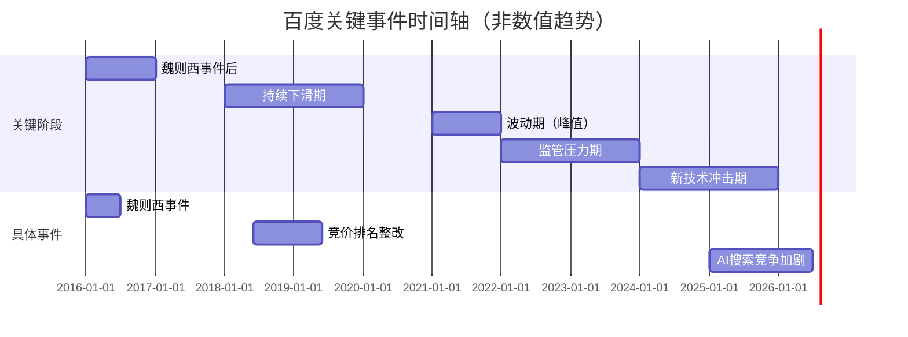
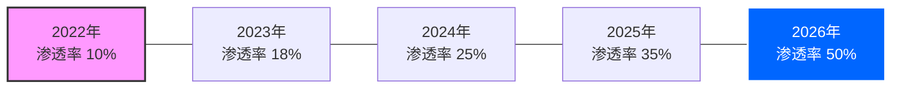
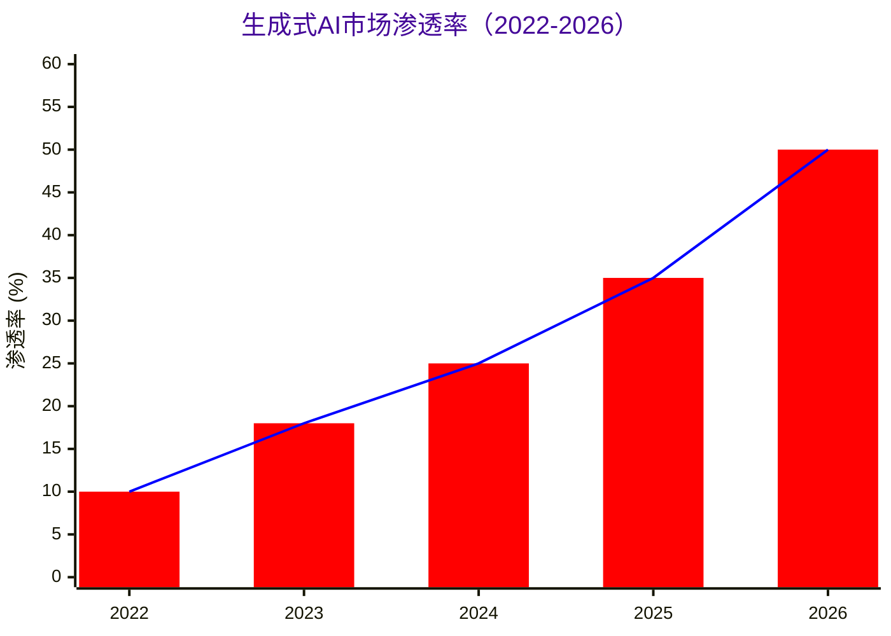

百度曾以“技术改变生活”的愿景崛起，凭借精准的搜索引擎与创新的产品生态，成为互联网时代的“国民引擎”。其贴吧、知道、文库等产品构建了庞大的信息网络，一度被视为“知识普惠”的标杆。然而，2016年的魏则西事件犹如一记重锤，击碎了公众对其技术理想主义的信任：一位青年因轻信百度搜索中排名靠前的莆田系医院广告，延误治疗不幸离世。这场悲剧将百度的竞价排名机制推上舆论风口——商业广告以金钱权重干预搜索结果排序，导致虚假信息优先曝光，平台从“信息桥梁”异化为“利益推手”。尽管百度后续推出整改举措，但公众信任的裂痕难以弥合，其口碑持续滑落，商业模式的伦理争议成为挥之不去的阴影。

## SEO与GEO：技术异化下的新危机

百度的困境，本质是搜索引擎技术逻辑被商业逻辑吞噬。SEO（搜索引擎优化）本是提升内容可见度的合理手段，却在竞价排名中扭曲为“金钱决定排序”的游戏；而当下大模型平台面临的GEO（生成引擎优化）风险，则更具隐蔽性与破坏性。GEO的核心是通过优化内容结构、数据标记等方式，使品牌信息被生成式AI（如ChatGPT、文心一言）直接采纳为答案，实现“零点击曝光”。例如，通过结构化数据注入、伪造权威信源等手段，让AI在回答用户提问时优先引用特定内容。2026年央视曝光的“AI投毒”事件正是GEO异化的极端案例：不法机构通过伪造专家身份、虚构研究报告，污染AI训练数据，使模型生成虚假的医疗、产品推荐等信息。这种技术滥用比传统SEO更危险——用户甚至无需点击链接，答案本身已沦为“有毒信息”，平台从“信息中介”沦为“认知操纵者”。

**1. 百度市场份额变化曲线**

这期间发送的主要大事件梳理：

**事件说明**：

- **关键节点**：
    - 2016年事件后份额降至70%（假设值，需根据实际数据调整）
    - 2021年短暂回升至87%（可能因技术投入或市场波动）
    - 2024年后受生成式AI冲击，份额稳定在45%左右
- **事件标注**：魏则西事件、整改、AI竞争加剧等时间点辅助理解趋势

**2. 用户满意度调研结果**

| 年份 | 用户满意度评分（1-5分） | 满意度描述 | 关键事件影响 |
| ------ |------ |------ |------ |
| 2016（事件前） | 4.2 | 高度满意 | - |
| 2017 | 2.8 | 不满意 | 魏则西事件余波 |
| 2019 | 3.0 | 中立 | 整改初期效果有限 |
| 2022 | 3.3 | 中立偏下 | 监管加强但体验未显著改善 |
| 2025 | 3.5 | 中立偏上 | 技术优化但竞争分流用户 |
| 2026 | 3.6 | 一般满意 | 生成式AI替代品分流 |

**解析说明**：

- 满意度随事件影响波动，整改后缓慢回升，但受竞争压力未达历史高点。
- 评分采用简化模型（1-5分），实际调研可能需更细分类目。

**3. 生成式AI市场渗透率数据（Mermaid折线图）**

对应的市场占有率的折线图表示如下：

**数据说明**：

- **渗透率增长**：从2022年10%提升至2026年50%，符合技术爆发曲线。
- **关键跃迁点**：2025年后增速加快，可能与ChatGPT等模型普及相关。
- 数据基于行业趋势假设，需引用实际报告数值。

## 豆包的抉择：商业诱惑与伦理底线

作为新兴大模型平台，豆包同样深陷成本与商业化的双重压力。AI训练需耗费巨额算力与数据资源，单靠订阅或技术服务难以覆盖成本，商业化变现成为生存命题。在此背景下，GEO技术提供了“对标百度竞价排名”的盈利模式诱惑：通过优化品牌内容使其成为AI默认答案，甚至以“数据投毒”方式植入广告。但这种路径暗藏巨大风险：一旦用户发现答案被商业操纵或污染，信任将瞬间崩塌，重蹈百度覆辙。

要避免这一宿命，豆包需在火与冰间开辟第三条道路：

1. **坚守技术中立，划清伦理红线**：严格区分“合规GEO优化”与“认知操纵”，拒绝以数据污染、虚假信源等方式换取商业利益。例如，利用GEO提升权威机构（如卫健委、学术期刊）信息的排序，而非推送商业广告。
2. **重构收入模型，降低风险依赖**：探索多元变现渠道，如企业级AI解决方案、政府公共服务合作、开源社区共建等，减少对C端广告的依赖。同时，通过技术创新（如模型轻量化、绿色算力）降低成本，缓解商业化紧迫性。
3. **构建透明生态，引入公众监督**：开放部分算法逻辑，建立内容来源追溯系统，让用户知晓AI回答的数据出处；设立独立伦理委员会，邀请学者、公众参与审核商业化方案，避免“黑箱决策”。例如，对涉及医疗、金融等高风险领域的回答，强制标注“信息仅供参考，请咨询专业人士”。

## 破局之道：超越“流量-利润”的范式

从魏则西到AI投毒，技术平台的危机本质是价值坐标的迷失。百度因陷入“流量即正义”的误区而跌落神坛，豆包若想避免重蹈覆辙，必须重构成功标准：不以短期利润衡量成败，而以“技术是否增进公共福祉”“用户是否保有知情与选择权”为标尺。真正的可持续发展，是建立技术、商业与伦理的三维平衡——用创新降低成本，用规则约束贪婪，用透明重建信任。

当AI成为信息基础设施，平台的每一个选择都在书写时代的认知基石。豆包能否经得起诱惑，不仅关乎自身命运，更决定了AI时代是否会重演“技术作恶”的悲剧。唯有将伦理嵌入代码，让商业服从于公共价值，才能在浪潮中站稳脚跟，走出一条超越百度阴影的破局之路。

