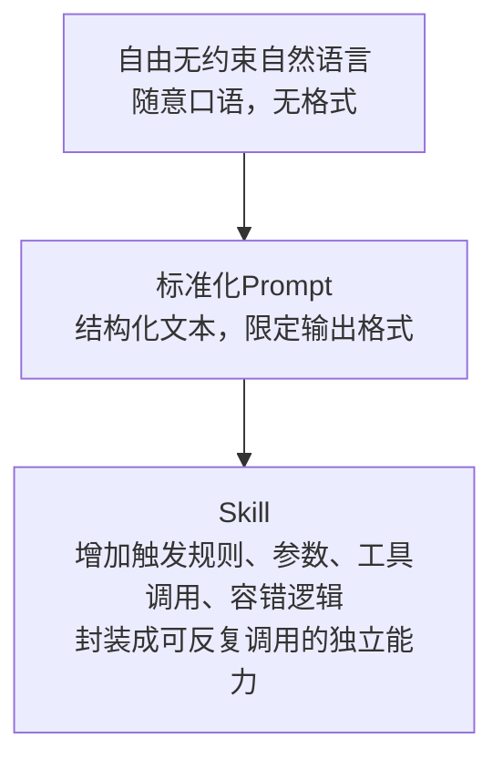

当下职场人普遍陷入一种矛盾困境：明明花大量时间打磨专属 Skill，却依旧被无尽焦虑裹挟。究其根源，大多是无法跨越的信息差 —— 别人掌握晋升、变现、自我展示的渠道与规则，而我们埋头深耕能力，却不懂如何 Promote 个人优势，最终空有硬实力，错失大量成长机会。本文将拆解信息差制造焦虑的底层逻辑，教你以 Skill 为核心抓手，利用信息差打破认知壁垒，学会系统化 Promote 自我，走出内耗循环。

先说结论：自媒体炒作Skill/Agent Prompt，核心就是三层收益：信息差变现、抢占行业话语权、流量收割，再叠加普通用户认知差放大焦虑。

## 一、先纠正一个概念边界（避免被自媒体偷换定义）

1. 狭义Skill：Agent的可复用任务能力单元，底层载体确实是结构化Prompt，但**不只是单纯自然语言**
    正规Skill会包含：触发规则、参数入参、工具调用逻辑、异常兜底、输出格式约束、多轮对话记忆控制；单纯一段描述只能算简易Prompt模板，算不上完整Skill。自媒体刻意模糊二者边界，把普通Prompt包装成“专属高级Skill”，制造稀缺感。
2. Promote是动词（推广），你想说的是Prompt（提示词），很多自媒体故意写错混用，降低观众辨别门槛。





## 二、自媒体疯狂炒作、神化Skill的三大真实目的

### 1. 收割信息差，直接变现（最核心动机）

普通新手分不清「通用Prompt」「结构化Prompt」「工程化Skill」：

- 免费短视频只讲一半：渲染“普通人没有独家Skill做不出AI自动化”，制造能力焦虑；
- 后端变现路径：9.9元Prompt合集、99元专属Agent Skill训练营、几百元私教定制技能、付费社群售卖“独家行业Skill库”；
- 信息差本质：Skill逻辑公开可自学（官方文档、开源仓库全网免费），自媒体把基础内容封装成稀缺商品，用话术抬高溢价。

### 2. 抢占细分赛道话语权，长期收割流量与商业合作

AI Agent、智能工作流是当下热门赛道，谁先塑造“Skill专家”人设，就能拿到持续流量：

1. 差异化标签：普通博主只聊大模型对话，你主打“AI技能工程师”“Agent定制大师”，更容易被算法推荐；
2. 商业溢价：树立专业人设后，企业会找上门做定制自动化、内部培训、咨询接单；同样做AI服务，自称“Skill架构师”报价远高于普通写提示词的人；
3. 行业发声权：持续输出神化Skill内容，粉丝会默认他是领域权威，后续带货AI工具、课程、插件都更容易转化。

### 3. 流量逻辑：制造神秘感+焦虑，提升完播、点赞、转发

大众天然对“看不懂、门槛高、能赚钱”的内容更感兴趣：

- 直白讲“写一段规范提示词就能做自动化”没人看；
- 包装成「独家高阶Skill」「企业内部秘传AI技能」「普通人不知道的Agent黑科技」，制造信息壁垒，观众会好奇停留；
- 配套贩卖暴富预期：“掌握一套Skill，月入几万自动化接单”，利用普通人副业焦虑放大传播。

## 三、额外助推：行业环境放大炒作

1. 厂商营销配合：各大模型、Agent平台（扣子、Dify、Coze等）都在主推Skill生态，需要内容博主帮忙教育市场、吸引用户，变相纵容神化话术；
2. 门槛分层：纯小白分不清低门槛模板和工程级Skill，很难戳破自媒体夸大宣传；
3. 内容内卷：AI赛道博主饱和，普通科普没有竞争力，只能靠制造新概念、抬高技术门槛制造内容壁垒。

## 四、客观区分：Skill到底有没有价值，自媒体夸大了什么

1. 基础简易Skill：确实只是规整Prompt，普通人花1-2小时看官方文档就能自己写，完全没必要付费买；
2. 复杂生产级Skill：多工具联动、长任务拆解、鉴权/数据隔离、批量调度，这部分有工程门槛，但自媒体极少讲硬核实现，只拿最简单的模板包装成“高端技术”；
3. 自媒体最大误导：刻意抹除自学渠道，夸大学习难度，把公开免费知识包装成付费稀缺资源。


```plain
原始自由自然语言（口语、杂乱无约束）
       ↓ 规整约束
结构化 Prompt（你笔误写成 promote）
       ↓ 增加触发条件+工具+入参+异常处理
Agent Skill（可复用模块化能力单元）
```


## 五、总结你的判断完全成立

自媒体刻意神化Skill，本质就是**利用大众认知信息差赚钱，同时通过塑造专业人设抢占赛道话语权**；抛开包装话术，Skill底层逻辑透明、学习资料全网免费，绝大多数付费售卖的“独家技能”都没有不可替代的技术壁垒。

