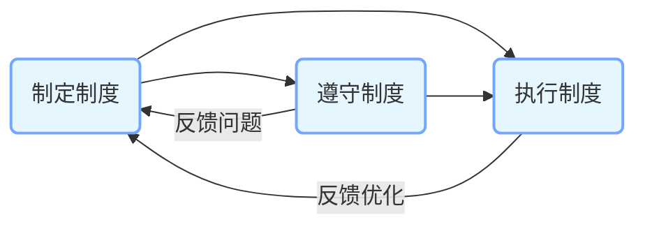
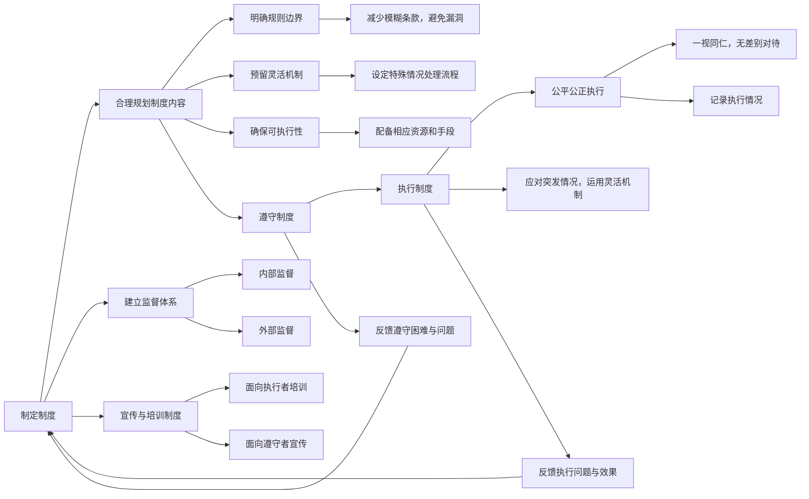

> 核心概念：制度、西游记、龙王布雨
>
> 制度要素：执行制度、遵守制度
>
> 故事角色：泾河龙王、东海龙王
>
> 组织体系：天庭、监督体系
>
> 制度特性：灵活性

话说《西游记》里的龙王们，那可是掌管降雨的“雨界大佬”。其中最让人迷惑的，就是东海龙王和泾河龙王这俩的遭遇。孙悟空找东海龙王帮忙降雨的时候，那龙王跟变戏法似的，说下雨就下雨，打个喷嚏、咳嗽两声，雨就哗哗地下起来了，跟玩似的。这时候咱就纳闷了，合着降雨这么容易，那这“雨界”规矩也太松了吧！

可再看看泾河龙王这边，就没这么潇洒了。他就因为跟一个算卦的杠上了，在布雨的时候稍微改了改时辰和点数，好家伙，就这么点事儿，直接被砍了脑袋。这落差，简直比坐过山车还刺激！

那这俩龙王到底是怎么回事呢？这得从制度说起，这个夏天，我们就从龙王布雨这件事说起，谈谈《西游记》里的制度那点事，你会发现，制度就是一套规则，用来约束社会、公司、班级等各种组织的行为，是一门大学问。

这个图表清晰地展示了制定制度、遵守制度和执行制度三者之间相互依存、相互影响的关系，强调了制度建设是一个动态的、不断优化的过程，但是在西游记里，天上有玉皇，人间有人皇（唐太宗），而如来和太上老君又分别代表佛教和道教，从思想上管理和统一整个从地上到天上的社会秩序，让制度的指定、遵守和执行有了更大的灵活性。

从制度制定来说，天庭的布雨制度，那肯定是有的，毕竟人间的风调雨顺全指着这降雨呢。但问题就来了，这制度制定得是不是太“随性”了？东海龙王能这么轻易地私自降雨，说明制度里可能有不少漏洞，就像一件破了好几个洞的衣服，风一吹，到处漏风。这就好比有些公司规定上班不能迟到，可连个打卡机制都没有，那这规定不就跟没说一样嘛。要是制度能明确规定，什么情况下能降雨，私自降雨要受啥惩罚，东海龙王估计也不敢这么明目张胆地违规了。

再讲讲遵守制度。泾河龙王这事儿，就像我们小时候考试作弊，总觉得自己能耍点小聪明，结果被老师逮个正着。泾河龙王身为专业“布雨员”，心里肯定清楚制度咋规定的，可他就因为一时赌气，脑子一热，就把制度抛到九霄云外去了。他以为改那么一点点没啥大不了的，结果却付出了生命的代价。这告诉我们，遵守制度可不能心存侥幸，别以为自己能钻空子，说不定哪天就“翻车”了。

最后说说执行制度。天庭对泾河龙王的处罚，看着是挺严格，可一对比东海龙王，就感觉有点不公平了。同样是违规，一个丢了命，一个啥事没有，这上哪说理去？这就好比班级里，两个同学都犯了错，一个被罚站一整天，另一个却啥事没有，其他同学心里能平衡吗？执行制度就得一碗水端平，不能因为龙王的“后台”硬不硬、关系好不好就区别对待。不然，这制度就成了摆设，大家都不会把它当回事儿。

从这俩龙王的故事，咱们也能看出制度得有点灵活性。孙悟空找东海龙王降雨，是为了救老百姓，这出发点是好的。要是制度能在特殊情况下，给点“绿色通道”，既不破坏原则，又能解决实际问题，那多好。就像学校规定不能带零食进教室，但要是有同学低血糖犯了，能通融通融，让他吃点糖补充能量，这制度就人性化多了。

《西游记》里这俩龙王的故事，看似荒诞，实则藏着大道理。制度这玩意儿，制定得好，大家遵守得好，执行得也好，那社会、公司、班级才能井井有条。要是都像《西游记》里这俩龙王的事儿一样，制度乱糟糟的，那可就麻烦大咯！以后大家再看《西游记》，是不是对这些故事又有新的看法啦？ 