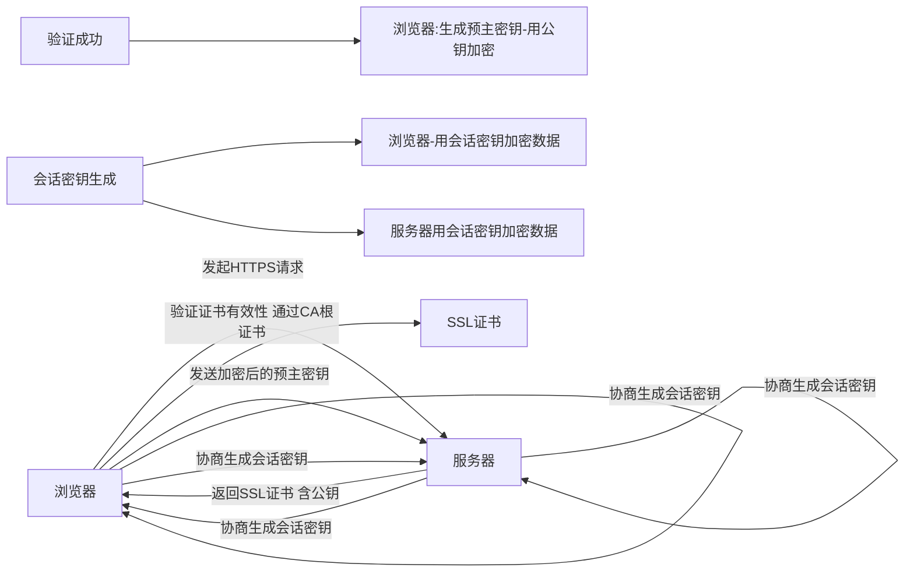
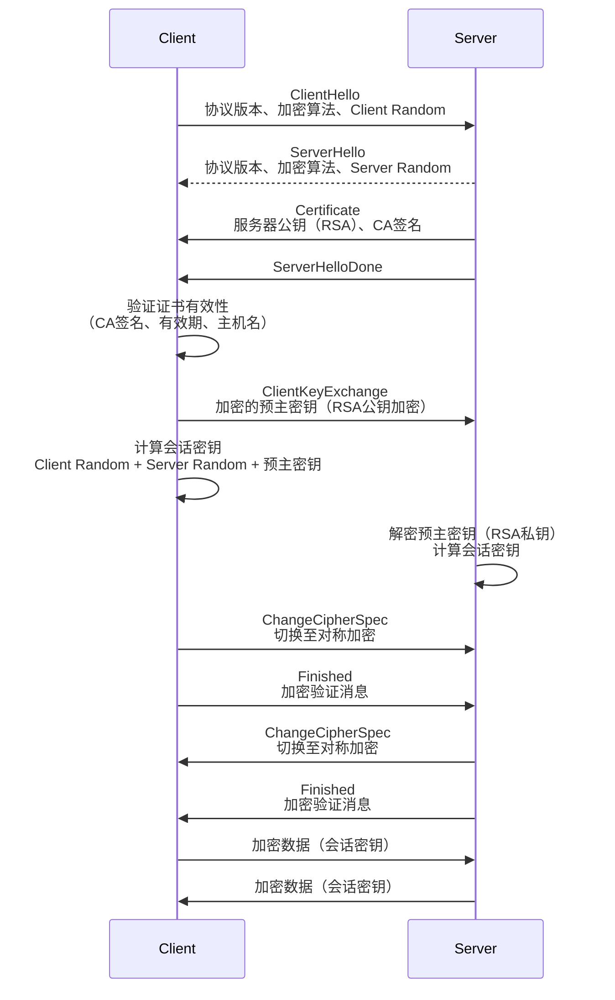

这几年几乎所有主流网站都升级为https连接了，本文分析其作用，并用Markdown表格比较http和https的异同点，同时用Mermaid流程图说明https的工作过程。如果这些内容感兴趣，可以继续阅读以了解更详细的RSA加密算法的原理，以及SSL非对称加密在HTTPS中的应用。

### HTTPS的核心作用分析  

HTTPS（Hyper Text Transfer Protocol Secure）通过加密、认证和完整性保护，解决了HTTP的安全缺陷，其核心作用包括：  
1. **数据加密传输**：防止通信内容被窃听、篡改（如中间人攻击）。  
2. **身份认证**：验证服务器身份（通过数字证书），防止用户访问伪造站点。  
3. **数据完整性校验**：确保数据在传输过程中未被篡改（通过摘要算法和MAC）。  
4. **符合监管要求**：满足隐私保护法规（如GDPR、等保2.0）对数据安全的强制要求。  
5. **提升用户信任**：浏览器显示“安全锁”标识，增强用户对网站的信任度。  
6. **SEO优化**：Google等搜索引擎优先索引HTTPS站点，提升排名。  

### HTTP与HTTPS异同点对比 

| **维度**         | **HTTP**                                  | **HTTPS**                                 |  
|------------------|-------------------------------------------|-------------------------------------------|  
| **协议端口**      | 默认80端口                                | 默认443端口                               |  
| **加密方式**      | 明文传输，无加密                          | 基于SSL/TLS加密（非对称+对称加密结合）    |  
| **安全性**        | 低，易被窃听、篡改、伪造                  | 高，数据加密、身份认证、完整性保护        |  
| **连接建立**      | 一次请求响应即可建立连接                  | 需要额外的TLS握手过程（约1-RTT延迟）      |  
| **数字证书**      | 无需                                      | 服务器必须持有CA签名的数字证书            |  
| **性能影响**      | 无显著延迟                                | 存在加密计算和握手延迟，需优化（如TLS 1.3）|  
| **搜索引擎友好度**| 无特殊优先级                              | Google等优先收录，提升SEO                 |  
| **适用场景**      | 公开、非敏感数据传输（如静态页面）        | 敏感数据传输（如登录、支付、个人信息）    |  

### HTTPS工作过程（Mermaid流程图）  

### HTTPS（SSL/TLS）通信核心流程分析

非对称加密的典型算法如RSA，加密密钥公开而解密密钥保密，以HTTPS的基于SSL算法的通信为例，我们分析具体的实现过程。

HTTPS通过**非对称加密（RSA）实现密钥交换**，**对称加密（如AES）加密数据传输**，结合**数字证书验证服务器身份**，确保通信的机密性、完整性和身份验证。具体步骤如下：

#### 1. **客户端发起连接（ClientHello）**  
- 客户端向服务器发送请求，包含：  
  - 支持的SSL/TLS协议版本（如TLS 1.2）  
  - 支持的对称加密算法列表（如AES）  
  - 随机数（Client Random，用于生成会话密钥）  

#### 2. **服务器响应（ServerHello）**  
- 服务器选择协议版本、对称加密算法，返回：  
  - 服务器随机数（Server Random）  
  - **服务器数字证书**（含RSA公钥，由CA签名）  
  - 服务器密钥交换消息（若需要，如Diffie-Hellman，但此处以RSA为例）  

#### 3. **客户端验证证书并生成预主密钥**  
- 客户端验证服务器证书的有效性：  
  - 检查CA签名是否可信（通过本地CA根证书）  
  - 验证证书有效期、主机名匹配  
- 客户端生成**预主密钥（Pre-Master Secret）**，用服务器证书中的**RSA公钥加密**，发送给服务器。  

#### 4. **服务器解密预主密钥**  
- 服务器用自己的**RSA私钥解密**，获取预主密钥。  
- 客户端和服务器通过 **Client Random + Server Random + 预主密钥** 生成**会话密钥（对称密钥）**。  

#### 5. **对称加密通信**  
- 双方使用会话密钥加密后续所有数据传输，提高效率。  

### 工作时序图

### 关键技术点解析
1. **非对称加密（RSA）的作用**：  
   - **公钥加密**：客户端用服务器公钥加密预主密钥，确保传输安全。  
   - **私钥解密**：服务器用私钥解密预主密钥，防止第三方获取。  

2. **对称加密的作用**：  
   - 会话密钥（如AES）用于加密实际数据，解决非对称加密效率低的问题。  

3. **数字证书的作用**：  
   - 绑定服务器身份与公钥，防止中间人攻击（MITM）。  
   - 通过CA签名确保公钥的合法性。  

4. **随机数的作用**：  
   - Client Random和Server Random确保每次会话的预主密钥和会话密钥唯一，防止重放攻击。  

### 总结
HTTPS通过RSA非对称加密实现**安全的密钥交换**，结合对称加密实现**高效的数据传输**，并通过数字证书实现**服务器身份验证**。这一过程确保了互联网通信的安全性，是现代Web安全的基石。