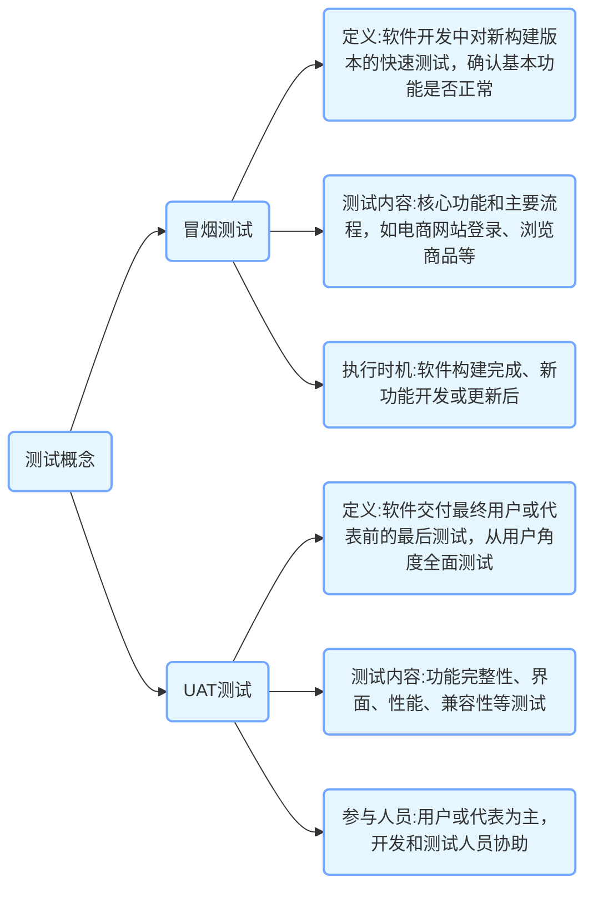

  

先从两个概念说起：冒烟测试是什么？UAT测试指的是什么？

冒烟测试是在软件开发过程中，对新构建的版本进行的一种快速测试，目的是确认软件的基本功能是否正常，是否可以进行进一步的全面测试。例如，新开发的软件安装后能否正常启动，主要界面能否正常显示等，就像检查烟囱是否冒烟来初步判断烟囱是否正常工作一样。

UAT 测试即用户验收测试，是软件开发完成后，由最终用户或客户进行的测试，以确保软件满足他们的业务需求和期望。比如一个电商软件上线前，邀请实际的商家和消费者来测试软件的各项功能是否好用、是否符合他们的使用习惯等。

本文具体说明这两个概念。

## **冒烟测试（Smoke Testing）**
   - **定义**：冒烟测试是在软件开发过程中，对软件进行的最基本功能的快速测试。它是一种比较粗略的测试，主要目的是确定软件的基本功能是否能够正常运行，是否具备可测试性，就像检查一个机器是否能“冒烟启动”一样。如果冒烟测试不通过，那么软件就没有必要进行更深入的测试，需要开发人员先修复基本功能的问题。
   - **测试内容**：通常包括软件的核心功能和主要流程。以一个电商网站为例，冒烟测试可能会检查用户是否能够正常登录、商品是否能够正常浏览、购物车功能是否正常（如添加商品、删除商品、修改数量）以及下单流程是否可以顺利进行等最基本的操作。这些功能是软件正常运行的基础，如果这些功能出现问题，软件的其他部分测试也很难开展。
   - **执行时机**：一般在软件构建完成后，新功能开发完成或者软件更新后进行。例如，开发团队每天都会构建一个新的软件版本，在这个版本交给测试团队进行详细测试之前，先进行冒烟测试，确保基本功能没有问题，这样可以避免测试团队在有严重基本功能缺陷的版本上浪费时间。

## **UAT测试（User Acceptance Testing）**
   - **定义**：UAT测试即用户验收测试，是软件交付给最终用户或者用户代表之前的最后一道测试关卡。它是从用户的角度出发，对软件的功能、性能、易用性等各个方面进行全面的测试，以确定软件是否满足用户的业务需求和期望。只有通过UAT测试，软件才能被用户正式接受并投入使用。
   - **测试内容**：测试内容涵盖了软件的所有功能和特性，包括功能完整性测试（检查软件是否实现了所有用户需求中规定的功能）、界面测试（检查软件界面是否符合用户的操作习惯和审美要求）、性能测试（如软件的响应时间、资源占用等是否在用户可接受的范围内）以及兼容性测试（检查软件在不同的操作系统、浏览器、设备等环境下是否能正常工作）等多个方面。例如，对于一个企业内部使用的财务管理软件，UAT测试需要检查财务报表生成功能是否准确、数据录入界面是否方便用户操作、软件在多人同时使用时的性能是否稳定，以及在不同的办公电脑（包括不同的操作系统和硬件配置）上是否都能正常运行。
   - **参与人员**：主要由用户或者用户代表（如企业的业务部门人员、软件的实际使用者等）来进行测试。他们会根据自己的实际业务场景和使用习惯来操作软件，提出反馈意见。同时，开发人员和测试人员也会在旁边协助，记录用户发现的问题和需求，及时进行修改和优化。例如，在企业上线新的客户关系管理（CRM）软件时，企业的销售部门和客服部门的员工会作为用户代表参与UAT测试，他们会按照日常工作中与客户沟通、跟进订单等业务场景来使用软件，从而验证软件是否符合他们的实际工作需求。