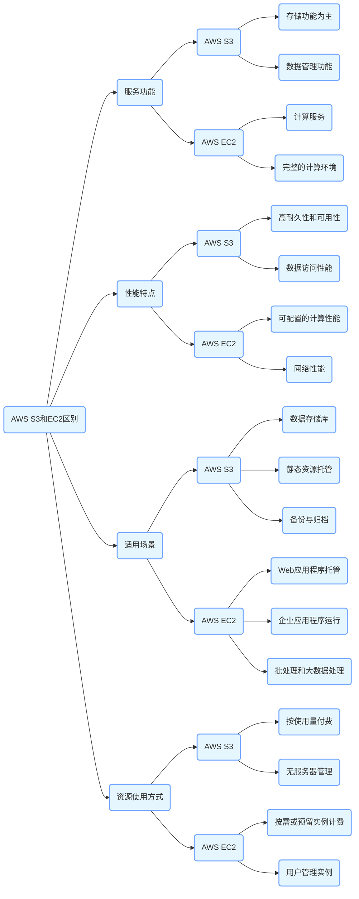

AWS的S3和EC2有什么区别？

AWS S3（Simple Storage Service）和EC2（Elastic Compute Cloud）是亚马逊网络服务（AWS）提供的两种不同服务，它们在功能、用途、特性等方面存在显著区别：

### 服务功能

- **AWS S3**

    - **存储功能为主**：S3主要用于存储数据，提供了高度可靠、可扩展且安全的对象存储服务。它可以存储各种类型的数据，如文件、图片、视频、备份数据、日志文件等，几乎没有存储容量限制，适合企业和开发者存放大量非结构化数据。
    - **数据管理功能**：用户可以通过AWS管理控制台、命令行界面（CLI）或API对存储在S3中的对象进行管理，包括上传、下载、删除、复制对象，以及设置对象的访问权限、存储类别（如标准存储、低频访问存储、归档存储等），以满足不同数据的存储成本和访问频率需求。

- **AWS EC2**

    - **计算服务**：EC2提供了可调整大小的云计算容量，用户可以在云中租用虚拟服务器（实例）来运行各种应用程序。这些实例具有不同的配置选项，包括CPU、内存、存储和网络性能，以适应不同的计算需求，从简单的Web服务器到复杂的企业级应用程序都可以在EC2实例上运行。
    - **完整的计算环境**：用户对EC2实例拥有完全的控制权，就像使用物理服务器一样，可以在实例上安装操作系统、部署应用程序、配置网络设置、管理用户权限等。用户可以根据需要随时启动、停止、重启或终止实例，并且可以根据业务需求灵活调整实例的类型和数量。

### 资源使用方式

- **AWS S3**

    - **按使用量付费**：收费主要基于存储的数据量、数据存储类别、数据传输量以及请求次数等。用户只需为实际使用的存储资源和操作付费，无需预先投入大量资金购买存储设备。例如，如果存储的数据量增加或数据访问频率变化，费用会相应调整。
    - **无服务器管理**：用户无需管理存储基础设施，AWS负责数据的存储、冗余、复制和可用性。这意味着用户可以专注于数据管理本身，而无需担心硬件故障、存储扩展等底层技术问题。

- **AWS EC2**

    - **按需或预留实例计费**：提供按需实例、预留实例和竞价实例等多种计费方式。按需实例按小时或秒为单位计费，用户根据实际使用时长支付费用；预留实例则通过预先支付一定费用获得折扣，适合长期稳定运行的工作负载；竞价实例价格根据市场供需情况波动，适用于对成本敏感且可以灵活中断的任务。
    - **用户管理实例**：用户需要负责管理EC2实例的操作系统、应用程序安装与更新、安全配置（如防火墙规则、用户权限管理）等。虽然AWS提供了一些自动化工具和管理服务来辅助用户，但相比S3，用户在EC2上需要更多的运维管理工作。

### 性能特点

- **AWS S3**

    - **高耐久性和可用性**：S3设计为具有极高的耐久性，数据在多个可用区中自动冗余存储，确保数据不会因硬件故障、自然灾害等原因丢失。官方宣称其数据耐久性高达99.999999999%，并且在全球多个地理位置分布数据中心，提供高可用性，用户可以随时随地访问存储的数据。
    - **数据访问性能**：对于频繁访问的数据，S3提供了低延迟的数据访问。通过AWS的内容分发网络（CloudFront）与S3集成，可以进一步加速数据的全球分发，提高数据传输速度，适用于需要快速提供静态内容（如网站图片、视频等）的场景。然而，对于大规模数据的顺序读写或需要高IOPS（每秒输入/输出操作次数）的场景，S3可能无法提供与传统高性能存储系统相同的性能。

- **AWS EC2**

    - **可配置的计算性能**：EC2实例的性能取决于所选择的实例类型，不同类型的实例具有不同的CPU、内存、存储和网络性能特点。用户可以根据应用程序的需求选择合适的实例类型，例如对于计算密集型任务可以选择高CPU核心数的实例，对于内存密集型应用可以选择大内存实例。同时，EC2支持临时扩展实例性能（如通过Amazon EC2 Auto Scaling服务），以应对突发的流量高峰或计算需求变化。
    - **网络性能**：EC2实例提供不同的网络性能选项，包括网络带宽和数据包处理能力。用户可以根据应用的网络需求选择合适的实例，并且可以通过弹性网络接口（Elastic Network Interface，ENI）、虚拟私有云（VPC）等功能灵活配置网络拓扑和安全组规则，优化网络性能和安全性。与S3相比，EC2在需要实时处理大量数据、运行复杂计算任务或提供低延迟交互服务（如在线游戏服务器、实时金融交易系统等）方面具有优势。

### 适用场景

- **AWS S3**

    - **数据存储库**：适用于作为企业的数据湖，集中存储和管理海量结构化和非结构化数据，方便进行数据分析和处理。例如，大型互联网公司可以将用户行为数据、日志数据等存储在S3中，供数据分析师和数据科学家进行挖掘和分析。
    - **静态资源托管**：是理想的静态网站托管解决方案，用户可以将HTML、CSS、JavaScript文件以及图片、视频等静态资源存储在S3中，并通过配置使其作为网站对外提供服务。许多小型网站和博客选择使用S3来托管静态页面，降低运维成本。
    - **备份与归档**：用于备份重要数据，无论是企业的数据库备份、文件服务器备份还是个人用户的数据备份需求，S3都可以提供可靠的存储解决方案。其归档存储类别适合长期保存很少访问的数据，如法律文件、历史记录等，在保证数据安全的同时降低存储成本。

- **AWS EC2**

    - **Web应用程序托管**：可以运行各种Web应用程序，从简单的个人博客网站到大型企业级电子商务平台。开发者可以在EC2实例上部署Web服务器（如Apache、Nginx）、应用服务器（如Tomcat、Node.js）以及数据库服务器（如MySQL、PostgreSQL），构建完整的Web应用架构。
    - **企业应用程序运行**：适合运行企业内部的各种应用系统，如企业资源规划（ERP）系统、客户关系管理（CRM）系统、办公自动化（OA）系统等。这些应用通常需要较高的计算能力、内存和存储资源，并且需要在安全可控的环境中运行，EC2可以提供满足这些需求的计算基础设施。
    - **批处理和大数据处理**：在大数据处理场景中，EC2常与其他AWS服务（如Amazon EMR、AWS Batch）结合使用。例如，使用EC2实例作为计算节点来运行分布式计算任务，处理大规模数据集。对于需要定期执行的批处理任务（如数据转换、报表生成等），也可以在EC2实例上进行调度和执行。

