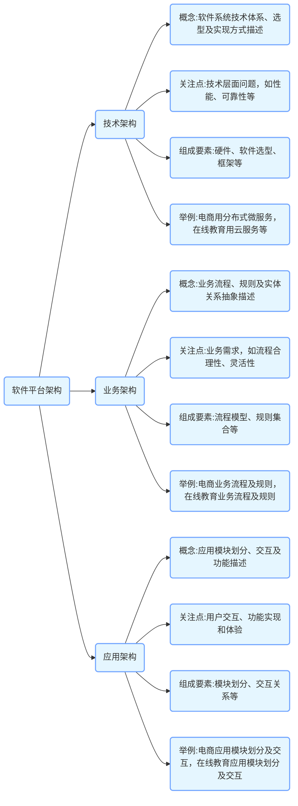

软件平台的技术架构、业务架构和应用架构是从不同角度对软件系统进行的描述，它们在概念、关注点、组成要素等方面存在明显区别，本文先从概念入手，再以一个具体例子做说明。

## 三种系统架构的区别

软件平台的技术架构、业务架构、应用架构，三者有什么区别？

### 概念
- **技术架构**：是对软件系统中所使用的技术体系、技术选型以及技术实现方式的总体描述。它主要关注软件系统如何在技术层面实现其功能，以确保系统的性能、可靠性、可扩展性、安全性等技术指标。
- **业务架构**：是对软件系统所支持的业务流程、业务规则以及业务领域内各实体之间关系的抽象描述。它以业务为核心，从业务视角出发，明确软件系统要实现的业务目标和提供的业务价值。
- **应用架构**：描述了软件系统中各个应用模块的划分、模块之间的交互关系以及这些模块如何为用户提供具体的应用功能。它侧重于软件系统的功能实现和用户体验，关注应用的整体布局和功能模块的组织。

### 关注点
- **技术架构**：重点关注技术层面的问题，如选择何种操作系统、数据库管理系统、编程语言、框架等；考虑系统的性能优化，包括如何提高系统的响应速度、处理大量并发请求等；确保系统的可靠性和稳定性，如采用容错机制、备份恢复策略等；解决系统的可扩展性问题，以便在未来能够轻松添加新功能、扩展业务规模；保障系统的安全性，采取加密、认证、授权等技术手段保护数据和系统的安全。
- **业务架构**：主要围绕业务需求展开，分析业务流程的合理性和优化空间，识别业务中的关键环节和核心业务规则；明确业务领域内的各种实体（如客户、订单、产品等）及其相互关系，构建业务模型；确保软件系统能够准确地支持业务运作，满足业务发展的需求，同时关注业务的灵活性和适应性，以应对不断变化的市场环境和业务需求。
- **应用架构**：关注用户如何与软件系统进行交互，如何将业务功能以直观、易用的方式呈现给用户；考虑应用模块的划分和组织，使功能模块之间职责清晰、高内聚、低耦合，便于开发、维护和扩展；注重模块之间的接口设计，确保各个模块能够高效地进行交互和数据共享；关注用户体验，包括界面设计、操作流程的便捷性等，以提高用户对软件系统的满意度。

### 组成要素
- **技术架构**：包括硬件架构（如服务器的配置、网络拓扑结构等）、软件技术选型（如操作系统、数据库、中间件、编程语言和框架等）、技术框架（如分层架构、微服务架构等）、数据存储和管理方式（如数据库设计、数据缓存策略等）、技术标准和规范（如代码规范、接口规范等）以及性能优化和安全策略等。
- **业务架构**：由业务流程模型（以流程图等形式描述业务的流转过程）、业务规则集合（如定价规则、审批规则等）、业务实体及其关系（如客户与订单之间的关系）、业务用例（描述业务场景和用户与系统的交互过程）以及业务目标和业务策略等组成。
- **应用架构**：包含应用模块的划分（如用户管理模块、订单管理模块等）、模块之间的交互关系（通过接口、消息队列等方式进行通信）、用户界面设计（包括界面布局、交互元素等）、应用的部署架构（如单服务器部署、分布式部署等）以及与其他应用系统的集成方式等。

### 举例说明
以一个电商软件平台为例：
- **技术架构**：采用分布式微服务架构，使用 Spring Cloud 框架构建各个微服务；选择 MySQL 作为数据库管理系统，Redis 作为缓存服务器；应用容器化技术（如 Docker）进行部署，通过 Kubernetes 进行容器编排和管理；采用 HTTPS 协议保障数据传输的安全，使用加密算法对用户敏感信息进行加密存储。
- **业务架构**：业务流程包括用户注册登录、商品浏览、下单、支付、物流配送、售后服务等环节；业务规则涉及商品定价规则、促销活动规则、订单处理规则等；业务实体有用户、商品、订单、商家、物流信息等，它们之间存在着复杂的关联关系，如一个用户可以有多个订单，一个订单包含多个商品等。
- **应用架构**：划分为用户端应用（包括 Web 端和移动端）、商家端应用、后台管理应用等模块；用户端应用提供商品搜索、浏览、下单等功能，商家端应用用于商品管理、订单处理等，后台管理应用负责系统的配置、数据统计分析等；各模块之间通过 RESTful API 进行交互；用户界面设计注重简洁美观、操作便捷，以提高用户购物体验。 

## 更具体的例子

为了更清晰的说明三种系统架构的区别，我们可以再使用一个更具体的，笔者过去几年多次主持开发的学而思培优、复文教育等教育培训行业系统的例子来说明。

以一个在线教育软件平台为例，详细说明技术架构、业务架构和应用架构：

### 技术架构
- **硬件基础设施**：采用云服务器（如阿里云的弹性计算服务 ECS）来承载应用程序，利用云存储服务（如阿里云 OSS）来存储课程视频、文档等教学资源。同时，使用负载均衡器（如阿里云 SLB）来分配用户请求，确保系统在高并发情况下的稳定性和性能。
- **开发框架与技术选型**：后端使用 Spring Boot 框架构建微服务架构，以实现业务模块的解耦和独立部署。采用 Spring Cloud 实现服务治理，包括服务注册与发现（Eureka）、配置管理（Config Server）等。使用 MyBatis 作为持久层框架，与 MySQL 数据库进行交互，存储用户信息、课程信息、订单信息等数据。
- **前端技术**：使用 Vue.js 框架构建用户界面，实现响应式设计，确保在不同设备（如电脑、平板、手机）上都能提供良好的用户体验。通过 Webpack 进行前端资源的打包和管理，提高页面加载速度。
- **通信协议与中间件**：微服务之间采用 RESTful API 进行通信，确保接口的通用性和灵活性。使用 RabbitMQ 作为消息队列中间件，用于异步处理一些任务，如发送课程更新通知、处理订单支付后的后续操作等，提高系统的整体性能和响应速度。
- **安全技术**：采用 HTTPS 协议进行数据传输加密，保护用户的隐私和数据安全。使用 Spring Security 进行用户认证和授权，确保只有合法用户才能访问相应的功能和资源。同时，对关键数据进行加密存储，如用户密码采用加盐哈希算法进行加密。

### 业务架构
- **业务流程**：
    - **用户注册与登录**：用户通过手机号或邮箱进行注册，设置密码。注册成功后，可使用账号登录系统。
    - **课程浏览与选择**：用户登录后，可以浏览平台上的各类课程，根据课程分类、推荐等信息选择感兴趣的课程。
    - **课程购买与学习**：对于付费课程，用户需要完成支付流程才能开始学习。购买成功后，用户可以在个人学习中心找到已购买的课程，进行在线学习，包括观看视频、阅读文档、参与讨论等。
    - **教师授课与管理**：教师可以在平台上创建课程，上传教学资源，设置课程价格等信息。同时，教师可以管理学生的学习情况，查看学生的作业、考试成绩等。
    - **订单与支付管理**：用户下单购买课程后，系统生成订单。支持多种支付方式，如微信支付、支付宝支付等。支付成功后，订单状态更新，用户可以开始学习课程。
- **业务规则**：
    - **课程定价规则**：根据课程的难度、时长、教师知名度等因素确定课程价格。同时，平台可以根据不同的促销活动（如限时折扣、满减等）调整课程价格。
    - **用户权限规则**：普通用户只能浏览课程、购买课程和学习课程。教师用户除了具备普通用户的功能外，还可以创建课程、管理课程和学生。管理员用户拥有最高权限，可以对整个平台进行管理，包括用户管理、课程审核、数据统计等。
    - **订单处理规则**：订单生成后，系统会自动检查用户的支付状态。如果支付成功，订单状态更新为“已支付”，用户可以开始学习课程。如果支付失败，订单状态更新为“未支付”，用户可以重新进行支付。

### 应用架构
- **用户端应用**：
    - **课程展示模块**：以列表、卡片等形式展示各类课程，包括课程封面、名称、简介、价格等信息。用户可以通过搜索、筛选等功能快速找到感兴趣的课程。
    - **课程详情模块**：用户点击课程进入详情页面，查看课程的详细介绍、教学大纲、教师信息、学员评价等内容，帮助用户决定是否购买该课程。
    - **购物车与订单模块**：用户可以将感兴趣的课程加入购物车，在购物车中可以对课程进行数量调整、删除等操作。确认购买后，进入订单填写和支付页面。
    - **学习中心模块**：用户购买课程后，在学习中心可以找到已购买的课程，开始学习。学习中心提供课程视频播放、文档下载、讨论区等功能，方便用户进行学习和交流。
- **教师端应用**：
    - **课程管理模块**：教师可以创建新的课程，编辑课程信息，上传教学资源（如视频、文档、作业等）。同时，教师可以查看课程的报名人数、学生学习情况等统计信息。
    - **学生管理模块**：教师可以查看学生的基本信息、学习进度、作业完成情况、考试成绩等，对学生进行管理和指导。
- **管理端应用**：
    - **用户管理模块**：管理员可以对用户进行管理，包括用户信息的查看、修改、删除等操作。同时，管理员可以对用户的权限进行管理，如将普通用户升级为教师用户或管理员用户。
    - **课程审核模块**：管理员对教师创建的课程进行审核，确保课程内容符合平台的规定和要求。审核通过后，课程才能在平台上正式发布。
    - **数据统计模块**：管理员可以查看平台的各类数据统计信息，如用户注册数量、课程购买数量、收入统计等，为平台的运营和决策提供数据支持。 

