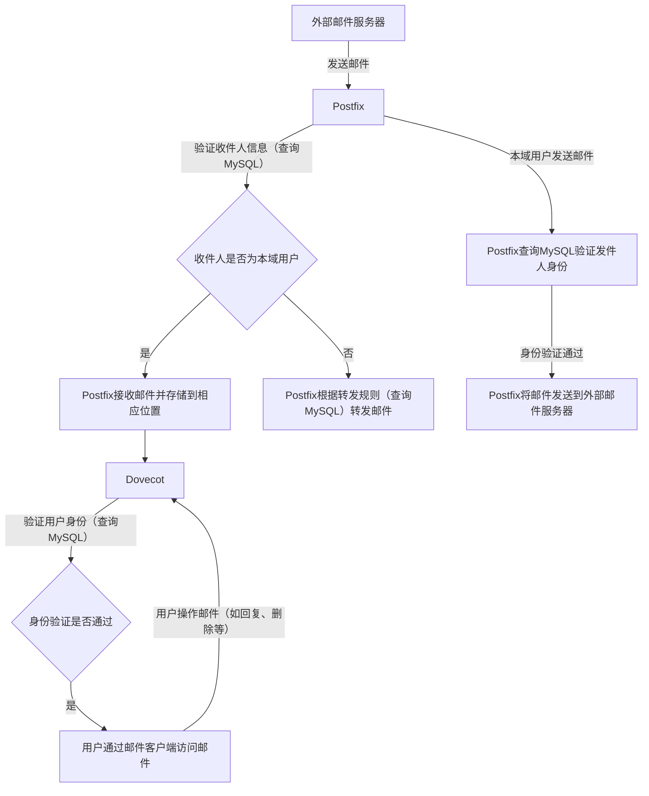

Postfix、Dovecot和MySQL是免费搭建邮件服务器的三个重要组件，它们各自负责不同的功能，协同工作以实现邮件的接收、存储、转发等功能。相较于其他邮件服务器搭建方案，Postfix、Dovecot和MySQL的组合具有以下优势：

1. **免费开源**：Postfix、Dovecot和MySQL都是开源软件，这意味着它们是免费使用的，无需支付任何费用。

2. **功能强大**：Postfix和Dovecot提供了丰富的功能，如邮件的接收、存储、转发等，而MySQL则提供了强大的数据存储和查询功能，能够支持复杂的邮件管理需求。

3. **灵活配置**：Postfix、Dovecot和MySQL都提供了丰富的配置选项，可以根据具体需求进行灵活配置，满足不同用户的邮件管理需求。

4. **社区支持**：由于Postfix、Dovecot和MySQL都是开源软件，它们拥有庞大的用户社区，用户可以通过社区资源获取帮助和支持，解决问题。


## Postfix、Dovecot和MySQL的功能关系

在搭建邮件服务器时，Postfix、Dovecot和MySQL相互协作，各自承担着不同但又紧密相关的角色，以下是它们之间的关系说明以及对应的Mermaid流程图表示：

### 角色及关系说明

#### Postfix

- **功能定位**：Postfix是一款邮件传输代理（MTA），主要负责邮件的接收、转发以及向外发送邮件等功能。它充当着邮件服务器与外部网络（如互联网）之间的桥梁，从外部接收发送给本域用户的邮件，并将本域用户要发送出去的邮件投递到相应的外部邮件服务器。例如，当有其他邮件服务器发来邮件时，Postfix会接收并判断邮件的收件人是否为本域用户，若是则进行下一步处理；若本域用户撰写邮件点击发送后，Postfix会按照收件人的地址将邮件转发出去。

- **与MySQL的关联**：Postfix可以配置连接到MySQL数据库，从数据库中获取诸如用户邮箱账号、域名信息、邮件转发规则等数据，以此来准确判断邮件的去向以及验证发件人和收件人的合法性。例如，通过查询数据库表来确认某个收件人邮箱账号是否存在，进而决定是接收并投递邮件还是拒绝该邮件。

- **与Dovecot的关联**：Postfix接收邮件后，需要将邮件存放到相应的存储位置（通常是邮件存储目录），而Dovecot在后续读取这些邮件供用户访问时，需要和Postfix存放邮件的机制相配合。例如，Postfix会把接收到的邮件按照一定规则存储起来，Dovecot就能基于此找到对应的邮件并提供给用户查看。

#### Dovecot

- **功能定位**：Dovecot是一款邮件投递代理（MDA），专注于邮件的存储以及为用户提供邮件访问服务。它负责管理邮件存储的目录结构，使用户能够通过邮件客户端（如Outlook、Foxmail等）方便地连接到邮件服务器，读取、管理自己的邮件。例如，用户使用邮件客户端登录邮箱账号后，Dovecot会验证用户身份，并从邮件存储目录中获取相应的邮件展示给用户，同时也处理用户对邮件进行的诸如删除、移动、回复等操作。

- **与MySQL的关联**：同样，Dovecot也可以配置连接到MySQL数据库，主要用于验证用户的登录信息，比如用户名和密码是否正确。数据库中存储着用户的账号密码等认证数据，Dovecot通过查询数据库来进行身份验证，只有验证通过后才允许用户访问邮件。

- **与Postfix的关联**：Postfix将邮件投递到存储位置后，Dovecot接管后续对这些邮件的管理和访问服务，二者在邮件的流转过程中紧密配合，确保邮件能正确存储且用户可顺利访问。

#### MySQL

- **功能定位**：MySQL作为数据库管理系统，用于存储邮件服务器相关的各种关键数据，包括但不限于用户的邮箱账号、密码、域名信息、邮件转发规则等。它为Postfix和Dovecot提供数据支持，使得整个邮件服务器的运行能够基于准确、灵活的数据配置。

- **与Postfix和Dovecot的关联**：为Postfix提供域名合法性判断、收件人存在与否、邮件转发规则等数据依据；为Dovecot提供用户身份验证的数据基础，保障邮件服务器在处理邮件以及用户访问邮件时能够依据数据库中的准确信息来操作。


### 功能关系流程图

以下是使用Mermaid语法绘制的表示它们之间关系的流程图：



上述流程图清晰地展示了在邮件服务器搭建中，Postfix、Dovecot以及MySQL之间相互协作、数据交互的关系，从邮件的接收、存储、用户访问到邮件的发送等各个环节都体现了它们各自的关键作用以及紧密配合的流程。 


## 邮件服务器配置实例

以下是 Postfix、Dovecot 以及 MySQL 在搭建邮件服务器时常用的标准配置文件实例。

### Postfix 配置文件 `/etc/postfix/main.cf` 示例
```plaintext
# 基础设置
myhostname = mail.example.com
mydomain = example.com
myorigin = $mydomain
inet_interfaces = all
inet_protocols = all
mydestination = $myhostname, localhost.$mydomain, localhost, $mydomain

# 中继设置
relayhost = 

# 限制设置
mynetworks = 127.0.0.0/8 [::ffff:127.0.0.0]/104 [::1]/128

# 邮件存储设置
home_mailbox = Maildir/

# 虚拟邮箱设置
virtual_mailbox_domains = mysql:/etc/postfix/mysql-virtual-mailbox-domains.cf
virtual_mailbox_maps = mysql:/etc/postfix/mysql-virtual-mailbox-maps.cf
virtual_alias_maps = mysql:/etc/postfix/mysql-virtual-alias-maps.cf

# SMTP 认证设置
smtpd_sasl_type = dovecot
smtpd_sasl_path = private/auth
smtpd_sasl_auth_enable = yes
smtpd_recipient_restrictions = permit_mynetworks, permit_sasl_authenticated, reject_unauth_destination
```

#### 关联的 MySQL 查询配置文件
- `/etc/postfix/mysql-virtual-mailbox-domains.cf`
```plaintext
user = mailuser
password = mailpassword
hosts = 127.0.0.1
dbname = maildb
query = SELECT 1 FROM domains WHERE domain = '%s'
```
- `/etc/postfix/mysql-virtual-mailbox-maps.cf`
```plaintext
user = mailuser
password = mailpassword
hosts = 127.0.0.1
dbname = maildb
query = SELECT 1 FROM users WHERE email = '%s'
```
- `/etc/postfix/mysql-virtual-alias-maps.cf`
```plaintext
user = mailuser
password = mailpassword
hosts = 127.0.0.1
dbname = maildb
query = SELECT goto FROM alias WHERE address = '%s'
```

### Dovecot 配置文件 `/etc/dovecot/dovecot.conf` 示例
```plaintext
# 基础设置
protocols = imap pop3 lmtp
log_path = /var/log/dovecot.log
info_log_path = /var/log/dovecot-info.log
mail_location = maildir:~/Maildir

# 认证设置
auth_mechanisms = plain login
!include auth-sql.conf.ext

# LMTP 设置
service lmtp {
  unix_listener /var/spool/postfix/private/dovecot-lmtp {
    mode = 0600
    user = postfix
    group = postfix
  }
}

# SSL/TLS 设置
ssl = required
ssl_cert = </etc/dovecot/dovecot.pem
ssl_key = </etc/dovecot/private/dovecot.key
```

#### 认证 SQL 配置文件 `/etc/dovecot/auth-sql.conf.ext`
```plaintext
passdb {
  driver = sql
  args = /etc/dovecot/dovecot-sql.conf.ext
}
userdb {
  driver = sql
  args = /etc/dovecot/dovecot-sql.conf.ext
}
```

#### SQL 查询配置文件 `/etc/dovecot/dovecot-sql.conf.ext`
```plaintext
driver = mysql
connect = host=127.0.0.1 dbname=maildb user=mailuser password=mailpassword
default_pass_scheme = SHA512-CRYPT
password_query = SELECT email as user, password FROM users WHERE email = '%u'
user_query = SELECT '/home/vmail/%d/%n' as home, 'Maildir' as mail, 5000 as uid, 5000 as gid, concat('dirsize:storage=', quota) as quota_rule FROM users WHERE email = '%u'
```

### MySQL 配置文件 `/etc/mysql/mysql.conf.d/mysqld.cnf` 示例
```plaintext
[mysqld]
pid-file        = /var/run/mysqld/mysqld.pid
socket          = /var/run/mysqld/mysqld.sock
datadir         = /var/lib/mysql
log-error       = /var/log/mysql/error.log

# 字符集设置
character-set-server = utf8mb4
collation-server = utf8mb4_unicode_ci

# 网络设置
bind-address            = 127.0.0.1
mysqlx-bind-address     = 127.0.0.1

# 性能优化设置
max_connections = 200
innodb_buffer_pool_size = 128M
```

### 注意事项
- 上述配置文件中的数据库用户名、密码、数据库名等信息需要根据实际情况进行修改。
- 对于 SSL/TLS 相关的证书文件，需要根据实际生成的证书路径进行配置。
- 在实际使用中，可能需要根据服务器的硬件资源、业务需求等对配置进行进一步的调整和优化。 