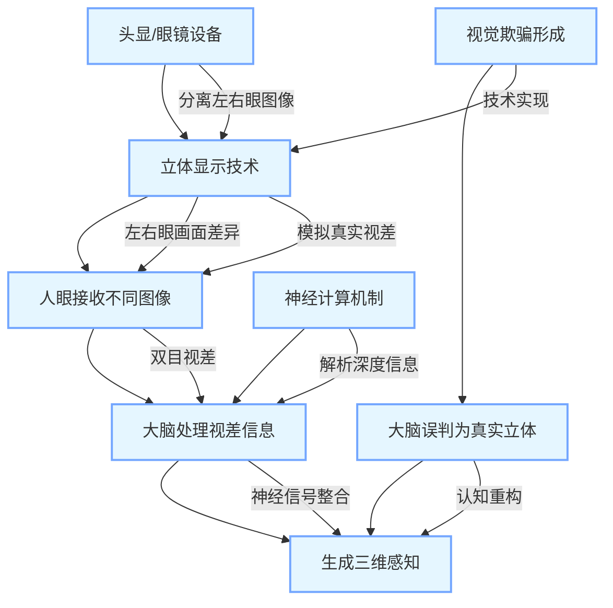

《红楼梦》第五回中，贾宝玉梦游太虚幻境，目睹"薄命司"判词与"红楼梦"十二支曲，这场精心设计的幻觉实为警幻仙姑对他的点化。太虚幻境的精妙之处，在于通过"假作真时真亦假"的叙事策略，将抽象的命运隐喻转化为具象的感官体验。当贾宝玉在幻境中经历"意淫"之劫时，他的认知系统完全被虚假场景所重构。


三百年后的今天，元宇宙技术正以更精密的方式复刻着这种认知欺骗。计算机图形学通过模拟人眼的双目视差，在平面屏幕上投射出具有纵深感的三维影像。当用户戴上VR设备时，左右眼分别接收略有差异的图像，大脑通过神经计算将其合成为立体场景。这种技术本质上与太虚幻境的"以假乱真"并无二致——都是通过操控感官输入来重塑大脑的认知判断。


在动画短片《天鹰座裂缝》（ Beyond the Aquila Rift ）中，导演通过赛博朋克式叙事，揭示了元宇宙技术的潜在危机，也是《爱，死亡与机器人》（ Love Death + Robots ）对幻觉成为现实避难所的隐喻。男主角杰克在飞船故障后进入元宇宙系统，与虚拟女友艾米丽展开一段完美恋情。系统通过脑机接口读取他的记忆，将虚拟场景精确匹配他的心理需求。当杰克最终发现真相时，真实世界已因生态崩溃而濒临毁灭。


这个故事映射出现实困境：当元宇宙能够提供比现实更完美的情感体验时，人类是否会选择永久逃避？神经科学研究显示，虚拟社交产生的多巴胺分泌量与真实社交相当，但缺乏真实人际互动的"情感空洞化"风险却被放大。韩国学者的跟踪调查表明，长期使用元宇宙社交的人群，其现实人际关系满意度下降37%，而抑郁倾向上升29%。

这种技术依赖正在重塑人类的认知模式。斯坦福大学虚拟互动实验室的实验显示，连续使用VR设备30分钟后，参与者对现实物体的三维感知出现偏差，这种现象被称为"虚拟后效"。当技术欺骗成为日常，人类对真实世界的感知能力可能逐渐退化。


## 3D技术的视觉陷阱：从生理到心理的欺骗链条
人类视觉系统的工作原理，为这场技术欺骗提供了生理基础。人眼的晶状体将光线聚焦在视网膜上，形成二维图像，但大脑通过以下机制构建三维感知：
- **双目视差**：左右眼视角差异产生深度信息
- **运动视差**：头部移动引发的场景变化
- **纹理梯度**：物体细节随距离变化的规律
- **遮挡关系**：近物遮挡远物的视觉线索

元宇宙技术正是通过算法精准模拟这些生理机制。例如，Valve Index头显能够以120Hz刷新率同步左右眼画面，配合Inside-Out追踪技术，实现毫米级定位精度。这种沉浸式体验让大脑误以为"看到"的虚拟物体具有真实物理属性，从而产生"具身认知"效应——用户会本能地伸手去抓虚拟茶杯，尽管知道那只是光影幻象。

这种技术欺骗正在突破传统媒介的局限。电影《头号玩家》中的"绿洲"世界，通过触觉反馈手套和跑步机实现多模态感官欺骗。当玩家在虚拟世界中奔跑时，设备会模拟脚掌接触地面的压力感，进一步强化"真实"幻觉。这种技术叠加，使得元宇宙的欺骗性远超太虚幻境。




**3D 技术视觉陷阱原理示意图**

```plaintext
双目视差 → 立体图像分离 → 左右眼画面差异 → 神经信号整合 → 三维感知形成
               ↗          ↖
       立体显示设备        头显/眼镜
               ↖          ↗
               视觉欺骗机制
```


## 技术盛宴的尽头：真实与虚幻的哲学思辨
元宇宙技术的可持续性，本质上是一个哲学命题。柏拉图在《理想国》中提出"洞穴寓言"，指出人类认知受限于感官经验的投射。元宇宙的3D技术，不过是将这种认知局限转化为可操控的商业产品。当扎克伯格宣称"元宇宙将成为人类的第二人生"时，他实际上在重复柏拉图洞穴囚徒的谬误——将影子误认为真实。

从技术发展角度看，元宇宙面临三大瓶颈：
- **算力天花板**：实时渲染8K分辨率3D场景需要千万亿次浮点运算
- **交互局限性**：当前设备无法模拟真实触觉的细微差别
- **伦理风险**：虚拟身份与现实身份的认知混淆


```mermaid
graph LR
    classDef bottleneck fill:#FFE6E6,stroke:#FF6666,stroke-width:2px
    classDef challenge fill:#E6F7FF,stroke:#66CCFF,stroke-width:2px
    
    A[元宇宙三大瓶颈] --> B[算力天花板]
    A --> C[交互局限性]
    A --> D[伦理风险]
    
    B --> B1[实时渲染需求]
    B --> B2[数据传输压力]
    B --> B3[硬件成本制约]
    
    C --> C1[触觉反馈缺失]
    C --> C2[多模态交互不足]
    C --> C3[延迟与同步问题]
    
    D --> D1[隐私泄露风险]
    D --> D2[虚拟身份认知混淆]
    D --> D3[数字鸿沟加剧]
    
    B1 --> B11[8K@120Hz渲染需千万亿次浮点运算]
    B1 --> B12[现有GPU算力缺口达100倍]
    B2 --> B21[5G带宽不足以支撑多人实时交互]
    B3 --> B31[高端VR设备成本超$1000]
    
    C1 --> C11[现有手套仅支持压力反馈]
    C2 --> C21[嗅觉/味觉交互尚未商用]
    C3 --> C31[20ms延迟即破坏沉浸感]
    
    D1 --> D11[脑机接口数据存在泄露风险]
    D2 --> D21[虚拟人格可能引发法律纠纷]
    D3 --> D31[发展中国家数字基建滞后]
```

这些瓶颈决定了元宇宙的"视觉欺骗"本质无法超越物理规律。就像太虚幻境最终要回归现实，元宇宙也必然面临技术边界的制约。当用户摘下头显，看到的仍是真实世界的物理存在。

元宇宙的3D盛宴，本质上是人类对完美世界的数字化想象。它继承了太虚幻境的哲学内核，却拥有更强大的技术实现手段。然而，正如贾宝玉最终从幻境中醒来，人类也终将面对技术幻觉的边界。当我们在虚拟世界中建造"数字永生"的神殿时，更需要守护对真实世界的感知能力——毕竟，真正的生命体验，永远发生在血肉之躯与物理世界的交互之中。


