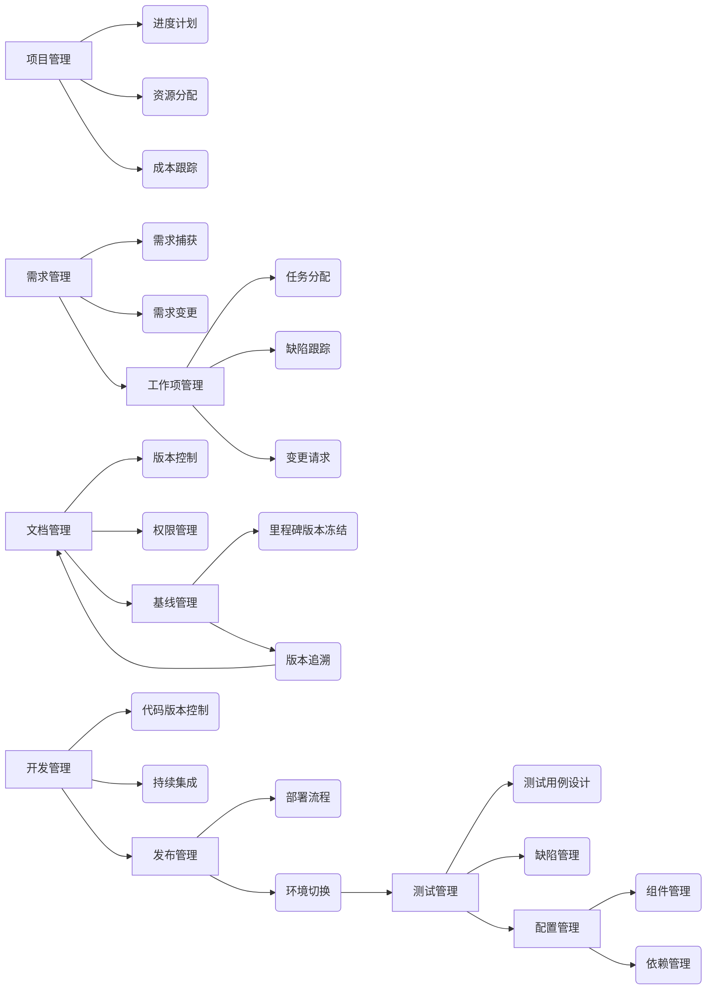
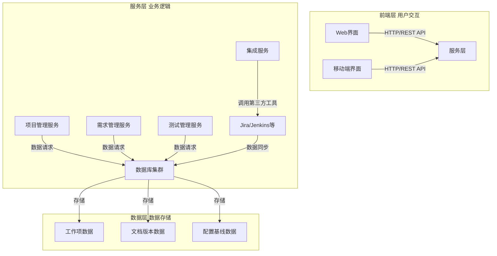

本文对ALM（应用生命周期管理）核心内容解析。ALM应用生命周期管理是否包含项目管理、文档管理、工作项管理、测试管理、基线管理等内容？主要的概念有哪些？主要的任务有哪些？开发这样一套系统，需要注意什么？

#### **一、ALM是否包含项目管理、文档管理等内容？**  
ALM是覆盖应用从需求到退役全生命周期的管理框架，包含以下核心模块：  
1. **项目管理**：进度计划、资源分配、成本跟踪、风险管控等。  
2. **需求管理**：需求捕获、分析、追溯与变更管理（部分场景归入工作项管理）。  
3. **工作项管理**：任务、缺陷、变更请求等工作项的创建、分配、跟踪与闭环。  
4. **文档管理**：需求文档、设计文档、测试报告等全生命周期文档的存储、版本控制与权限管理。  
5. **测试管理**：测试用例设计、执行、缺陷跟踪，测试环境管理与测试结果分析。  
6. **开发管理**：代码版本控制（如Git集成）、构建自动化、持续集成（CI）等。  
7. **基线管理**：对代码、文档、配置等关键里程碑版本进行冻结与追踪，确保可追溯性。  
8. **发布管理**：部署流程管理、环境切换（如开发→测试→生产）、版本发布控制。  
9. **配置管理**：管理软件组件、环境配置、依赖关系等，确保一致性。  

#### **二、ALM主要概念**  
1. **生命周期阶段**：  
   - 需求分析 → 设计 → 开发 → 测试 → 部署 → 运维 → 退役。  
2. **管理对象**：  
   - 工作项（需求、任务、缺陷）、文档、代码、测试用例、环境配置等。  
3. **核心原则**：  
   - **流程标准化**：定义可重复的开发、测试、发布流程。  
   - **追溯性**：建立需求-设计-代码-测试用例的双向追溯链。  
   - **协作性**：跨团队（开发、测试、产品、运维）实时协同。  
   - **度量与优化**：通过指标（如缺陷密度、进度偏差）持续改进流程。  
4. **集成能力**：  
   - 与IDE（如Visual Studio）、版本控制工具（如Git）、CI/CD工具（如Jenkins）等无缝集成。  

#### **三、ALM主要任务**  
| **阶段**       | **核心任务**                                                                 |  
|----------------|-----------------------------------------------------------------------------|  
| **需求阶段**   | 收集需求，创建需求文档，分解为工作项，建立需求跟踪矩阵。                     |  
| **设计阶段**   | 架构设计、模块划分，生成设计文档，关联需求工作项。                           |  
| **开发阶段**   | 代码开发与版本控制，提交工作项状态更新，集成构建。                           |  
| **测试阶段**   | 设计测试用例，执行测试，记录缺陷并跟踪修复，生成测试报告。                   |  
| **发布阶段**   | 制定发布计划，配置基线，部署到目标环境，验证发布结果。                       |  
| **运维阶段**   | 监控系统运行，管理用户反馈，创建维护工作项，推动版本迭代。                   |  
| **跨阶段任务** | 流程审计、变更管理（如需求变更审批）、资源冲突协调、度量数据汇总分析。       |  

#### **四、开发ALM系统的关键注意事项**  
##### **1. 需求与场景适配**  
- **明确目标用户**：是面向企业级复杂项目（如银行核心系统）还是中小团队敏捷开发？  
- **支持多方法论**：兼容瀑布模型、敏捷开发（Scrum/XP）、DevOps等不同模式。  
- **灵活可配置**：允许用户自定义工作流（如缺陷处理流程）、字段属性、权限策略。  

##### **2. 架构设计要点**  
- **分层架构**：  
  - 前端层（UI/UX，支持Web/移动端）  
  - 服务层（业务逻辑，如工作项管理API）  
  - 数据层（数据库，支持MySQL/PostgreSQL，需处理海量数据存储与查询）  
- **微服务化**：将模块拆分为独立服务（如文档服务、测试服务），便于扩展与维护。  
- **集成能力**：提供RESTful API、Webhook等接口，对接Jira、Confluence、Jenkins等第三方工具。  

##### **3. 核心功能实现难点**  
- **追溯性管理**：  
  - 建立需求-设计-代码-测试用例的关联关系，支持跨模块查询（如“某个需求对应哪些测试用例”）。  
- **版本与基线管理**：  
  - 实现文档、代码、配置的版本快照，支持基线创建、回滚与比较。  
- **权限与安全**：  
  - 细粒度权限控制（如按项目、模块、操作类型授权），数据加密（传输层TLS，存储层AES），审计日志留存。  

##### **4. 用户体验与效率**  
- **可视化仪表盘**：实时展示项目进度、缺陷趋势、团队负载等数据（如甘特图、燃尽图）。  
- **自动化流程**：  
  - 自动触发构建（代码提交后）、测试（构建成功后）、通知（缺陷分配时）。  
- **移动端适配**：支持移动办公（如审批、缺陷查看），适配iOS/Android。  

##### **5. 技术选型建议**  
- **开发框架**：  
  - 前端：Vue.js/React + Element UI/Ant Design  
  - 后端：Java（Spring Boot）/Python（Django）/Go  
- **版本控制**：集成Git/SVN，或自研轻量级版本管理模块。  
- **部署方式**：支持私有化部署（VM/容器化）与云部署（AWS/Azure/阿里云）。  

##### **6. 实施与推广**  
- **试点验证**：先在小团队或单项目中试用，收集反馈优化流程。  
- **培训与支持**：提供操作手册、视频教程，支持定制化培训。  
- **持续迭代**：根据行业标准（如CMMI、ISO 25010）与用户需求，定期升级功能。  

### **总结**  
ALM是软件开发团队的“中枢神经系统”，需平衡功能全面性与易用性，通过标准化流程、高效协作与数据驱动优化，提升交付质量与效率。开发时需聚焦业务场景适配、架构可扩展性与用户体验，同时注重安全性与合规性（如GDPR、等保要求）。

