# Mermaid 流程图：用 Markdown 绘制可视化逻辑

作为一名老程序员，我对于markdown格式的文件可谓情有独钟，因为它的简洁性和易读性让我能够快速地编写文档和笔记。然而，在编写技术文档时，我发现markdown的表达能力有限，特别是对于复杂的逻辑流程和图表展示。

为了解决这个问题，我开始寻找一种更强大的工具来支持markdown文档中的图表展示，而Mermaid就是这样的一个工具。但是mermaid的语法相对复杂，而且在不同的平台上的集成方式也存在差异，这给我带来了一些困扰。

随着ChatGPT的火爆，我发现似乎这完全不是问题。当我想让复杂的逻辑关系用mermaid表示出来的时候，我会让ChatGPT先绘制一个版本，然后我在这个版本的基础上修改，效率简直火箭般的提升。

所以，我决定将mermaid的学习和使用经验分享给大家，如果你能借助ChatGPT或者文心一言助力，无疑是生产力爆棚的节奏。


## 一、Mermaid 与 Markdown 的关系

Mermaid 是一种基于文本的可视化工具，通过简单的语法生成流程图、时序图、类图等。它与 Markdown 的结合实现了文档与图表的无缝融合：
- **语法集成**：Mermaid 代码通过 Markdown 的代码块（需要指出代码类型为mermaid）嵌入
- **轻量化**：无需复杂绘图工具，纯文本即可定义图表
- **跨平台**：支持 GitHub、GitLab、VSCode 等主流平台

**JavaScript 的作用**：

Mermaid 图表需要 JavaScript 渲染引擎支持，不同平台的集成方式差异：
| 场景         | 浏览器端                     | VSCode 端                   |
|--------------|------------------------------|----------------------------|
| 渲染方式     | 加载 CDN 脚本                | 使用扩展（如 Mermaid Previewer）|
| 交互性       | 支持动态缩放/导出            | 实时预览                    |
| 依赖管理     | 手动引入脚本                 | 自动处理依赖                |


## 二、集成 Mermaid 的方法

### 1. 浏览器端集成

```html
<!DOCTYPE html>
<html>
<head>
  <script src="https://cdn.jsdelivr.net/npm/mermaid/dist/mermaid.min.js"></script>
  <style>
    .mermaid { background: white; }
  </style>
</head>
<body>
  <div class="mermaid">
    graph TD
      A[Start] --> B{Decision}
      B -->|Yes| C[End]
      B -->|No| D[Loop]
  </div>
  <script>mermaid.initialize({startOnLoad:true});</script>
</body>
</html>

```


### 2. VSCode 端集成
1. 安装扩展：
   - **Mermaid Previewer**（推荐）
   - **Markdown Preview Enhanced**
2. 快捷键预览：
   - `Ctrl+Shift+V`（Markdown 预览）
   - `Ctrl+K V`（分屏预览）


## 三、Mermaid 核心图表类型

### 1. 流程图（Flowchart）

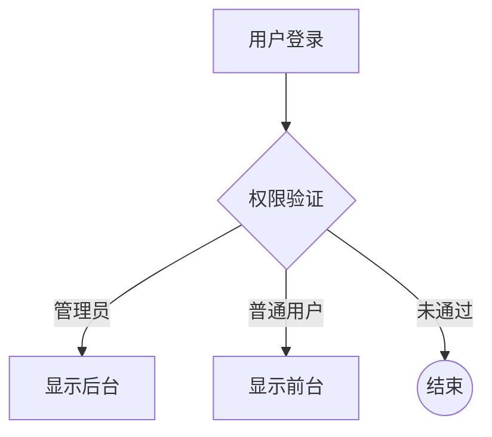

### 2. 时序图（Sequence Diagram）

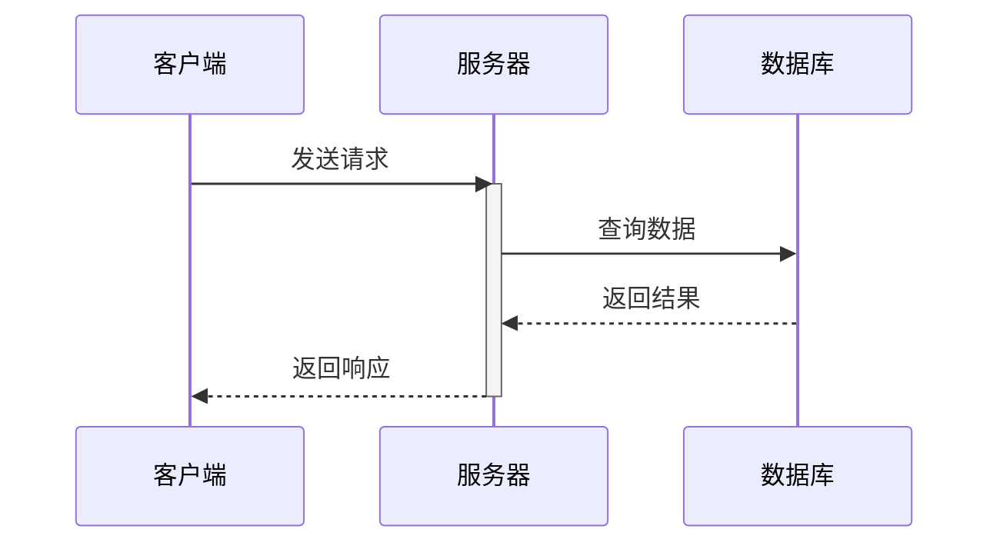

### 3. 类图（Class Diagram）

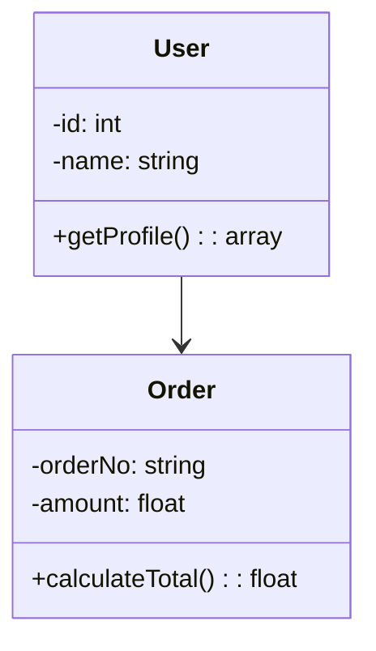

### 4. 状态图（State Diagram）

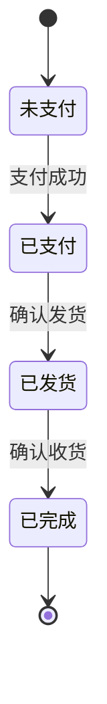

### 5. 甘特图（Gantt Chart）

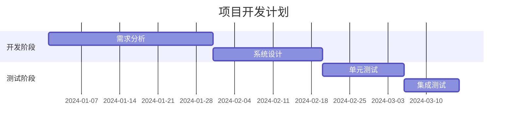

### 6. 饼图（Pie Chart）

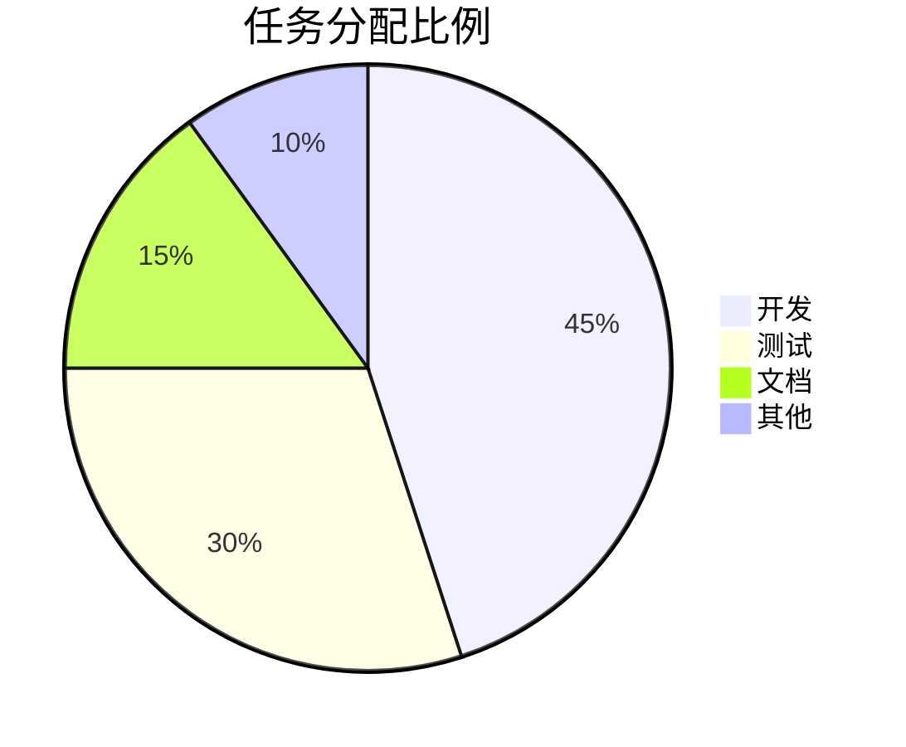

## 四、图表类型详解

### 1. 流程图（Flowchart）
| 符号         | 描述           | 示例代码           | 显示效果          |
|--------------|----------------|--------------------|-------------------|
| `[节点内容]` | 矩形节点       | `A[用户登录]`      | ▢ 用户登录        |
| `((节点))`   | 圆形节点       | `B((结束))`        | ◯ 结束            |
| `[[节点]]`   | 外部系统节点   | `C[[支付网关]]`    | ▢▢ 支付网关       |
| `[(节点)]`   | 数据库节点     | `D[(订单表)]`      | ▢(订单表)         |
| `{节点}`     | 菱形判断节点   | `E{是否通过?}`     | ◇ 是否通过?       |

### 2. 时序图（Sequence Diagram）
```mermaid
sequenceDiagram
  参与者1 ->> 参与者2: 消息1
  参与者2 -->> 参与者1: 消息2
  参与者1 ->> 参与者3: 消息3
  激活 参与者3
  参与者3 --> 参与者2: 消息4
  非激活 参与者3
```

### 3. 类图（Class Diagram）
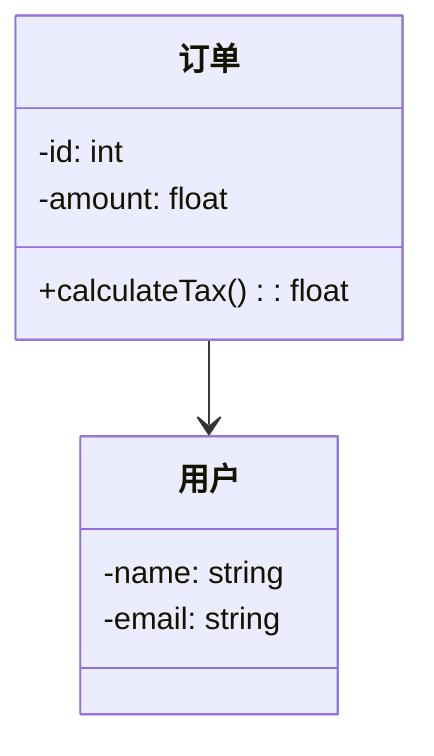

### 4. 状态图（State Diagram）
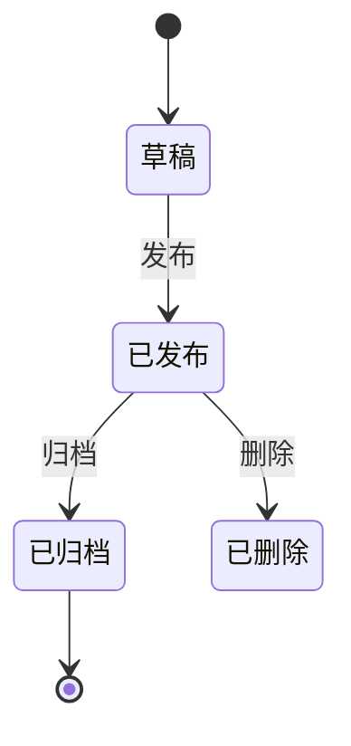

### 5. 甘特图（Gantt Chart）


### 6. 饼图（Pie Chart）
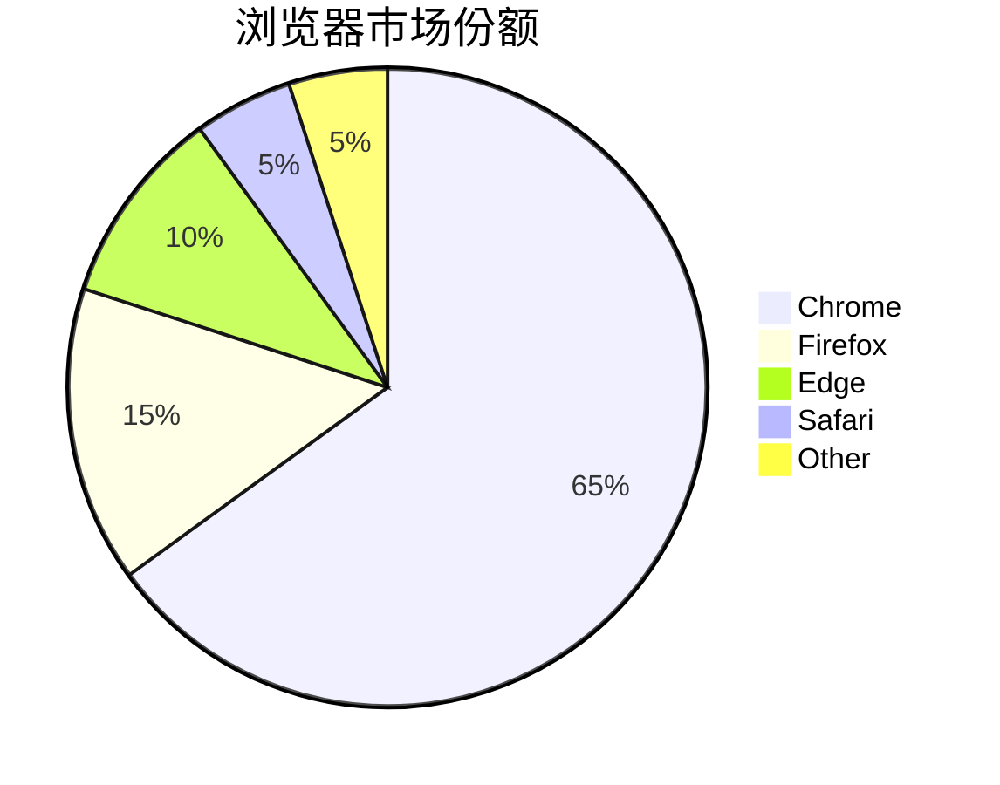

## 五、高级用法示例

### 1. 嵌套子图
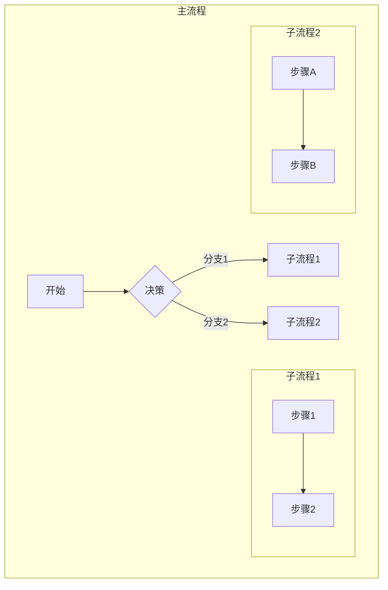

### 2. 并行处理
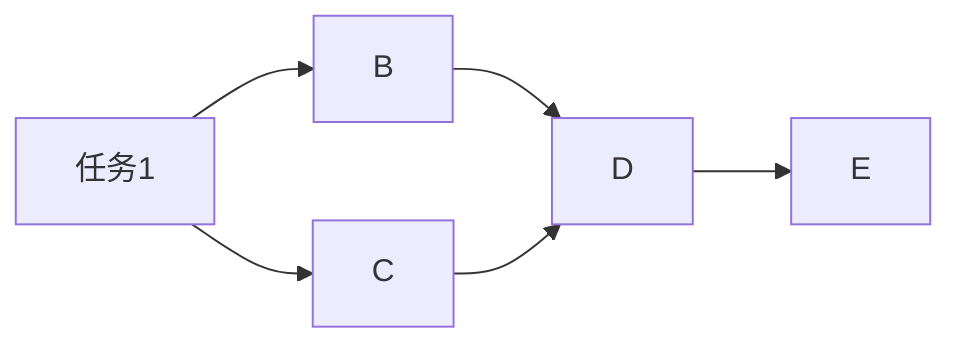

### 3. 动态交互（浏览器端）

```javascript
mermaidAPI.render('graph', 'graph TD A[动态节点] --> B', function(svgCode) {
  document.getElementById('container').innerHTML = svgCode;
});
```

## 六、最佳实践建议

1. **保持简洁**：避免复杂嵌套，必要时拆分子图
2. **规范命名**：节点名称使用清晰的业务术语
3. **统一方向**：流程图保持一致的流向（如全部 LR 方向）
4. **交互增强**：在浏览器中使用 `mermaidAPI` 实现动态交互
5. **版本控制**：将 Mermaid 代码与文档一同纳入版本管理

通过这种图文结合的方式，技术文档可以实现：
- 逻辑可视化：复杂流程一目了然
- 维护便捷性：文本格式便于版本控制
- 跨平台兼容性：一次编写多处渲染
- 协作友好性：图表与代码同步更新

> **注意事项**：

> 1. 确保渲染引擎版本兼容（Mermaid 8+ 支持更多特性）
> 2. 长文本节点可使用 `<<br>>` 换行
> 3. 复杂图表建议使用 `subgraph` 分组
> 4. 浏览器中可通过 `mermaid.parse()` 方法动态渲染

