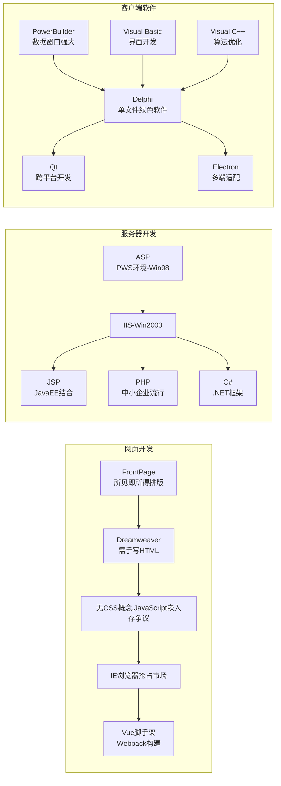

大学时代已经是很遥远的事情了，当年在学校计算机楼的机房里学网页设计，最开始用的是FrontPage，微软的东西最核心的理念是所见即所得，像Word一样排版。后来出了Dreamweaver，大家说比FrontPage专业，生成的垃圾代码少，但是需要会HTML，当时还没有CSS的概念，嵌入JavaScript还是其他脚本在静态网页中是有争议的，当时的IE浏览器正快速吞食网景浏览器的市场。虽然如今Dreamweaver也几乎没人用了，Vue等脚手架开发已经是主流，其实本质上不是好不好用的问题，变革才是王道。

当时学了ASP，运行环境是Windows 98上的PWS，直到Windows 2000才有IIS。后来发现JSP、PHP、C#也很好用。

客户端软件，PowerBuilder和Delphi曾经是王者，PowerBuilder数据窗口独领风骚数十年，Delphi做出来的软件体积小运行效率高，最主要是能做绿色软件，单文件运行，不需要安装环境。那时我更多的时候则是用Visual Basic和Visual C++做客户端软件的开发，不像现在基于Qt和Electron，一个release没有100MB都不好意思发出来。

大学时代已经是很遥远的事情了，记忆里斑驳的计算机楼机房，老式CRT显示器泛着幽蓝的光，键盘上WASD键被磨得发亮。那时学网页设计，最开始用的是FrontPage，微软"所见即所得"的理念贯彻其中，就像用Word排版一样简单直观，拖拽文本框、插入图片，鼠标轻点就能生成网页雏形。直到Dreamweaver横空出世，机房里开始流传"专业设计师都用这个"的说法。这款软件虽然需要手写HTML代码，但生成的页面干净利落，不像FrontPage总会夹带冗余代码。当时CSS还未形成完整体系，在静态网页里嵌入JavaScript都充满争议——有人觉得这能实现动态效果，有人担心会拖慢页面加载，而IE浏览器正以惊人的速度蚕食网景浏览器的市场份额，这场浏览器大战间接影响着前端技术的走向。如今再看，Dreamweaver早已淡出视野，Vue脚手架配合Webpack构建项目成为标配，技术更迭的浪潮里，从来不是单纯的"好不好用"之争，而是变革驱动着整个行业不断向前。

服务器端开发的探索同样充满时代印记。记得最早接触ASP，在Windows 98系统上安装PWS（Personal Web Server）搭建运行环境，捣鼓着"<% %>"标签里的VBScript代码。直到Windows 2000推出IIS，才真正感受到企业级Web服务的雏形。后来陆续接触JSP、PHP、C#，每个技术栈都像打开新世界的钥匙：JSP与JavaEE的结合适合大型项目，PHP凭借轻便灵活在中小企业网站遍地开花，C#则依托.NET框架展现出强大的整合能力。

客户端软件领域更是群雄逐鹿。PowerBuilder的数据窗口堪称神来之笔，一个控件就能完成数据增删改查的全流程操作，在企业管理系统开发中独领风骚数十年；Delphi凭借Object Pascal语言的高效编译，生成的软件不仅体积小巧，运行速度也令人惊叹，单文件绿色版的特性让程序部署变得无比轻松。那时我常守在机房，用Visual Basic绘制漂亮的窗体界面，再用Visual C++优化底层算法逻辑。对比现在，基于Qt和Electron开发的客户端，一个release版本动辄上百MB，虽然功能更强大、跨平台性更好，但总让人怀念当年"小而精"的编程岁月。这些技术的兴衰交替，就像计算机历史长河里的朵朵浪花，见证着程序员群体在技术浪潮中的不懈探索与突破。 

