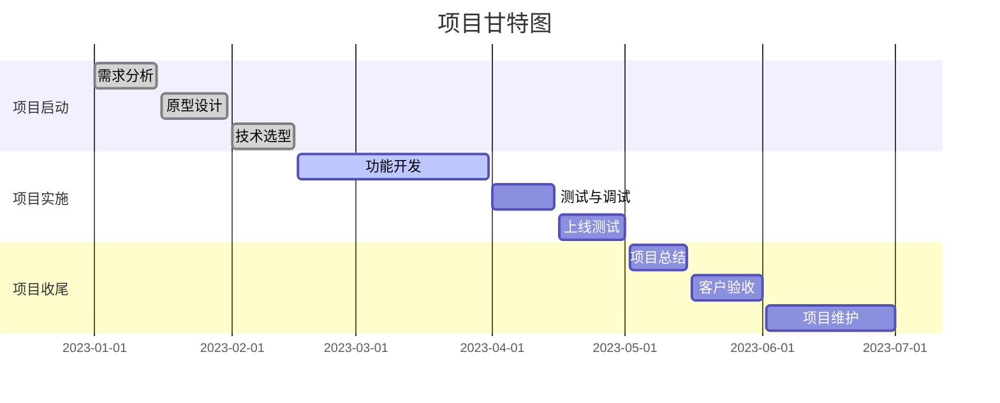
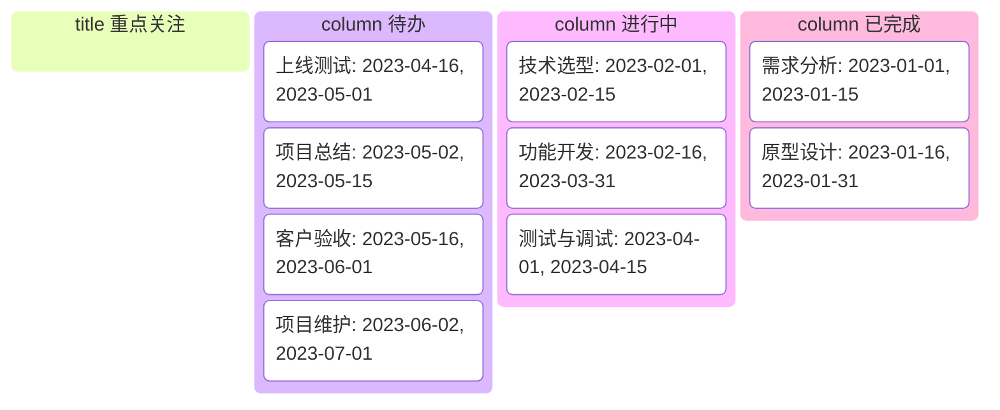
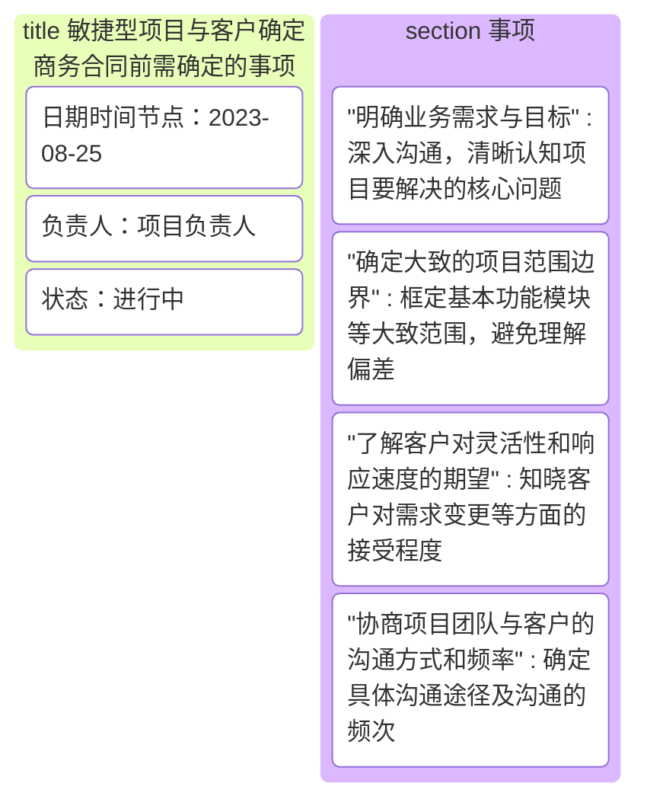

敏捷型软件项目周期管理与预测型、迭代型、增量型的不同，其范围的不确定性和变更的复杂性，使得项目周期管理变得更加灵活和动态，这也为项目的成功实施提出了更高的要求，特别是在外包项目中，敏捷型项目管理中如何做好范围基准、进度基准、成本基准、质量基准的管理，让相关干系人都满意，是当前软件项目经理必须面对并解决的问题。

### 项目周期的特点

敏捷型项目周期管理与预测型、迭代型、增量型的不同，具体表现在：

1. **预测型项目周期管理**
    - **特点**：在项目开始阶段就对整个项目进行详细的规划，需求明确且固定，各项活动、时间、资源等都按计划预先确定好，如同按照精确的蓝图进行施工。例如建筑工程项目，在动工前就设计好详细的建筑图纸、施工流程、材料用量等，后续按部就班执行，变更相对较少且控制严格。
    - **不同之处**：与敏捷型相比，预测型缺乏灵活性，不太能快速响应需求的变化，项目周期是线性推进的，从规划、执行到收尾，各阶段界限清晰且顺序固定，而敏捷型更强调在过程中不断适应变化，灵活调整方向。

2. **迭代型项目周期管理**
    - **特点**：项目被划分为多个迭代周期，每次迭代都会产生一个可运行的版本，不断重复计划、执行、评估、改进的过程，侧重于通过多次迭代来逐步完善产品功能和提升质量。比如一些软件产品的开发，先做一个基础可用版本，然后在后续迭代中不断优化界面、增强性能等。
    - **不同之处**：敏捷型虽然也有迭代，但敏捷更注重客户价值的快速交付，以较短的迭代周期（通常2 - 4周）快速响应客户需求变化，迭代型可能不一定有敏捷那样强烈的客户参与度以及对变化的快速响应机制，迭代周期也可能相对更长一些。

3. **增量型项目周期管理**
    - **特点**：项目是通过逐步增加产品功能来构建完整的产品，将项目分解为多个相互独立的增量，每个增量都能为客户提供部分可用的功能，最后整合形成完整的产品。例如企业资源管理系统（ERP），先上线财务模块作为一个增量，后续再陆续增加人力管理、供应链管理等模块。
    - **不同之处**：敏捷型在每个迭代中都会交付有价值的、能立即投入使用的功能，更强调功能的完整性和客户价值体现，增量型则更侧重于功能模块的逐步累加，可能一个增量中的功能不一定能马上独立发挥较大价值，并且敏捷型对过程的灵活性和适应性要求更高。

**我们对以上内容做简单的归纳**

|类型|特点|与敏捷型项目周期管理的不同之处|
| ---- | ---- | ---- |
|预测型项目周期管理|在项目开始阶段就对整个项目进行详细的规划，需求明确且固定，各项活动、时间、资源等都按计划预先确定好，变更相对较少且控制严格|缺乏灵活性，不太能快速响应需求的变化，项目周期是线性推进的，各阶段界限清晰且顺序固定，而敏捷型更强调在过程中不断适应变化，灵活调整方向|
|迭代型项目周期管理|项目被划分为多个迭代周期，每次迭代都会产生一个可运行的版本，不断重复计划、执行、评估、改进的过程，侧重于通过多次迭代来逐步完善产品功能和提升质量|敏捷型更注重客户价值的快速交付，以较短的迭代周期（通常2 - 4周）快速响应客户需求变化，迭代型可能不一定有敏捷那样强烈的客户参与度以及对变化的快速响应机制，迭代周期也可能相对更长一些|
|增量型项目周期管理|项目是通过逐步增加产品功能来构建完整的产品，将项目分解为多个相互独立的增量，每个增量都能为客户提供部分可用的功能，最后整合形成完整的产品|敏捷型在每个迭代中都会交付有价值的、能立即投入使用的功能，更强调功能的完整性和客户价值体现，增量型则更侧重于功能模块的逐步累加，可能一个增量中的功能不一定能马上独立发挥较大价值，并且敏捷型对过程的灵活性和适应性要求更高| 

### 商务合同前需要确定的事情

围绕项目的范围、进度、质量和成本，敏捷型项目与客户确定商务合同前需确定以下事项，为后续项目实施过程中确定以上四个基准提供依据。

1. **明确业务需求与目标**
与客户深入沟通，了解其业务痛点、期望通过项目实现的目标，例如客户希望通过软件项目提高销售业务流程的效率，那就要详细了解具体是哪些环节效率低、期望提升到什么程度等，确保双方对项目要解决的核心问题有清晰一致的认知。

2. **确定大致的项目范围边界**
虽然敏捷允许需求变更，但也要先框定一个大致的范围，比如确定软件项目涉及的主要功能模块，像电商系统中确定包含商品管理、订单管理、用户管理这些大的模块范围，让客户清楚项目启动时涵盖的基本内容，避免后续出现太大的理解偏差。

3. **了解客户对灵活性和响应速度的期望**
询问客户对于项目过程中需求变更的接受程度、希望团队能多快响应新的想法或调整，以便合理安排团队资源和制定相应的变更管理策略，不同客户对敏捷的“敏捷程度”需求是不一样的。

4. **协商项目团队与客户的沟通方式和频率**
确定是通过定期会议、线上沟通工具还是现场交流等方式保持沟通，以及多久沟通一次，例如每周进行一次项目进度沟通会，这样能保证项目推进过程中信息及时传递，问题及时解决。

我们可以经常绘制甘特图来展示项目的进度：

用看板归纳重要的事项：

对于具体事项，看板的优势更加明显：

### 确定范围基准

敏捷型项目确定商务合同的内容和价格后控制范围的方式

1. **建立严格的变更管理流程**
    - 规定需求变更的提出方式，比如客户需通过正式的变更请求文档提交需求变更内容，详细说明变更原因、期望的变更效果等。
    - 组建变更评估委员会（可以包含项目团队核心成员、客户代表等），对变更请求进行评估，分析其对项目进度、成本、质量等方面的影响，只有经过评估通过的变更才能纳入项目范围。
    - 根据变更的影响程度，确定是否调整价格、延长项目周期等，与客户达成书面协议后再实施变更。

2. **定期梳理和确认项目范围**
    - 在每个迭代开始前，和客户一起重新审视项目待办事项列表，明确本迭代要完成的功能范围，剔除已经不再需要或者优先级变得很低的事项，确保范围始终聚焦在当前最有价值的部分。
    - 迭代结束后，对照计划范围进行验收，确认实际完成的功能是否符合预期，及时发现范围偏差并采取措施纠正，避免范围蔓延。

### 项目收款方式

敏捷型项目分阶段收款的方式

1. **项目启动阶段收款**
收取合同总金额的10% - 30%作为预付款，用于项目前期的团队组建、初始环境搭建、初步需求调研等工作，签订合同后，客户按约定支付这笔款项，保障项目能顺利启动。例如合同金额为100万元，可收取20万元预付款。

2. **迭代过程中收款**
    - 按照迭代周期进行收款，每个迭代完成并通过客户验收后，收取该迭代对应价值一定比例的款项，比例可设定在20% - 40%左右。比如一个项目有5个迭代，合同金额100万元，每个迭代验收合格后可收取20万元（按20%比例）。
    - 或者依据关键里程碑收款，例如完成核心功能模块开发、实现系统的关键集成等里程碑达成后，收取相应的款项，里程碑节点和对应的收款比例需在合同中明确约定，便于双方操作和确认。

3. **项目上线及验收后收款**

软件正式上线且经过一段稳定运行期（如1 - 2周），满足合同约定的验收标准后，收取项目尾款，一般为合同总金额的30% - 50%左右。例如合同金额100万元，上线验收合格后收取30 - 50万元尾款，尾款收取标志着项目整体交付完成，后续可能进入质保期相关服务阶段。

通过以上这些方式，可以在敏捷型项目中更好地管理项目周期、控制范围以及合理安排收款，保障项目顺利推进并满足客户与项目团队双方的利益需求。 

