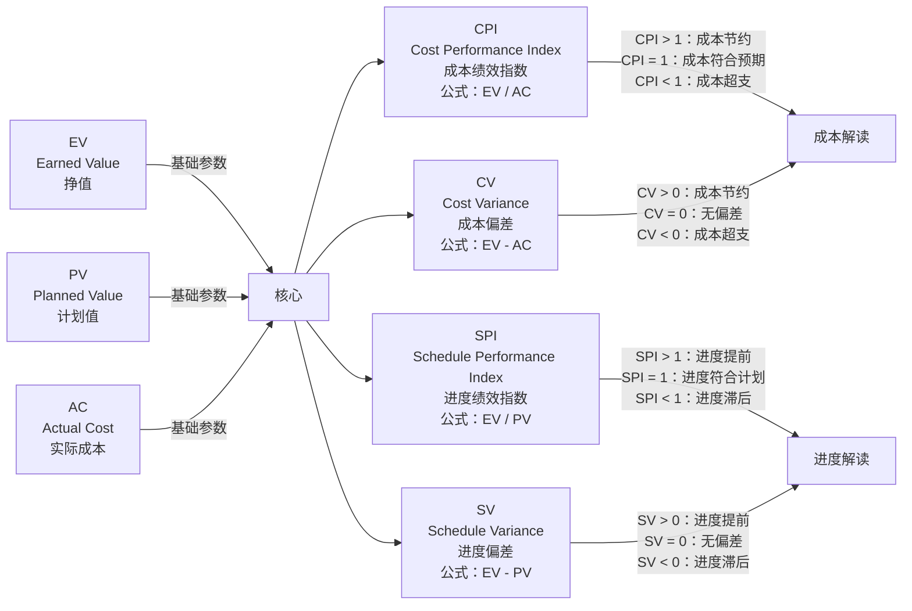

在信息系统项目管理师考试中，计算题的很多概念是直接使用PMBOK的，特别是英文简称，对于使用中文的我们简直是摸不着头脑。下面这些术语是项目挣值管理中用到的概念，其含义、英文全称及相关关系如下：

### EV、PV、AC、CPI、SPI、CV、SV

- **EV（Earned Value）**：挣值，是指项目实施过程中已完成工作的价值，通过实际完成的工作量乘以预算单价来计算。
- **PV（Planned Value）**：计划值，是指根据项目计划，在特定时间点应该完成的工作的预算价值。
- **AC（Actual Cost）**：实际成本，是指在项目实施过程中，为完成实际工作所花费的实际成本。
- **CPI（Cost Performance Index）**：成本绩效指数，计算公式为$CPI = EV/AC$，用于衡量项目成本的绩效情况。当$CPI>1$时，表示成本节约；当$CPI = 1$时，表示成本符合预期；当$CPI<1$时，表示成本超支。
- **SPI（Schedule Performance Index）**：进度绩效指数，计算公式为$SPI = EV/PV$，用于衡量项目进度的绩效情况。当$SPI>1$时，表示进度提前；当$SPI = 1$时，表示进度符合计划；当$SPI<1$时，表示进度滞后。
- **CV（Cost Variance）**：成本偏差，计算公式为$CV = EV - AC$。当$CV>0$时，说明成本节约；当$CV = 0$时，说明成本无偏差；当$CV<0$时，说明成本超支。
- **SV（Schedule Variance）**：进度偏差，计算公式为$SV = EV - PV$。当$SV>0$时，说明进度提前；当$SV = 0$时，说明进度符合计划；当$SV<0$时，说明进度滞后。

### ETC、EAC与其他参数的关系

- **ETC（Estimate to Complete）**：完工尚需估算，是指完成项目剩余工作预计需要的成本。如果当前成本绩效是典型的，即认为未来的工作将按照当前的成本绩效指数进行，则$ETC=(BAC - EV)/CPI$，其中$BAC$是项目的总预算。如果当前成本绩效是非典型的，即认为未来的工作将按照原计划的成本进行，则$ETC = BAC - EV$。
- **EAC（Estimate at Completion）**：完工估算，是指项目完成时预计的总成本。$EAC = AC + ETC$。通过$EAC$与$BAC$的比较，可以判断项目最终的成本情况。

这些参数相互关联，通过对它们的计算和分析，可以帮助项目管理者全面了解项目的成本和进度状况，及时发现问题并采取相应的措施进行调整和控制。

### BAC与成本基准、管理储备、项目预算的关系

BAC的英文全称是Budget at Completion，即完工预算，是项目在完成时预计的总花费。

- **与成本基准的关系**：成本基准是经过批准的、按时间安排的成本支出计划，包括所有的预算活动，是测量和监控项目成本绩效的基础。BAC是成本基准的一部分，是成本基准中项目完工时的预算总额，通常在项目规划阶段确定，随着项目进展，如果没有批准的变更，BAC是固定不变的。
- **与管理储备的关系**：管理储备是为应对项目中不可预见的工作或风险而预留的预算，不包含在成本基准中，但属于项目总预算的一部分。BAC通常不包括管理储备，只有在项目范围发生变更等特殊情况下，可能会动用管理储备，此时BAC也会相应调整。
- **与项目预算的关系**：项目预算是项目所需的全部资金，包括成本基准和管理储备。BAC是项目预算中用于完成项目工作的预计成本，不包括管理储备等用于应对未知情况的资金。项目预算是一个更宽泛的概念，涵盖了项目从启动到结束的所有预计资金需求，而BAC主要聚焦于完成项目范围内工作的预算。

### 挣值管理（EVM）的核心框架

以下是使用 Mermaid 流程图表示 **EV、PV、AC、CPI、SPI、CV、SV** 等概念关系的图表：

### 图表说明：
1. **基础参数**：  
   - **EV、PV、AC** 是最核心的三个参数，其他指标均由它们衍生计算得出。

2. **偏差计算**：  
   - **CV（成本偏差）** = EV - AC，反映成本执行与实际成本的差异。  
   - **SV（进度偏差）** = EV - PV，反映进度执行与计划的差异。

3. **绩效指数**：  
   - **CPI（成本绩效指数）** = EV / AC，衡量成本使用效率。  
   - **SPI（进度绩效指数）** = EV / PV，衡量进度执行效率。

4. **结果解读**：  
   - 通过 **CPI/SPI 的数值** 或 **CV/SV 的正负值**，判断项目成本和进度的健康状态。

这个图表清晰展示了各指标的计算逻辑和关联关系，便于快速理解挣值管理（EVM）的核心框架。