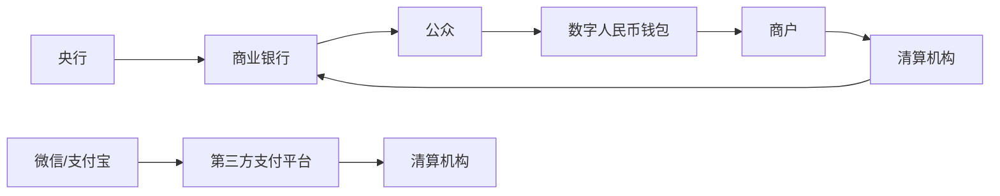

好长一段时间以来，我一个做了二十几年应用软件开发的人，还是计算机专业科班出身，却没有搞清楚数字人民币跟微信和支付宝的在线收付款有什么区别？直到后来听说数字人民币是集成了区块链等技术实现的一种全新的支付方式。听起来非常的高大上，我也就没有再去深入研究这个技术问题。

但是，最近两年接触区块链的项目多了，再想一想数字人民币的技术，似乎又觉得有很多不合理的地方。

如果数字人民币采用区块链技术，那么实际上有很多问题和隐患。从区块链的技术实现上面来说，区块链最本质的特征是联合记账，多账本相互承认。记账的人可以得到一些奖励，这就是过去几年特别火的所谓的“挖矿”。这个技术原理通俗的解释就是：区块链中收支账目是有很多台计算机分别记账的，那么作为一个政府发行的法定货币，如果采用了区块链技术来管理，那么必然失去中央的管控能力。这似乎不符合我们的发展战略不符。再放眼看看世界上其他国家，虽然我们在电子支付领域走的超前，但是在这些根本性的关乎经济发展路线的问题上，应该还没有超前到这样的程度。

数字人民币与区块链存在本质区别：

| 维度        | 数字人民币                | 区块链技术                |
|-------------|---------------------------|---------------------------|
| 记账主体    | 央行直属机构              | 全网节点共同参与          |
| 共识机制    | 中心化验证                | 工作量证明（PoW）等       |
| 交易速度    | 毫秒级（理论值）          | 分钟级（比特币）          |
| 监管权限    | 央行完全掌控              | 无中心化监管              |
| 数据隐私    | 可控匿名                  | 伪匿名                    |

如果抛开区块链技术，那么又回到了最初的原点，数字人民币跟微信支付和支付宝的收付款究竟有什么区别？如果没有什么区别，为什么又要通过技术包装，让大家觉得跟微信支付和支付宝不一样呢？这其中是否又是一个荒诞的技术骗局呢？

这几年我们国家围绕“信创”做了大量的工作，付出了巨大代价的同时，收获了很多重大的工程。从出发点和归宿的角度来看，信创是好的，在这个执行的过程中，总有一些浑水摸鱼的公司可以昧着良心赚钱，也不去顾忌国家和集体的利益。

作为国家信创工程的核心项目，数字人民币承载着多重战略意义：
1. **货币主权保障**：构建自主可控的支付清算体系
2. **金融普惠深化**：实现离线支付等特殊场景覆盖
3. **反洗钱强化**：通过交易溯源提升监管效能
4. **国际支付突围**：降低对SWIFT系统的依赖

当然，信创和数字人民币这两者做关联还是有些牵强，但是，作为这样一个将来可能跟老百姓钱袋子直接相关的信创工程其内涵和外延究竟是什么？是否要更多的有识之士。勇敢的站出来直面这个问题？
