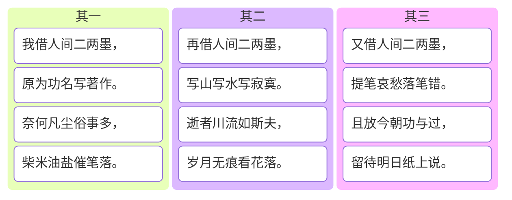

这个冬天来得太早，又唯恐走得太迟，后疫情时代似乎没有描述得那么美好，一个新的经济周期已经悄然开始，想想这几年从追求功名的无奈，到感叹时光的寂寞，再到面对现实的迷茫，在刷着抖音的时候看到关于打油诗，于是顺手写了三首：

```text

我借人间二两墨，
原为功名写著作。
奈何凡尘俗事多，
柴米油盐催笔落。
-.-
再借人间二两墨，
写山写水写寂寞。
逝者川流如斯夫，
岁月无痕看花落。
-.-
又借人间二两墨，
提笔哀愁落笔错。
且放今朝功与过，
留待明日纸上说。

```

至于想要表达的内容，AI是这样帮我解释的：

> **第一首诗**： 作者本想借笔墨书写功名、著书立说，实现远大抱负。然而，现实生活中繁杂的俗事，如柴米油盐等生活琐事，打乱了其计划，让作者不得不放下手中的笔。这里描绘出理想与现实的落差，透露出一种无奈与感慨。

> **第二首诗**：作者再次借墨，不再着眼于功名，而是将目光投向山水自然，以书写山水来寄托内心的寂寞。“逝者川流如斯夫”化用孔子名言，感叹时光如流水般匆匆流逝，“岁月无痕看花落”则通过花开花落的自然现象，进一步强化了时光悄然流逝、物是人非的感慨，营造出一种孤寂、惆怅的氛围。

> **第三首诗**：第三次借墨，作者心中满是哀愁，以至于提笔时思绪混乱，落笔出错。面对今朝的功过是非，作者选择暂且放下，期待明日能在纸上好好梳理。此诗体现出作者内心的纠结与迷茫，以及对未来的一丝期许。


程序员写诗，少不了markdown和mermaid，于是做了个看板，用来展示我的诗。





