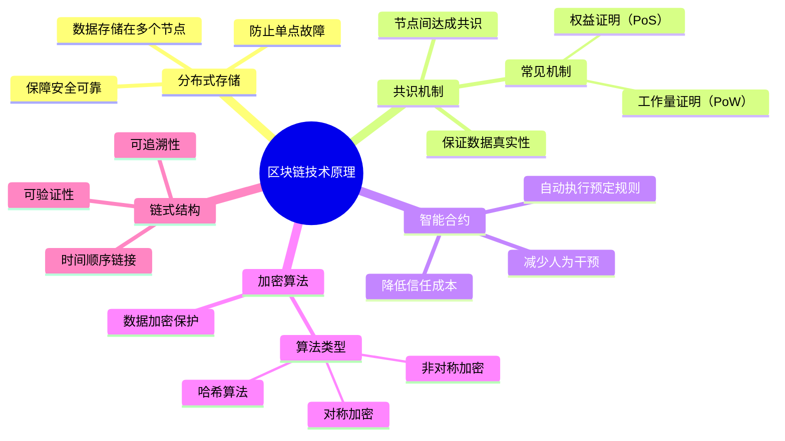
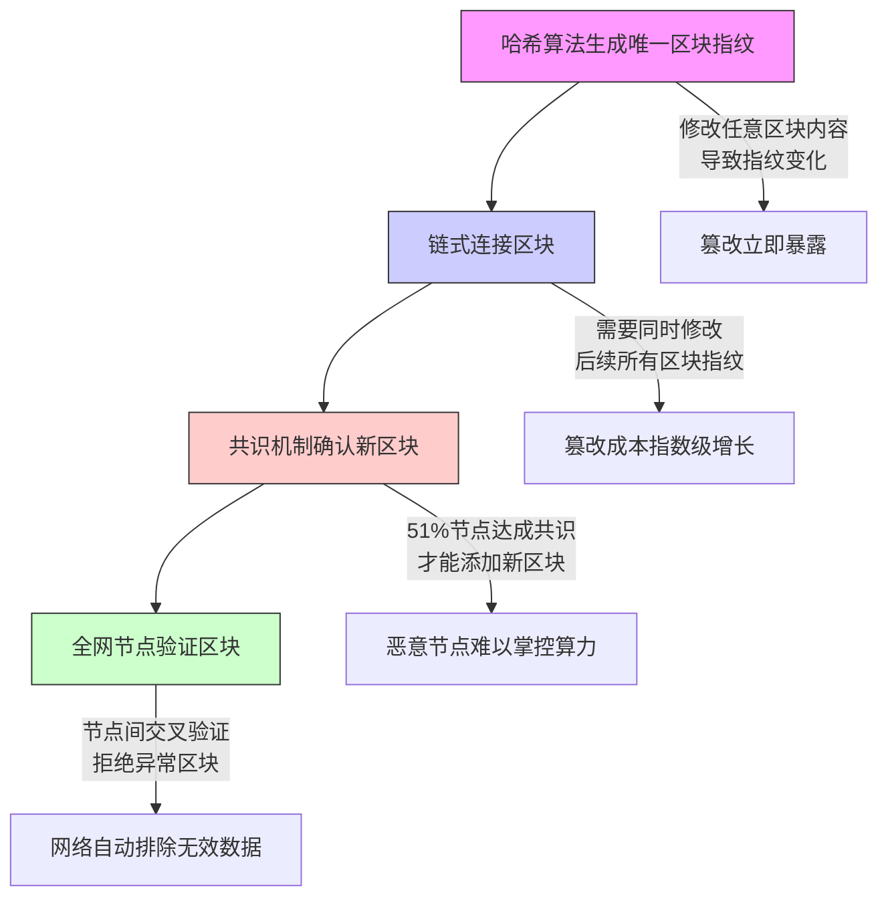

>
> 区块链技术是通过分布式存储、共识机制、智能合约、加密算法和链式结构等技术手段，实现数据的不可篡改、安全可靠、真实可信和可追溯等目标。
>
> 区块链中的每个数据区块都包含前一个区块的哈希值，形成了一个链条。
>
> 这种链式结构保证了每个区块的顺序和完整性，使得篡改某个区块的数据变得非常困难，因为需要同时修改该区块以及其之前所有区块的哈希值，这几乎不可能实现。


区块链技术主要包括以下几个方面：

1. 分布式存储：区块链采用分布式存储方式，将数据存储在多个节点上，使得数据不会因为某个节点故障而丢失，保证了数据的安全性和可靠性。区块链采⽤分布式记账技术，就像全班50人同时记录同一本账本。如果有人想偷偷修改自己的交易记录，必须同时修改超过半数同学的账本，这需要极高的成本和协调难度，最终会发现老老实实记账更划算。

2. 共识机制：区块链采用共识机制，使得多个节点之间可以达成共识，从而保证了数据的真实性和可信度。常见的共识机制有工作量证明（Proof of Work）、权益证明（Proof of Stake）等。类似小区业主投票选物业公司。要更换物业需要超过51%的业主同意（类似PoW机制），或者由持有最多房产证的业主决定（类似PoS机制），确保决策获得多数认可。

3. 智能合约：区块链支持智能合约，智能合约可以自动执行预定的规则和条款，从而减少了人为干预和信任成本。想象一个自动售货机：投入指定金额→选择商品→机器自动出货。整个过程没有售货员参与，就像区块链自动执行合约条款。

4. 加密算法：区块链采用加密算法对数据进行加密和解密，保证了数据的安全性和隐私性。常见的加密算法有哈希算法、对称加密算法、非对称加密算法等。好比用特制信封传递情书：
  - 哈希算法：信封封口有特殊花纹，拆开就会留下痕迹
  - 非对称加密：你有专用拆信刀（私钥），别人只能用透明胶（公钥）验证信封完整性

5. 链式结构：区块链采用链式结构，将数据按照时间顺序链接在一起，使得数据具有可追溯性和可验证性。类似火车车厢连接方式：每节车厢（区块）都挂着前一节的车钩（哈希值）。要修改中间某节车厢的货物，必须断开后面所有车厢重新连接，工程量大到不现实。

通过以上五项技术的组合，区块链实现了数据的不可篡改、安全可靠、真实可信和可追溯等目标。我对以上过程做了梳理，形成这张思维导图：





在具体的操作中，区块链通过多种机制共同作用来实现不同数据区块之间的相互验证，防止被篡改。以下是具体的实现方式：

1. 哈希算法：每个数据区块都有一个唯一的哈希值，该哈希值是对区块头部信息的计算结果。如果区块中的数据发生任何变化，都会导致哈希值发生变化，从而被检测出来。这种机制使得篡改数据变得非常困难，因为轻微的改动都会导致哈希值发生变化，从而被其他节点检测出来。

2. 链式结构：区块链中的每个数据区块都包含前一个区块的哈希值，形成了一个链条。这种链式结构保证了每个区块的顺序和完整性，使得篡改某个区块的数据变得非常困难，因为需要同时修改该区块以及其之前所有区块的哈希值，这几乎不可能实现。

3. 共识机制：区块链中的共识机制使得所有节点都同意应该添加到区块链中的数据区块。例如，比特币使用的工作量证明（Proof of Work）机制，需要节点通过计算哈希值的方式添加新区块，这需要大量的计算资源和时间。如果某个节点想要篡改区块链中的某个区块，需要重新计算该区块以及其之前所有区块的哈希值，这需要耗费大量的资源和时间，使得篡改变得不现实。

4. 验证机制：在区块链中，每个节点都会验证其他节点的数据区块。如果某个数据区块的哈希值或其他验证信息不正确，其他节点将拒绝该数据区块。这进一步保证了区块链中数据的完整性和可信度。

对应的流程如下图所示：




总而言之，区块链通过综合应用哈希算法、链式结构、共识机制和验证机制等多种机制共同作用，实现了不同数据区块之间的相互验证，防止被篡改。这些机制共同保证了区块链中数据的不可篡改性和可信度。


以上是理论部分，在技术开发实现中，区块链技术主要代码编程开发过程如下图所示：


接下来按照上图的算法，我用Python写一个简单的示例来说明：

```python
import hashlib
import time

class Block:
    def __init__(self, index, timestamp, data, prev_hash):
        self.index = index
        self.timestamp = timestamp
        self.data = data
        self.prev_hash = prev_hash
        self.hash = self.calculate_hash()

    def calculate_hash(self):
        block_string = f"{self.index}{self.timestamp}{self.data}{self.prev_hash}"
        return hashlib.sha256(block_string.encode()).hexdigest()

class Blockchain:
    def __init__(self):
        self.chain = [self.create_genesis_block()]

    def create_genesis_block(self):
        return Block(0, time.time(), "Genesis Block", "0")

    def add_block(self, new_data):
        prev_block = self.chain[-1]
        new_block = Block(
            index=len(self.chain),
            timestamp=time.time(),
            data=new_data,
            prev_hash=prev_block.hash
        )
        self.chain.append(new_block)

    def is_chain_valid(self):
        for i in range(1, len(self.chain)):
            current = self.chain[i]
            previous = self.chain[i-1]
            
            if current.hash != current.calculate_hash():
                return False
            if current.prev_hash != previous.hash:
                return False
        return True

# 使用示例
if __name__ == "__main__":
    my_chain = Blockchain()
    
    # 添加三个区块
    my_chain.add_block("Alice 转账 1BTC 给 Bob")
    my_chain.add_block("Bob 转账 0.5BTC 给 Charlie")
    my_chain.add_block("Charlie 转账 0.3BTC 给 David")

    # 打印区块链
    for block in my_chain.chain:
        print(f"区块 #{block.index}")
        print(f"时间戳: {block.timestamp}")
        print(f"数据: {block.data}")
        print(f"前哈希: {block.prev_hash[:10]}...")
        print(f"当前哈希: {block.hash[:10]}...\n")

    # 验证链完整性
    print("区块链是否有效:", my_chain.is_chain_valid())
```

以上代码是区块链开发的一个简单示例，它包含了区块链的基本结构和功能。在这个示例中，我们定义了一个`Block`类来表示区块链中的区块，每个区块包含索引、时间戳、数据和前一个区块的哈希值。我们还定义了一个`Blockchain`类来管理区块链，它包含一个`chain`列表，用于存储所有的区块。

在`Blockchain`类中，我们实现了一些基本的方法，例如`create_genesis_block`用于创建创世区块，`add_block`用于添加新的区块，`is_chain_valid`用于验证区块链的完整性。

在`Block`类中，我们使用`calculate_hash`方法来计算区块的哈希值，它使用了SHA-256哈希算法。

在使用示例中，我们创建了一个区块链实例，并添加了三个区块。更完整的区块链的开发，在之前的一个NFT相关的项目中有用到过，如果你对NFT没有概念可以先脑补一下^_^。


上图的区块链算法，我这里用Python代码做示例说明。

```python

import hashlib
import time
from dataclasses import dataclass
from typing import List, Dict

@dataclass
class NFT:
    token_id: str          # 唯一标识符
    metadata: Dict         # 元数据（数字资产描述）
    owner: str              # 当前所有者
    history: List[Dict]    # 交易历史记录

class NFTBlock:
    def __init__(self, index: int, transactions: List[NFT], prev_hash: str):
        self.index = index
        self.timestamp = time.time()
        self.transactions = transactions
        self.prev_hash = prev_hash
        self.nonce = 0      # 工作量证明随机数
        self.hash = self.calculate_hash()

    def calculate_hash(self):
        block_header = f"{self.index}{self.timestamp}{self.prev_hash}{self.nonce}"
        transaction_hash = hashlib.sha256(str(self.transactions).encode()).hexdigest()
        return hashlib.sha256(f"{block_header}{transaction_hash}".encode()).hexdigest()

class NFTChain:
    def __init__(self):
        self.chain = [self.create_genesis_block()]
        self.pending_transactions = []
        self.nft_registry = {}  # 维护NFT状态：token_id -> NFT对象

    def create_genesis_block(self):
        return NFTBlock(0, [], "0")

    def mint_nft(self, metadata: Dict, creator: str):
        """铸造新NFT"""
        new_id = f"NFT-{hashlib.sha256(str(time.time()).encode()).hexdigest()[:8]}"
        new_nft = NFT(
            token_id=new_id,
            metadata=metadata,
            owner=creator,
            history=[{"action": "MINT", "by": creator, "timestamp": time.time()}]
        )
        self.pending_transactions.append(new_nft)
        self.nft_registry[new_id] = new_nft

    def transfer_nft(self, token_id: str, from_addr: str, to_addr: str):
        """转移NFT所有权"""
        if token_id not in self.nft_registry:
            raise ValueError("NFT不存在")
        
        nft = self.nft_registry[token_id]
        if nft.owner != from_addr:
            raise PermissionError("无权转移该NFT")
            
        nft.owner = to_addr
        nft.history.append({
            "action": "TRANSFER",
            "from": from_addr,
            "to": to_addr,
            "timestamp": time.time()
        })
        self.pending_transactions.append(nft)

    def mine_block(self, miner_address: str):
        """工作量证明挖矿"""
        last_block = self.chain[-1]
        
        # 矿工奖励（可选）
        # self.pending_transactions.append(NFT(...))
        
        new_block = NFTBlock(
            index=len(self.chain),
            transactions=self.pending_transactions,
            prev_hash=last_block.hash
        )
        
        # 简单的工作量证明
        while new_block.hash[:4] != "0000":
            new_block.nonce += 1
            new_block.hash = new_block.calculate_hash()
        
        self.chain.append(new_block)
        self.pending_transactions = []

# 使用示例
if __name__ == "__main__":
    nft_chain = NFTChain()
    
    # 铸造NFT
    nft_chain.mint_nft(
        metadata={
            "name": "数字艺术品#1",
            "author": "艺术家Alice",
            "type": "digital_art"
        },
        creator="Alice"
    )
    
    # 转移所有权
    nft_chain.transfer_nft(
        token_id=list(nft_chain.nft_registry.keys())[0],
        from_addr="Alice",
        to_addr="Bob"
    )
    
    # 挖矿确认交易
    nft_chain.mine_block(miner_address="矿工Charlie")
    
    # 验证区块链
    print(f"区块链长度：{len(nft_chain.chain)}")
    print(f"最新区块哈希：{nft_chain.chain[-1].hash[:10]}...")
    print(f"NFT当前所有者：{nft_chain.nft_registry['NFT-xxxxxx'].owner}")
```

以上代码是一个简单的NFT区块链示例，它包含了区块链的基本结构和功能。在这个示例中，我们定义了一个`NFT`类来表示数字资产，每个数字资产包含唯一标识符、元数据、当前所有者和交易历史记录。我们还定义了一个`NFTBlock`类来表示区块链中的区块，每个区块包含索引、时间戳、交易列表和前一个区块的哈希值。