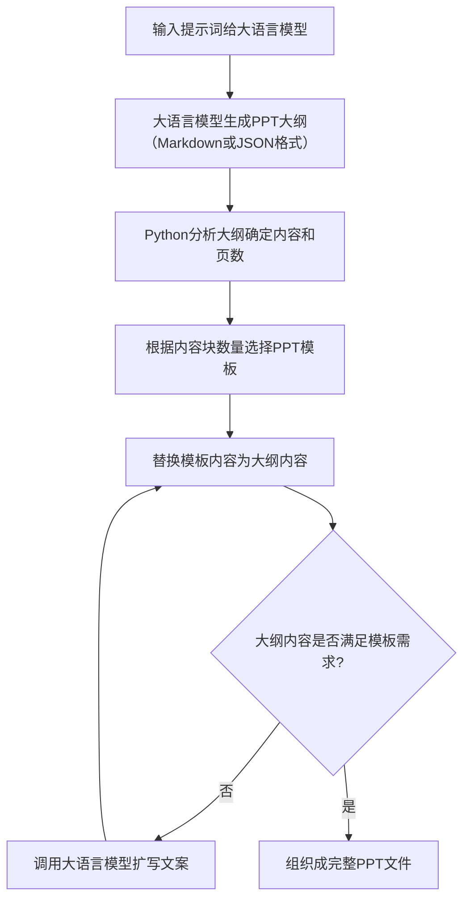

网上有很多使用大语言模型模型生成PPT文件的教程，但是我发现很多教程都只是到了生成PPT大纲这个阶段就戛然而止了，没有讲清楚拿到PPT大纲之后怎么做，还有一些网站可以根据PPT大纲，自动生成PPT文件，但是也是需要收费的这个且不说，也没有讲清楚中间过程，所以我决定写一篇文章来讲解一下从ChatGPT到生成PPT文件，中间经历了什么？

<!-- more -->

其实不仅仅是ChatGPT，几乎所有的大语言模型都提供生成PPT文件大纲的功能，包括豆包、文心一言、讯飞星火、通义千问等，但是也仅仅是到了PPT大纲阶段就戛然而止了，完全停留在ChatPPT的阶段，而且还仅仅是聊聊PPT，没有实际制作PPT文件。

最近公司在做AI智能体开发的项目，所以顺便就了解了一下大语言模型对个人知识库的定制方面的能力，以及在调用传统软件功能业务上的应用，比如生成PPT文件大纲，生成PPT文件，生成代码，生成文档等等。

<!-- mermaid语法： TD LR控制流程图的方向 -->



从提示词生成PPT大纲，到自动选择模板、替换内容，最终生成完整PPT文件，这就是通过AI自动生成PPT的整个流程。关键点包括：
1. **大语言模型生成大纲**：确保大纲结构清晰、内容完整。
2. **Python 解析与处理**：自动化分析大纲内容并选择模板。
3. **模板替换与扩写**：根据内容动态调整 PPT 页面。
4. **PPT 文件生成**：将所有页面组合成最终的 PPT 文件。


下面结合大语言模型的生成能力和 Python 的自动化处理能力，可以实现从大纲生成到最终 PPT 文件的完整流程。

---

### **1. 通过提示词让大语言模型生成 PPT 大纲**
   - **目标**：根据用户提供的主题或提示词，生成一个结构化的 PPT 大纲。
   - **实现方法**：
     1. 用户输入提示词，例如：
        ```
        请生成一个关于“人工智能在医疗领域的应用”的 PPT 大纲。
        ```
     2. 调用 ChatGPT 生成大纲，要求输出格式为 Markdown 或 JSON，例如：
        ```markdown
        # 人工智能在医疗领域的应用
        ## 1. 引言
        - 人工智能的定义
        - 医疗领域的挑战
        ## 2. 人工智能在医疗中的应用场景
        - 医学影像分析
        - 疾病预测与诊断
        - 药物研发
        ## 3. 案例分析
        - IBM Watson 在癌症治疗中的应用
        - Google DeepMind 的眼病诊断系统
        ## 4. 未来展望
        - 人工智能在医疗中的潜力
        - 面临的挑战与伦理问题
        ```
     3. 将生成的大纲保存为 Markdown 或 JSON 文件。

---

### **2. 通过 Python 分析 Markdown 或 JSON 格式的 PPT 大纲**
   - **目标**：解析大纲内容，确定 PPT 的页数和每页的内容。
   - **实现方法**：
     1. 使用 Python 解析 Markdown 或 JSON 文件：
        ```python
        import json
        from markdown import Markdown

        # 解析 Markdown
        def parse_markdown(md_text):
            md = Markdown()
            content = md.parse(md_text)
            return content

        # 解析 JSON
        def parse_json(json_text):
            return json.loads(json_text)

        # 示例：解析 Markdown
        with open("ppt_outline.md", "r", encoding="utf-8") as file:
            md_text = file.read()
            outline = parse_markdown(md_text)
        ```
     2. 根据大纲的层级结构（如 `#`、`##`、`###`）确定 PPT 的页数和每页的内容：
        ```python
        def generate_ppt_structure(outline):
            pages = []
            current_page = {"title": "", "content": []}
            for line in outline.split("\n"):
                if line.startswith("# "):
                    if current_page["title"]:
                        pages.append(current_page)
                    current_page = {"title": line[2:], "content": []}
                elif line.startswith("## "):
                    current_page["content"].append({"type": "heading", "text": line[3:]})
                elif line.startswith("- "):
                    current_page["content"].append({"type": "bullet", "text": line[2:]})
            if current_page["title"]:
                pages.append(current_page)
            return pages
        ```

---

### **3. 根据 PPT 大纲的内容选择合适的模板**
   - **目标**：根据每页的内容结构（如 2 个内容块、3 个内容块等），选择合适的 PPT 模板。
   - **实现方法**：
     1. 定义不同结构的 PPT 模板：
        - **左右结构**：适合 2 个内容块。
        - **上下结构**：适合 2 个内容块。
        - **三栏结构**：适合 3 个内容块。
        - **四象限结构**：适合 4 个内容块。
     2. 使用 Python 根据内容块数量选择模板：
        ```python
        def select_template(content):
            num_blocks = len(content)
            if num_blocks == 2:
                return "two_column_template.pptx"
            elif num_blocks == 3:
                return "three_column_template.pptx"
            elif num_blocks == 4:
                return "four_quadrant_template.pptx"
            else:
                return "default_template.pptx"
        ```
     3. 使用 `python-pptx` 库替换模板中的内容：
        ```python
        from pptx import Presentation

        def replace_template_content(template_path, page_content):
            prs = Presentation(template_path)
            slide = prs.slides[0]
            for shape in slide.shapes:
                if shape.has_text_frame:
                    for paragraph in shape.text_frame.paragraphs:
                        for run in paragraph.runs:
                            if "{{title}}" in run.text:
                                run.text = run.text.replace("{{title}}", page_content["title"])
                            if "{{content}}" in run.text:
                                run.text = run.text.replace("{{content}}", "\n".join([item["text"] for item in page_content["content"]]))
            return prs
        ```

---

### **4. 如果大纲内容不足，调用大语言模型扩写文案**
   - **目标**：如果大纲中的内容不足以填充 PPT 页面，调用 ChatGPT 扩写相关内容。
   - **实现方法**：
     1. 检测内容是否不足：
        ```python
        def is_content_insufficient(page_content):
            return len(page_content["content"]) < 2  # 假设每页至少需要 2 个内容块
        ```
     2. 调用 ChatGPT 扩写内容：
        ```python
        def expand_content_with_chatgpt(prompt):
            # 调用 ChatGPT API
            response = openai.ChatCompletion.create(
                model="gpt-4",
                messages=[{"role": "user", "content": prompt}]
            )
            return response["choices"][0]["message"]["content"]
        ```
     3. 将扩写的内容添加到 PPT 页面中。

---

### **5. 将替换的模板组织成完整的 PPT 文件**
   - **目标**：将所有页面组合成一个完整的 PPT 文件。
   - **实现方法**：
     1. 使用 `python-pptx` 库创建和保存 PPT：
        ```python
        def save_ppt(presentation, output_path):
            presentation.save(output_path)

        # 示例：生成完整 PPT
        prs = Presentation()
        for page in ppt_structure:
            template_path = select_template(page["content"])
            slide_prs = replace_template_content(template_path, page)
            for slide in slide_prs.slides:
                prs.slides.add_slide(slide)
        save_ppt(prs, "output_presentation.pptx")
        ```

---

### **总结**

这种方法可以显著提高 PPT 制作的效率，特别适合需要快速生成大量演示文稿的场景。