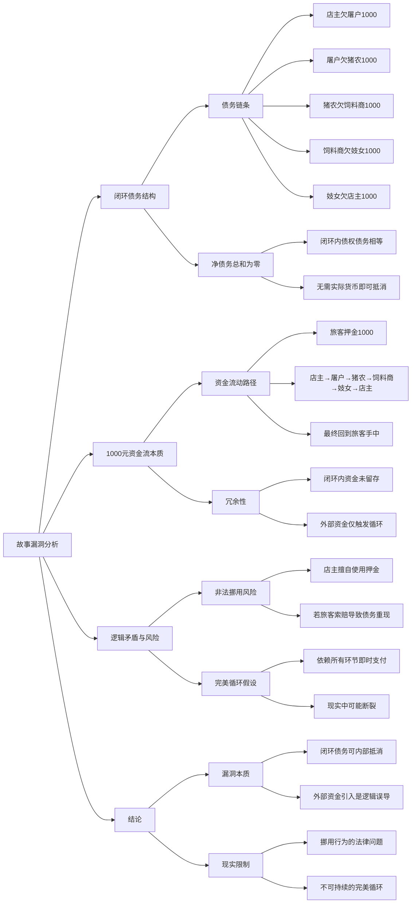

一个很多年前的小故事，翻出来考考DeepSeek大模型，看看它的思考过程，没想到差点就把这个LLM难倒了。幸亏DeepSeek是一个推理模型，不然就尴尬了。

## 1 先说故事

这是炎热小镇慵懒的一天。太阳高挂，街道无人，每个人都债台高筑，靠信用度日。 这时，从外地来了一位有钱的旅客，他进了一家旅馆，拿出一张1000元钞票放在柜台，说 想先看看房间，挑一间合适的过夜。 就在此人上楼的时候，店主抓了这张1000元钞，跑 到隔壁屠户那里支付了他欠的肉钱。 屠夫有了1000元，横过马路付清 了猪农的猪本钱。 猪农拿了1000元，出去付了他欠的饲料款。 那个卖饲料的老兄，拿到1000元赶忙去付清他召妓的钱（经济不景气，当地的服务业也不得不提供信用服务）。 有了1000元 ，这名妓 女冲到旅馆付了她所欠的房钱。 旅馆店主忙把这1000元放到柜台上，以免旅客下楼时起疑。 此时那人正下楼来，拿起1000元， 声称没一间满意的，他把钱收进口袋，走了……这一天，没有人生产了什么东西，也没有人得到什么东西，可全镇的债务都清了，大家很开心。 请问这个故事的漏洞在哪里？

## 2 让DeepSeek大模型思考

针对这个故事，DeepSeek满血版大模型思考了229秒，具体的推理过程如下，虽然有些啰嗦，但是作为推理模型，认真看下去，思考的方法还是合理的：

### 梳理逻辑线

嗯，这个问题看起来有点复杂，但其实可能是一个常见的经济学故事，用来解释货币流通或者债务抵消的现象。不过题目说这里有一个漏洞，需要找出哪里不对。让我先仔细读一遍故事，然后一步步分析。

首先，故事发生在一个炎热的小镇，大家债台高筑，靠信用度日。然后来了一个旅客，拿1000元放在旅馆说要看看房间，然后上楼。店主趁机用这1000元去付了屠户的肉钱，屠户又拿去付猪农的钱，猪农付饲料钱，饲料商付妓女的召妓钱，妓女再付旅馆的房钱，最后店主把1000元放回柜台，旅客下来不满意，拿钱走了。结果大家债务都清了，但没人生产或得到东西，所以问题在于这个故事的漏洞在哪里。

首先，我需要理清楚每个人的债务关系。假设每个人都是欠下家的钱，也就是店主欠屠户1000元，屠户欠猪农1000元，猪农欠饲料商1000元，饲料商欠妓女1000元，妓女欠店主1000元。这样形成一个闭环，每个人的债务都是1000元。当旅客的1000元被用来依次偿还这些债务时，最后这1000元又回到了店主手里，然后还给旅客，结果大家都还清了债务，而旅客拿回了自己的钱，好像什么都没损失。

但是这里可能存在的问题是，实际上这些债务是否真的被清算了？因为当店主用旅客的钱支付给屠户时，店主自己的债务减少了，但同时旅客的钱被用了，但后来妓女又支付给店主，所以店主又拿回了这1000元，可以放回柜台，旅客拿回去后，整个过程看似没有实际货币流通，只是同一笔钱被循环使用，但债务都抵消了。

不过，可能的漏洞在于，虽然债务被抵消了，但实际过程中是否存在货币的重复使用导致债务清偿的错觉？例如，如果每个人原本欠债1000元，那么总债务应该是5个人，每个人欠1000元，总共有5000元的债务，但实际只用1000元就清偿了，这似乎有问题，因为通常需要足够的货币流通来清偿所有债务，但在这个闭环中，可能因为是环状债务，所以可以通过同一笔钱循环来抵消，因为每个环节的债务都是相互抵消的，所以实际上不需要额外的货币，只需要一笔钱来启动这个过程。

不过，可能的问题是，当旅客拿回他的1000元时，店主是否真的有能力归还这笔钱？因为店主在中间用了这1000元支付给屠户，然后妓女又支付了1000元给店主，所以店主实际上有1000元来自妓女，然后放回柜台，所以当旅客取回时，店主并没有损失，因为妓女已经付了房钱，所以店主原本欠妓女的房钱已经被抵消了，对吗？

或者，可能的问题在于，整个过程中，旅客并没有真正支付任何钱，因为他拿回了钱，所以实际上整个债务清偿的过程并没有任何实际的资金注入，只是通过一个临时的资金流动来抵消债务，但实际上如果没有旅客的钱，他们是否也能通过相互抵消来清偿债务？例如，如果他们彼此之间有环状债务，那么理论上他们可以互相抵消债务，而不需要实际支付货币，只需要账面上的调整。例如，店主欠屠户1000，屠户欠猪农1000，依此类推，最后妓女欠店主1000，那么他们可以互相抵消，不需要实际货币流动，所以这个故事中的1000元可能只是一个误导，实际上并不需要，因为闭环债务可以通过抵消来解决，而旅客的钱只是暂时被使用，但最终被拿回，所以实际上并没有任何资金注入，因此债务清偿是可能的，但故事中的漏洞可能在于旅客的钱其实并没有被使用，因为他拿回去了，所以整个清偿过程其实并没有发生，因为店主必须归还那1000元，导致妓女付的1000元实际上是用来归还旅客的钱，所以店主可能并没有真正收到妓女的1000元来抵消自己的债务，或者可能这里存在双重支付的问题。

### 复盘思考过程

另一个可能的漏洞是，当店主用旅客的钱支付给屠户时，这笔钱属于旅客，店主无权使用，因为旅客只是暂时存放作为看房的押金，但并没有确定要住店，所以店主挪用这笔钱属于非法，当旅客决定不住时，店主必须归还，但此时店主已经用这笔钱支付了债务，所以可能无法归还，导致整个链条崩溃，但故事中妓女最后付了1000元给店主，所以店主才能归还，但这里的问题在于妓女付的钱其实是来自于饲料商，而饲料商的钱来自于猪农，依此类推，最终是来自于旅客最初的1000元，所以当旅客拿回钱时，实际上这1000元已经循环了一圈，归还给旅客，但过程中每个人的债务都抵消了，所以表面看起来没问题，但实际上可能因为旅客并没有真正支付，所以债务清偿并没有发生，因为当旅客拿回钱后，店主并没有实际收到任何钱，只是暂时借用，导致整个链条其实是虚构的，因为如果旅客拿回钱，那么店主必须自己垫付1000元来偿还屠户，否则屠户并没有真正收到钱，所以整个链条可能无法成立。

或者更简单地说，当旅客拿回他的1000元后，店主实际上并没有获得任何收入，因此他用来支付屠户的1000元其实是来自旅客的押金，而如果旅客拿回押金，店主必须自己承担这1000元的支出，因此店主实际上欠了屠户1000元，而屠户又欠猪农，依此类推，所以整个债务并没有被清偿，只是转移了，最终由店主承担，导致漏洞在于店主无法归还旅客的钱，因为他已经用掉了，所以当旅客要拿回钱时，店主必须用其他资金来归还，否则无法清偿，因此整个债务清偿过程实际上并没有完成，只是表面的。

不过根据故事描述，妓女最后付了1000元给店主，所以店主可以放回柜台，让旅客拿回。但这里的问题是，妓女付的1000元其实是来自于饲料商，而饲料商的钱来自于猪农，猪农的钱来自于屠户，屠户的钱来自于店主，而店主的钱来自于旅客，所以当旅客拿回钱后，这1000元又回到了旅客手中，而整个过程中，这1000元被用来清偿了所有债务，但实际上，如果旅客没有真正支付这1000元（因为他拿回去了），那么这些债务是否真的被清偿了？因为每个环节的人虽然收到了钱，但最终这钱又回到了旅客手中，所以实际上他们并没有获得任何新的资金，因此他们的债务是否真的被清偿了呢？

可能的漏洞在于，虽然表面上每个人都用这1000元支付了债务，但因为最终这1000元回到了旅客手中，所以实际上这些债务并没有被真正支付，而是通过循环同一笔钱来暂时抵消，但如果没有旅客的这1000元真正留在系统中，那么店主实际上无法偿还屠户，因为当旅客拿回钱后，店主并没有真正的资金来支付给屠户，因此整个链条其实是虚构的，债务并没有被清偿，只是暂时被转移了，但最终由于旅客拿回钱，导致所有支付都被撤销，因此债务仍然存在。

换句话说，整个清偿过程依赖于旅客的1000元留在系统中，但旅客最终拿回了钱，所以这1000元并没有实际注入到系统中，因此债务并没有被清偿，只是账面上的暂时平衡，当旅客取回钱后，店主必须重新欠屠户1000元，导致整个链条崩溃，因此漏洞在于旅客的1000元并没有实际支付，所以债务没有被真正清偿，只是暂时被掩盖了。

### 换个角度分析

或者，另一个角度是，如果所有债务都是相互抵消的闭环，那么他们本可以通过相互抵消来清偿债务，而不需要实际货币流动，所以旅客的钱其实是多余的，或者故事中的清偿过程实际上并没有必要，因为闭环债务可以通过抵消来解决，不需要货币。因此漏洞在于，即使没有旅客的钱，他们也可以通过互相抵消债务来解决问题，所以引入旅客的钱只是误导，实际上并没有起到作用，因为当旅客拿回钱后，系统内的债务仍然存在，因为那1000元并没有留在系统中，所以实际上并没有清偿。

不过，可能更直接的漏洞是，当店主最初使用旅客的1000元支付给屠户时，这笔钱属于旅客，店主并没有权利使用，因为旅客只是暂时存放作为押金，并没有完成交易（即没有租房间），所以店主挪用这笔钱是非法的，当旅客决定不住时，店主必须归还，而此时如果店主已经用掉了这笔钱，就必须自己找钱来归还，但故事中妓女支付了房钱，所以店主用妓女的钱来归还，但实际上妓女的钱来自于旅客的1000元，因此当旅客拿回钱后，妓女支付的1000元其实是同一笔钱，导致店主实际上并没有获得新的收入，因此他无法同时支付给屠户和归还旅客，因此整个链条存在双重支付的矛盾，即同一笔钱被用于支付两次，这是不可能的，因此漏洞在于同一笔钱被循环使用多次，但实际上在现实中，同一时间只能有一人持有该钞票，因此不可能同时用于多个支付，但在这个故事中，由于时间顺序，可能可以循环使用，但关键在于当旅客拿回钱时，是否这1000元已经被归还，导致之前的支付无效。

例如，假设旅客放下1000元，店主拿它支付给屠户，屠户支付给猪农，依此类推，最后妓女支付给店主，店主放回柜台，旅客拿回。那么这1000元实际上完成了整个循环，所以每个人的债务都被清偿了，而旅客拿回自己的钱，表面上看起来没问题。但问题在于，当店主最初使用这1000元时，他实际上是在未经旅客允许的情况下使用了押金，而旅客可能并没有同意支付，因此当旅客拿回钱时，店主必须从其他地方拿钱来支付之前的债务，否则债务仍然存在。因此，整个清偿过程依赖于旅客的钱最终留在系统中，但旅客拿回了钱，所以实际上店主必须自己承担这1000元的债务，导致整个链条的清偿无效。

或者，更准确地说，这个故事中的每个支付都是基于同一张1000元钞票，因此当妓女支付给店主时，店主将这1000元放回柜台，旅客取回，意味着这1000元从未真正离开旅客，因此实际上所有的支付都是无效的，因为同一张钞票被多次使用，但现实中同一时间只能存在一个地方，因此当店主支付给屠户时，钞票离开店主，之后依次传递，最后回到店主手中，再还给旅客，因此实际上钞票确实流经了所有环节，每个人确实收到了并支付了，因此债务被清偿。但问题可能在于，当旅客没有消费，因此店主并没有收入，所以妓女支付给店主的房钱实际上是用来抵消店主欠妓女的钱，还是店主原本应该收到妓女的房钱？如果妓女欠店主房钱，那么当妓女支付1000元给店主，店主应该抵消这笔债务，但店主之前因为旅客的押金已经用这1000元支付了屠户，所以当妓女支付时，店主现在有了1000元，可以用来归还旅客，因此整个过程中，每个人的债务确实被清偿了，因为每个人都用同一张钞票支付了债务，而最终钞票回到旅客手中，但旅客并没有消费，所以店主实际上并没有赚到钱，但因为妓女支付了房钱，所以店主可能原本有应收的房钱，因此抵消了。

不过，可能漏洞在于，整个过程中，旅客的钱其实并没有被消费，只是作为流通工具，而实际上如果旅客没有消费，那么旅馆并没有收入，因此妓女支付的房钱应该是她之前欠的，而店主用旅客的钱来支付屠户，然后通过循环拿回钱来归还旅客，这整个过程可能合法，只要旅客同意押金被暂时使用，但通常押金是不能被店主随意使用的，除非有协议，否则这是挪用，可能构成违法，因此漏洞在于店主未经允许使用了旅客的押金，当旅客要拿回时，如果店主无法归还，就会导致问题，但故事中店主通过妓女的支付拿回了钱，所以能够归还，因此表面上是可行的。

### 补充遗漏的逻辑

但另一个角度是，整个债务清偿实际上只需要信用转移，而不需要实际货币，因为这是一个闭环，所以即使没有货币，他们也可以通过相互抵消来清偿债务，因此引入旅客的1000元其实是多余的，或者故事中的清偿过程实际上并不需要这笔钱，因此漏洞在于他们其实可以不用任何货币就抵消债务，而旅客的出现只是混淆了这一点。

或者，更直接的漏洞是，当旅客拿回他的1000元时，实际上这1000元已经用于清偿了所有债务，但因为旅客又拿回去了，相当于这1000元从未离开过旅客，因此整个清偿过程并没有发生，因为所有的支付都是基于同一笔钱，而这笔钱最终回到了原点，导致实际上没有人真正收到钱，因此债务仍然存在。例如，店主用旅客的钱支付给屠户，但随后屠户又支付给猪农，依此类推，最后妓女支付给店主，店主归还给旅客，因此这1000元回到了旅客手中，意味着这些支付实际上并没有发生，因为钱最后被拿走了，所以每个人并没有真正收到钱，因此债务没有被清偿。

不过，这似乎不太对，因为在这个过程中，钱确实流经了每个人的手，他们用这1000元支付了债务，因此即使钱最后回到旅客手中，他们的债务已经被清偿了，因为他们确实收到了钱并支付了债务，所以他们的账目已经平衡了。例如，店主欠屠户1000元，用旅客的1000元支付，屠户的债务就清了，然后屠户用这1000元支付猪农，猪农的债务清了，依此类推，最后妓女用这1000元支付店主，店主的债务（来自妓女）清了，然后店主把这1000元放回去，旅客拿回，所以整个过程每个人的债务都被清偿了，而旅客没有损失，因为钱拿回去了。但问题在于，店主在中间环节是否真的有权使用旅客的钱，因为旅客只是查看房间，可能并没有同意支付，所以店主的行为可能构成挪用，但假设旅客同意了，或者这是押金的一部分，那么可能没问题，但通常押金是在确定入住后才使用，而不是在查看房间期间就被使用，所以这可能是不合法的，导致漏洞在于店主非法使用了旅客的钱，从而使得整个清偿过程建立在非法行为上，因此当旅客取回钱时，店主实际上无法清偿，导致债务重新出现。

不过，故事中明确说最后店主把1000元放回柜台，旅客拿回，所以表面上没有问题，但关键在于，当店主使用这1000元支付屠户时，是否这笔钱已经属于店主，还是仍然属于旅客。如果旅客只是暂时存放作为押金，那么店主无权使用，直到旅客确认入住，因此当旅客决定不住时，押金必须全额退还，因此店主使用这笔钱支付债务是非法的，导致整个清偿过程无效，因为店主实际上并没有这笔钱的所有权，因此后续的支付都是无效的，债务仍然存在，而店主必须自己承担支付给屠户的1000元，因此漏洞在于店主非法挪用了旅客的押金，导致整个链条的基础不合法，因此债务并未真正清偿。

### 阶段性小结

总结一下，可能的漏洞有几个方向：

1. 店主未经许可使用旅客的押金，属于非法挪用，导致清偿无效。

2. 同一笔钱被循环使用，但实际上当旅客拿回后，所有支付被撤销，债务仍然存在。

3. 闭环债务本可以通过相互抵消清偿，无需实际货币流动，因此旅客的钱是多余的。

4. 故事中的清偿过程实际上并没有发生，因为钱最终回到了旅客手中，相当于没有资金注入，债务未被清偿。

不过根据经济学原理，闭环债务确实可以通过同一笔货币循环来清偿，因此可能故事本身是合理的，但问题在于现实中的法律问题，即店主无权使用押金，导致整个链条不成立，因此漏洞在于店主挪用了旅客的钱，而旅客拿回钱后，店主必须自己承担支付给屠户的1000元，因此债务并未清偿，只是转移到了店主身上，所以整个链条其实没有解决债务，只是转移了债务，因此漏洞在这里。

不过可能还有其他角度，比如货币流通中的时间差，或者双重支付等，但最可能的答案还是店主未经允许使用旅客的押金，导致当旅客拿回钱时，店主无法偿还，从而债务仍然存在，因此整个清偿过程是虚假的。

不过，根据一些类似的经济学谜题，正确答案通常是整个债务网络实际上可以通过信用抵消来清偿，而不需要实际货币，因此旅客的钱其实并没有必要，因此漏洞在于即使没有旅客的钱，他们也可以通过相互抵消来清偿债务，因此故事中的1000元只是转移注意力，而实际上不需要。

不过，另一个角度是，当旅客拿回钱后，实际上这1000元并没有留在系统中，因此所有债务的清偿依赖于这1000元的存在，而如果它被拿走了，那么店主必须重新欠屠户1000元，导致债务重新出现，因此漏洞在于清偿只是暂时的，当钱被拿走后，债务恢复，因此实际上并没有清偿。

不过，根据故事描述，当妓女支付给店主1000元后，店主可以放回柜台，因此旅客拿回钱，而妓女的支付实际上抵消了她欠店主的房钱，因此店主的债务被抵消，而屠户的债务已经被店主的支付抵消，所以整个链条确实清偿了，而旅客的钱只是作为流通工具，最终回到自己手中，但每个人的债务已经被清偿，因为他们都通过收到钱并支付了债务，所以可能没有问题。

因此，可能正确的漏洞在于，实际上，当旅客拿回钱后，店主并没有获得任何收入，因此他用来支付屠户的1000元实际上是来自妓女的支付，而妓女的支付是来自饲料商，依此类推，最终来自旅客的钱，因此当旅客拿回钱，整个系统中的货币总量并没有增加，所以实际上每个人的债务清偿是依赖于同一笔钱循环，但这在现实中是可行的，因为货币流通速度足够快，可以多次使用同一笔钱清偿多笔债务，因此这个故事可能并没有漏洞，但题目说有漏洞，因此需要再仔细分析。

### 考虑其他可能性

另一个可能性是，每个债务都是1000元，总共有5个债务，总债务5000元，但只用1000元清偿，这在现实中是不可能的，因为需要足够的货币来清偿所有债务，但在这个闭环中，因为是环状结构，所以只需要一笔钱来启动清偿，因为每个债务相互抵消，因此总债务实际上为零，因为每个债权人同时也是债务人，所以净额为零，因此不需要实际货币，因此漏洞在于故事中误以为需要货币来清偿，而实际上不需要，因此旅客的钱是多余的，他们本可以通过抵消来清偿债务。

例如，如果A欠B，B欠C，C欠D，D欠E，E欠A，各1000元，那么实际上整个系统的净债务为零，因此他们可以互相抵消，不需要任何货币流动，因此故事的漏洞在于他们不需要旅客的钱来清偿债务，因此整个情节是误导的。

因此，正确答案应该是：闭环债务可以通过相互抵消来清偿，无需实际货币流动，因此旅客的钱其实是不必要的，故事的漏洞在于错误地认为需要货币来清偿债务，而实际上不需要。

不过，也有可能题目中的债务并不是闭环，例如店主欠屠户，屠户欠猪农，猪农欠饲料商，饲料商欠妓女，妓女欠店主，这样形成一个闭环，因此总债务净额为零，可以互相抵消，因此不需要货币，因此漏洞在于他们本可以互相抵消，而不需要旅客的1000元，因此整个故事中的货币流动是多余的，债务本可以通过账目抵消来清偿，而不需要实际支付。

因此，答案应该是：故事中的债务实际上是一个闭环，彼此相互抵消，因此不需要任何货币流动即可清偿，因此旅客的1000元并非必要，整个清偿过程可以通过债务抵消完成，而无需实际资金，因此漏洞在于错误地认为必须使用货币来清偿这些债务。

## 3 结论和总结

最后的结论如下：

故事的漏洞在于，所有债务实际上形成了一个闭环，即店主欠屠户、屠户欠猪农、猪农欠饲料商、饲料商欠妓女、妓女欠店主，每个环节的债务均为1000元。在这种情况下，整个系统的净债务总和为零，因此无需实际货币流动即可通过债务抵消来清偿。具体分析如下：

1. **闭环债务的自我抵消**  
   由于债务链条首尾相连（店主→屠户→猪农→饲料商→妓女→店主），每个主体的债务和债权相等（均为1000元）。理论上，只需通过账目调整即可完成债务清偿，无需注入外部资金。例如，店主和妓女之间的债务可相互抵消，屠户与猪农、猪农与饲料商等同理。

2. **旅客的1000元是冗余的**  
   故事中引入旅客的1000元作为启动资金，但这笔钱最终被旅客收回，并未实际留在系统中。闭环债务的清偿并不依赖外部资金，只需内部信用调整。因此，旅客的1000元只是一个误导性工具，掩盖了债务可通过内部抵消解决的本质。

3. **非法挪用押金的逻辑矛盾**  
   店主未经旅客同意擅自使用押金支付债务，若旅客坚持拿回钱，店主需自掏腰包归还，导致债务重新出现。但故事中，妓女通过循环链条归还了1000元，使店主能“合法”掩盖挪用行为。然而，这依赖于闭环中各环节的完美衔接，现实中若任一环节延迟或拒绝支付，链条将断裂，债务无法清偿。

**结论**：故事的漏洞在于闭环债务本可通过内部抵消解决，无需实际货币流动。引入旅客的1000元只是冗余操作，且店主挪用押金的行为在现实中可能导致法律问题，使整个清偿过程不可持续。因此，债务清偿的假象依赖于不切实际的完美循环，忽视了信用经济中账目抵消的本质。

