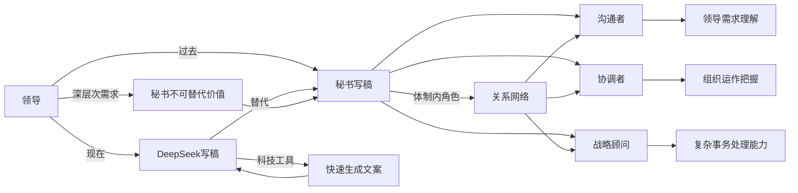

过去，领导让秘书写稿，现在，秘书让deepseek给领导写稿；如果领导可以直接让deepseek写稿，秘书依然不会失业，因为其价值，不仅仅是写稿，体制内的人，懂的都懂。

在这个时代，秘书的价值，不仅仅是写稿，而是体现领导存在的价值。

过去，领导让秘书写稿，秘书是桥梁，是将领导意图与文字表达之间的纽带，负责将想法变为文案，承载着领导的决策和声音。然而，随着技术的进步，今天我们看到了一种新的现象：秘书让DeepSeek来为领导写稿。人工智能的出现，赋予了领导们更高效的工具，能够迅速地生成各种文案，节省了大量的时间和精力。

然而，这并不意味着秘书的价值就此消失。因为在现代的工作环境中，秘书的作用远不止于写稿。秘书不仅仅是一个执行者，更是一个沟通者、协调者、战略顾问，和领导之间的心灵桥梁。尤其在体制内，秘书的价值体现在其对内外部复杂关系的熟悉、对领导需求的深刻理解以及对组织运作的全面把握。

领导虽然可以直接通过DeepSeek来写稿，但深层次的政治敏感性、沟通技巧、决策分析，都是机器所无法替代的。秘书了解领导的喜好、风格和战略意图，在日常工作中扮演着不可替代的角色。因此，尽管科技发展了，秘书的地位依然牢固，因为其背后的深厚专业能力和人际关系的网络，是任何机器无法轻易复制的。

虽然技术让工作变得更高效，但秘书的“魔力”依然存在。毕竟，DeepSeek可以写出一篇漂亮的文案，却永远无法理解领导“今天心情不好”的微妙情绪；它能处理大数据，却无法在关键时刻递上一杯热茶。秘书的真正价值，就像是隐藏在深山中的宝藏——你可能一时看不到，但一旦缺了它，马上就会感受到那种“怎么少了点什么”的失落感。所以，虽然AI能够帮忙写稿，但如果你问我秘书的工作会不会消失，我只能说：那是不可能的，除非DeepSeek开始懂得送花和讲笑话！