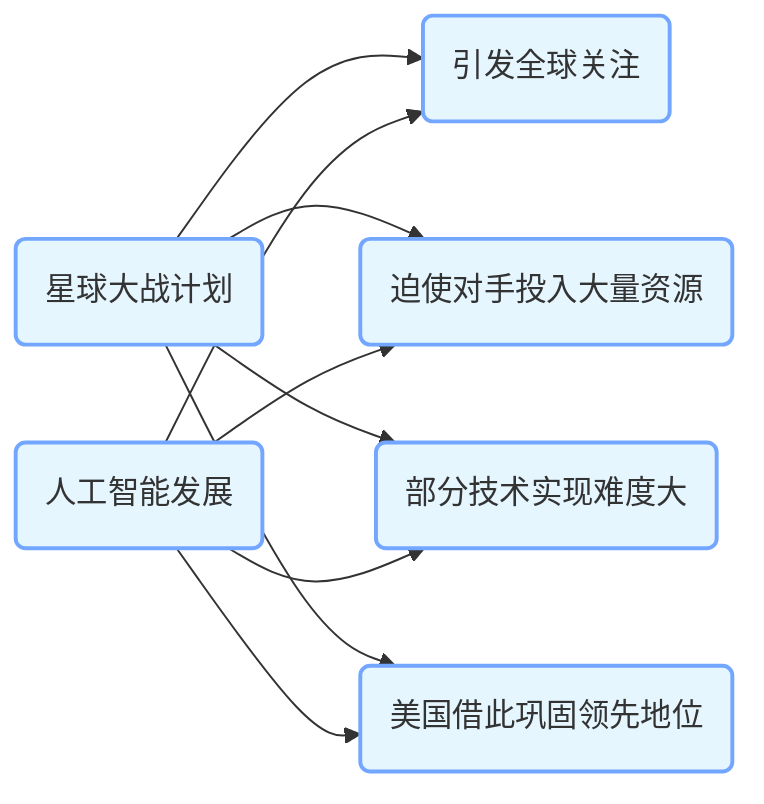
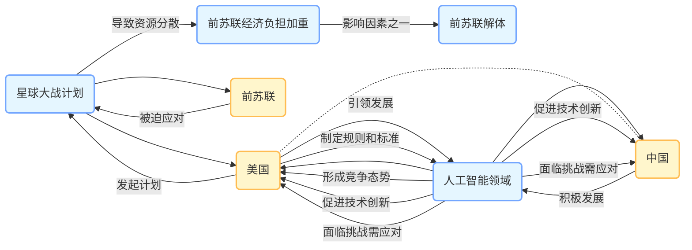

近年来，人工智能（AI）成为全球瞩目的焦点，技术飞速发展，应用场景不断拓展，从医疗到金融，从交通到娱乐，似乎无孔不入。但在这一片繁荣景象背后，有人提出了一个大胆且颇具争议的观点：人工智能或许是美国继星球大战计划之后，又一个拖死竞争对手的骗局。

回顾历史，20世纪80年代，美国提出星球大战计划。当时，美国宣称要建立一个多层次、多手段的反弹道导弹系统，用于抵御苏联可能发动的核攻击。这一计划听起来雄心勃勃且极具前瞻性，瞬间引发全球关注。苏联为了不落后于美国，在自身经济并不宽裕的情况下，投入大量资源进行相关研究和技术开发。

苏联在这场“太空竞赛”中，不断加大对军事航天、导弹防御等领域的投入，将原本就紧张的经济资源进一步分散。大量的科研力量、资金和物资被调配到星球大战计划相关的项目中。然而，美国的星球大战计划很大程度上是一种战略威慑手段，部分技术在当时甚至此后很长一段时间都难以真正实现。最终，苏联因长期的高额投入，经济负担愈发沉重，各方面发展失衡，这成为苏联解体的众多因素之一。美国则凭借自身相对雄厚的经济实力和灵活的战略调整，并未受到太大的负面影响，反而巩固了其在军事和科技领域的领先地位。

如今，人工智能的发展态势与当年的星球大战计划有着相似之处。美国凭借其在科技领域的先发优势和强大的资金、人才储备，在人工智能领域大力布局，引领着全球人工智能的发展潮流。美国的科技巨头们纷纷投入大量资金用于人工智能技术的研发，在算法、芯片、数据等核心领域不断取得突破。从谷歌的深度学习框架TensorFlow，到OpenAI推出的GPT系列语言模型，美国在人工智能领域的成果令人瞩目。

美国大力推动人工智能发展，在全球范围内营造出一种“人工智能决定未来”的紧迫感。各国为了在未来的科技竞争中不被淘汰，纷纷跟进，加大对人工智能的投入。许多国家将大量的科研资金、顶尖人才汇聚到人工智能领域，期望在这一新兴赛道上占据一席之地。

但值得思考的是，人工智能的发展是否真的如表面这般一帆风顺，是否真的需要如此不计成本地投入？目前，虽然人工智能在某些特定领域取得了显著成果，如图像识别、语音助手等，但在通用人工智能、伦理道德、安全风险等关键问题上，仍面临诸多挑战。

一方面，人工智能的发展需要海量的数据支持和强大的计算能力。训练一个大型的人工智能模型，不仅需要收集和整理大量的数据，还需要耗费大量的能源用于计算和存储。这对于许多资源有限的国家来说，是一个巨大的负担。为了满足人工智能发展的数据需求，一些国家不得不投入大量资金用于数据采集和存储设施建设；为了提升计算能力，又要花费巨额资金购买先进的芯片和服务器，这些都给国家的财政带来了沉重压力。

另一方面，人工智能的应用也带来了一系列复杂的问题。例如，人工智能在就业市场引发的冲击，大量重复性、规律性的工作岗位可能被人工智能取代，导致失业率上升；在隐私保护方面，人工智能系统在收集和处理数据的过程中，可能会侵犯个人隐私；在伦理道德层面，人工智能的决策过程缺乏透明度，可能会导致不公平的结果。解决这些问题需要投入大量的人力、物力和时间，而目前还没有一套完善的解决方案。

美国在推动人工智能发展的过程中，其背后的战略意图值得深入分析。美国凭借其在人工智能领域的领先地位，通过制定行业标准、掌控关键技术和数据资源，进一步巩固自身的全球霸权。美国的科技公司在全球范围内推广人工智能技术和产品，不仅获取了巨额的经济利益，还掌握了大量用户数据，这些数据又成为进一步提升其人工智能技术的关键资源。

对于其他国家而言，盲目跟风投入人工智能研发，可能会陷入一场“无底洞”式的竞争。在这场竞争中，一些国家可能会因为过度投入而忽视了自身在其他关键领域的发展，如基础科学研究、传统产业升级等。当这些国家在人工智能领域投入大量资源却无法取得实质性突破，或者在国际竞争中难以与美国抗衡时，可能会面临经济发展受阻、产业结构失衡等问题，就如同当年苏联在星球大战计划中的遭遇一样。

当然，这并不意味着人工智能本身是毫无价值的，相反，它具有巨大的发展潜力和应用前景。但在发展人工智能的过程中，各国需要保持清醒的头脑，理性看待人工智能的发展，避免被美国的战略节奏所左右。要根据自身的国情和发展需求，制定合理的人工智能发展战略，平衡好人工智能与其他领域的发展关系，确保在科技竞争的浪潮中稳健前行。 
