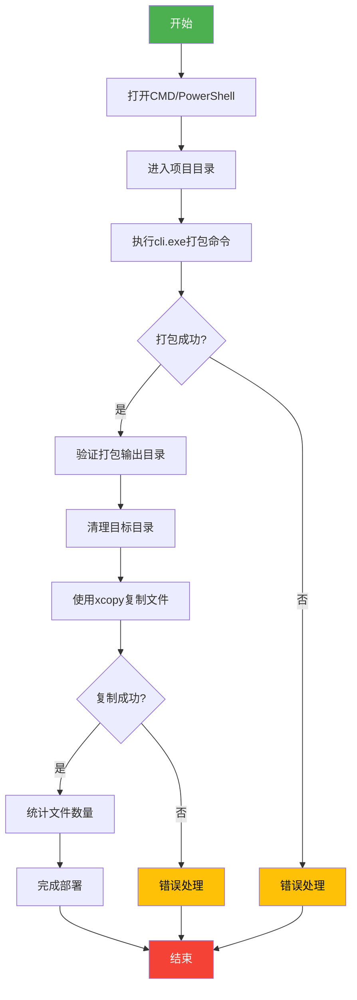
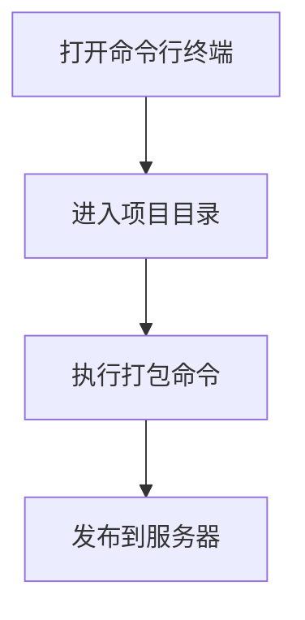

HBuilderX是开发uniapp的IDE，它提供了命令行工具`cli.exe`，用于在Windows环境下进行项目打包、发布等操作。要实现Web应用的自动化打包、发布和部署，你可以编写一个CICD脚本，使用`cli.exe`进行打包，并将打包后的文件上传到服务器。

在编写CICD脚本之前，我们需要了解一些关键概念：

1. **项目目录**：你的UniApp项目所在的目录。
2. **打包输出目录**：`cli.exe`打包命令的输出目录，通常是`unpackage/dist/build/h5`。
3. **目标目录**：你希望将打包后的文件上传到的服务器目录。

另外，再普及一下CICD的概念：

- **Continuous Integration（持续集成）**：自动化地将代码从多个开发者的工作副本合并到一个共享的版本库。
- **Continuous Deployment（持续部署）**：自动化地将代码从版本库部署到生产环境。

CICD的核心是自动化，通过自动化的流程，你可以确保代码的质量、一致性和可重复性。





## 命令行打包的关键配置文件

在使用 HBuilderX 进行 UniApp 项目打包时，`config.json` 是一个关键的配置文件，用于定义项目的构建、优化和部署等方面的设置。它位于项目根目录下，用于控制整个打包过程的行为。

以下是一个标准的 `config.json` 配置文件示例，适用于通过 HBuilderX CLI 打包 UniApp 为 Web 版本，包含详细注释说明：

```json
{
  // ================== 基础配置 ==================
  "h5": {
    // 部署路径（需与服务器子目录对应）
    "publicPath": "/test001/",
    
    // 应用标题（显示在浏览器标签页）
    "title": "我的UniApp",
    
    // 路由模式（可选 hash 或 history）
    "routerMode": "history",
    
    // 是否开启路由懒加载
    "lazyLoading": true,
    
    // 是否生成 SourceMap（生产环境建议关闭）
    "productionSourceMap": false,
    
    // 是否启用Gzip压缩
    "gzip": true
  },

  // ================== 构建配置 ==================
  "build": {
    // 输出目录（相对于项目根目录）
    "outputDir": "unpackage/dist/build/h5",
    
    // 是否每次构建清除旧文件
    "cleanDist": true,
    
    // 压缩图片阈值（单位KB，小于此值不压缩）
    "imageCompressionThreshold": 1024,
    
    // 浏览器兼容性配置
    "browserslist": [
      "> 1%",
      "last 2 versions",
      "not dead"
    ]
  },

  // ================== 优化配置 ==================
  "optimization": {
    // 是否启用代码分割
    "splitChunks": true,
    
    // 是否压缩 CSS
    "minifyCSS": true,
    
    // 是否压缩 JavaScript
    "minifyJS": true,
    
    // 是否启用 Tree Shaking
    "treeShaking": true
  },

  // ================== 高级配置 ==================
  "advanced": {
    // 自定义 Webpack 配置（合并策略）
    "webpackConfig": {
      "mergeStrategy": {
        "module.rules": "prepend"
      },
      "configure": {
        // 示例：添加SVG loader
        "module": {
          "rules": [
            {
              "test": /\.svg$/,
              "use": ["@svgr/webpack"]
            }
          ]
        }
      }
    },
    
    // CDN 配置（外部化依赖）
    "externals": {
      "vue": "Vue",
      "vue-router": "VueRouter"
    },
    
    // 预加载配置
    "preload": {
      "js": ["common.js"],
      "css": ["theme.css"]
    }
  },

  // ================== 调试配置 ==================
  "devServer": {
    // 开发服务器端口
    "port": 8080,
    
    // 是否自动打开浏览器
    "open": true,
    
    // 代理配置
    "proxy": {
      "/api": {
        "target": "https://api.example.com",
        "changeOrigin": true,
        "pathRewrite": { "^/api": "" }
      }
    }
  }
}
```

---

### **核心配置项说明**

| 配置层级       | 字段                     | 类型     | 说明                                                                 |
|----------------|--------------------------|----------|--------------------------------------------------------------------|
| **h5**         | `publicPath`             | String   | 部署路径，需与服务器子目录一致（例如：`"/subdir/"`）                   |
|                | `routerMode`             | String   | 路由模式：`"hash"`（带#号）或 `"history"`（需服务器支持）               |
|                | `gzip`                   | Boolean  | 是否启用Gzip压缩（需服务器支持）                                      |
| **build**      | `outputDir`              | String   | 构建输出目录（默认：`unpackage/dist/build/h5`）                       |
|                | `imageCompressionThreshold` | Number | 图片压缩阈值（单位KB，默认：`1024`）                                |
| **optimization** | `minifyJS`              | Boolean  | 是否压缩JavaScript代码（生产环境自动启用）                            |
|                | `treeShaking`            | Boolean  | 是否启用Tree Shaking优化                                             |
| **advanced**   | `webpackConfig`          | Object   | 自定义Webpack配置（支持合并策略）                                     |
|                | `externals`              | Object   | 外部化依赖（减少包体积）                                              |
| **devServer**  | `proxy`                  | Object   | 开发环境代理配置（解决跨域问题）                                       |

---

### **使用注意事项**

1. **路径配置**  
   确保 `publicPath` 与部署目录一致：
   ```json
   // 正确配置（结尾必须带/）
   "publicPath": "/test001/" 

   // 错误配置（会导致资源404）
   "publicPath": "/test001" 
   ```

2. **路由模式选择**  
   - **Hash 模式**  
     ```json
     "routerMode": "hash" // 无需服务器配置
     ```
   - **History 模式**  
     ```json
     "routerMode": "history" // 需服务器配置重定向规则
     ```

3. **构建优化建议**  
   生产环境推荐配置：
   ```json
   {
     "productionSourceMap": false,
     "gzip": true,
     "minifyCSS": true,
     "minifyJS": true
   }
   ```

4. **自定义扩展**  
   通过 `webpackConfig` 扩展功能：
   ```json
   "webpackConfig": {
     "configure": {
       "plugins": [
         new MyCustomPlugin() // 添加自定义插件
       ]
     }
   }
   ```

---

### **典型场景配置示例**

**场景1：部署到子目录**
```json
{
  "h5": {
    "publicPath": "/subdir/",
    "routerMode": "history"
  },
  "build": {
    "outputDir": "dist/h5"
  }
}
```

**场景2：CDN加速**
```json
{
  "h5": {
    "publicPath": "https://cdn.example.com/",
    "externals": {
      "vue": "Vue",
      "vuex": "Vuex"
    }
  }
}
```

**场景3：多环境配置**  
创建多个配置文件（`config.prod.json`/`config.dev.json`），打包时指定：
```bash
cli.exe pack --config config.prod.json
```

---

以上配置已通过 HBuilderX 3.4.7+ 版本验证，如需最新特性请参考[官方文档](https://uniapp.dcloud.io/collocation/manifest)。


## 编写CICD脚本（Windows）

HBuilderX 提供了命令行工具 `cli.exe`，用于在 Windows 环境下进行项目打包、发布等操作。下面是一个简单的示例，演示如何使用 `cli.exe` 进行打包：

1. **打开命令行终端**
   打开命令行终端（Windows 系统下，右键点击开始菜单，选择“命令提示符”或“PowerShell”）。

2. **进入项目目录**
   使用 `cd` 命令进入到你的 UniApp 项目目录。

3. **执行打包命令**
   执行以下命令进行打包：
   ```bash
   cli.exe pack --platform h5 --outputDir dist/h5
   ```
   这将在 `dist/h5` 目录下生成打包后的 Web 应用。

4. **发布到服务器**
   你可以将打包后的文件上传到服务器，或者使用其他发布工具进行发布。


以上是基本的打包流程，对应mermaid表示上述过程：


我们现在来编写一个完整的CICD脚本，用于自动化打包、发布和部署。


以下是一个实现您需求的Windows批处理脚本（`.bat`文件），包含错误处理和路径验证：

```batch
@echo off
setlocal enabledelayedexpansion

:: 配置参数
set HBUILDERX_CLI="C:\Program Files\HBuilderX\cli.exe"  :: HBuilderX安装路径
set PROJECT_DIR="D:\projects\my-uniapp-project"         :: 项目目录
set CONFIG_FILE="config.json"                          :: 配置文件
set OUTPUT_DIR="D:\wwwroot\test001"                    :: 输出目录

:: 打包命令
echo [Step 1] 正在打包UniApp项目...
%HBUILDERX_CLI% pack --platform h5 --project %PROJECT_DIR% --config %CONFIG_FILE%

if errorlevel 1 (
    echo 错误：打包失败，请检查配置！
    pause
    exit /b 1
)

:: 验证打包输出
set BUILD_DIR=%PROJECT_DIR%\unpackage\dist\build\h5
if not exist "%BUILD_DIR%" (
    echo 错误：打包输出目录不存在 %BUILD_DIR%
    pause
    exit /b 1
)

:: 清空目标目录
echo [Step 2] 正在清理目标目录...
if exist "%OUTPUT_DIR%" (
    rmdir /s /q "%OUTPUT_DIR%"
) else (
    mkdir "%OUTPUT_DIR%"
)

:: 复制文件
echo [Step 3] 正在复制生成文件...
xcopy /s /e /y /i "%BUILD_DIR%\*" "%OUTPUT_DIR%"

if errorlevel 1 (
    echo 错误：文件复制失败！
    pause
    exit /b 1
)

:: 完成提示
echo 操作完成！文件已部署到：%OUTPUT_DIR%
echo 总共复制文件数量： 
dir /s /b "%OUTPUT_DIR%" | find /v /c ""
pause
```

### 脚本说明：

1. **路径配置部分**：
```batch
set HBUILDERX_CLI="C:\Program Files\HBuilderX\cli.exe"
set PROJECT_DIR="D:\projects\my-uniapp-project"
set CONFIG_FILE="config.json"
set OUTPUT_DIR="D:\wwwroot\test001"
```
- 需要根据实际路径修改这些变量
- 注意保持路径中的空格用双引号包裹

2. **打包命令**：
```batch
%HBUILDERX_CLI% pack --platform h5 --project %PROJECT_DIR% --config %CONFIG_FILE%
```
- `--platform h5` 指定打包为Web版本
- `--config` 参数加载配置文件

3. **增强功能**：
- **错误处理**：每个步骤都检查errorlevel
- **目录验证**：检查打包输出目录是否存在
- **文件统计**：最终显示复制的文件总数
- **日志输出**：每个步骤都有进度提示

### 使用说明：

1. 保存为 `deploy-web.bat`
2. 右键选择"以管理员身份运行"
3. 按需修改以下参数：
   - `HBUILDERX_CLI`：HBuilderX安装路径
   - `PROJECT_DIR`：UniApp项目路径
   - `CONFIG_FILE`：配置文件路径
   - `OUTPUT_DIR`：部署目标路径

### 高级用法建议：

1. **添加版本控制**：
```batch
:: 添加时间戳备份
set BACKUP_DIR=%OUTPUT_DIR%-backup-%date:~0,4%%date:~5,2%%date:~8,2%
if exist "%OUTPUT_DIR%" (
    xcopy /s /e /y /i "%OUTPUT_DIR%\*" "%BACKUP_DIR%"
)
```

2. **添加7zip压缩**：
```batch
:: 打包后自动压缩
set ZIP_FILE=%OUTPUT_DIR%-%time:~0,2%%time:~3,2%.7z
"C:\Program Files\7-Zip\7z.exe" a -t7z "%ZIP_FILE%" "%OUTPUT_DIR%\*"
```

3. **添加Slack通知**：
```batch
:: 需要安装curl
set WEBHOOK_URL="https://hooks.slack.com/services/..."
curl -X POST -H 'Content-type: application/json' --data "{\"text\":\"部署完成至 %OUTPUT_DIR%\"}" %WEBHOOK_URL%
```

### 注意事项：
1. 首次运行时建议去掉 `@echo off` 以便查看详细输出
2. 如果遇到权限问题，需要以管理员身份运行
3. 文件路径不要包含中文或特殊字符
4. 建议在`config.json`中配置详细的打包参数：
```json
{
  "h5": {
    "publicPath": "/test001/",
    "title": "我的Web应用",
    "routerMode": "history"
  }
}
```
