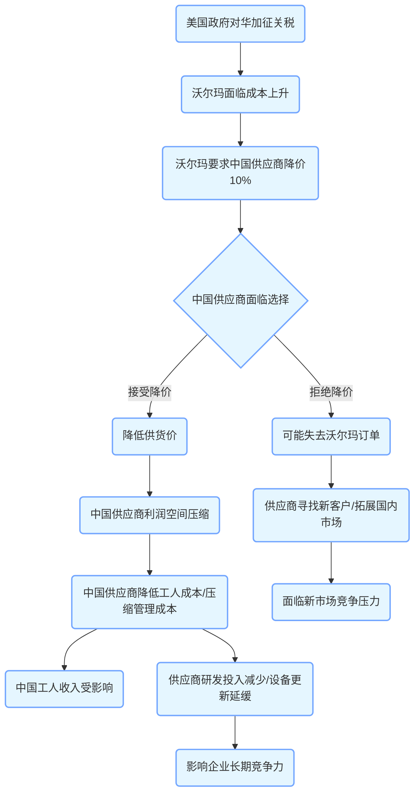

沃尔玛总部大楼的玻璃幕墙折射着刺眼的阳光，这座零售帝国的采购指令正通过越洋邮件不断发往珠三角的工厂。当美国对华加征的10%关税如约而至，全球最大零售商没有选择调整货架价格，而是向中国供应商发出了降价10%的"最后通牒"。这场看似寻常的商业博弈，撕开了全球产业链利益分配失衡的隐秘伤口。虽然中国的软件行业已经不是之前美国的廉价市场，我们依然可以感受到在国际和国内两个市场的供应链中相似的处境。沃尔玛关税转嫁背后的供应链困局，恰恰揭露了中国制造业的"内卷式生存"与全球贸易的残酷真相。

## 一、关税大棒下的"价格游戏"

2023年3月，美国零售巨头沃尔玛向中国供应商发出通牒：要求将供货价降低10%，以消化美国对华加征的10%关税成本。这一纸通知，如同投入平静湖面的巨石，在中国制造业圈激起千层浪。数据显示，中国出口美国的商品中，约60%的关税成本最终由中国企业承担。这意味着，在"中国制造"的标签背后，中国工人正在默默承受着贸易摩擦的隐性代价。

## 二、中国供应商的"内卷式生存"
在浙江义乌的小商品市场，一家经营圣诞装饰品的企业负责人算了一笔账："我们的利润率已经从2018年的8%降到现在的3%，沃尔玛要求再降10%，相当于每件产品要倒贴5毛钱。"这种情况并非个案，中国机电产品进出口商会的调查显示，家电行业平均利润率已跌破2%，而服装行业更是低至0.8%。

这种"内卷式竞争"正在掏空制造业的利润空间。在广东东莞，某电子元件厂厂长无奈地说："为了保住订单，我们不得不接受客户的降价要求，但原材料价格每年都在涨，工人工资也不能降，只能通过压缩管理成本和延长工时来维持。"这种饮鸩止渴的生存方式，正在透支中国制造业的未来。

## 三、关税政策的"蝴蝶效应"
传统观点认为，关税增加会直接推高进口国物价。但现实远比理论复杂。美国彼得森国际经济研究所的研究表明，关税成本中只有30%由美国消费者承担，剩下的70%被进口商和零售商通过压低采购价转嫁给了出口国企业。

沃尔玛的做法正是这种"成本转嫁"的典型案例。作为全球最大的零售商，沃尔玛拥有强大的议价能力，其在中国的采购额每年超过500亿美元。这种不对称的谈判地位，使得中国供应商在面对不合理要求时往往只能选择妥协。

## 四、被忽视的"隐性剥削"
当我们讨论关税对美国消费者的影响时，往往忽略了另一端的中国工人。根据中国商务部的数据，加工贸易直接带动了超过3000万人就业。这些产业工人的收入，正随着供应商利润的压缩而受到威胁。

在江西某服装厂，工人李大姐每月工资4500元，已经三年没有涨过。"听说美国加关税了，但我们的工资反而降了200块，说是厂里利润不好。"这种"隐性剥削"，正在通过全球供应链链条悄然发生。

## 五、破局之路：从"制造大国"到"制造强国"
面对这种困境，中国制造业必须加快转型升级的步伐。海尔集团通过自主创新，将冰箱的核心部件成本降低了30%，在北美市场的占有率提升至15%。这种技术突破，让企业在谈判桌上有了更多话语权。

政府层面也在积极行动。2023年新修订的《鼓励外商投资产业目录》中，高端装备制造、新能源等领域被列为重点支持对象。同时，人民币跨境支付系统的完善，也在帮助企业规避汇率风险。

## 六、全球化供应链的重新洗牌
这场关税博弈，本质上是全球供应链的重新洗牌。越南、墨西哥等国正在成为新的制造业转移目的地。但中国制造业的优势依然明显：完整的产业链配套、高素质的产业工人队伍、以及超大规模的国内市场。

某跨国企业采购总监坦言："虽然东南亚的劳动力成本低，但中国的生产效率是他们的3倍。短期内，中国在全球供应链中的地位难以被取代。"

纽约证券交易所的钟声照常响起，沃尔玛股价在财报发布后上涨2.3%，而千里之外东莞工厂的机器仍在轰鸣。这场静默的关税转嫁战，本质是全球经济治理失序的微观投射。当中国制造穿越四十年代工积累，站上转型升级的历史隘口，如何突破价值链锁链、重构利益分配格局，已不仅是商业命题，更关乎全球经济秩序的深刻变革。

沃尔玛的关税转嫁事件，暴露了中国制造业在全球价值链中的低端锁定问题。但危机也是转机，它倒逼中国企业加快技术创新和品牌建设，推动产业升级。正如华为轮值董事长郭平所说："没有伤痕累累，哪来皮糙肉厚，英雄自古多磨难。"当中国制造业挺过这场风雨，必将迎来更加光明的未来。

这场贸易摩擦，不仅是对中国制造业的考验，更是对全球经济治理体系的拷问。在全球化遭遇逆流的今天，如何构建公平合理的贸易秩序，已经成为摆在各国面前的共同课题。而中国制造业的转型之路，也将为全球价值链的重构提供重要启示。

