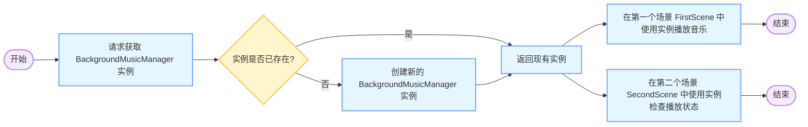

软件开发的设计模式有很多，常用的几种设计模式有：

1. **单例模式**：确保一个类只有一个实例，并提供一个全局访问点。
2. **工厂模式**：定义一个用于创建对象的接口，让子类决定实例化哪一个类。
3. **观察者模式**：定义对象之间的一对多依赖，当一个对象状态改变时，它的所有依赖者都会收到通知并自动更新。
4. **策略模式**：定义一系列算法，将每个算法封装起来，并使它们可以相互替换。
5. **装饰器模式**：动态地给对象添加一些额外的职责，而不改变其结构。

在 Laya 引擎中，单例模式常用于管理游戏中的全局资源，比如音乐、音效等。

## 1 单例模式的实现原理

我们使用单例模式来管理背景音乐，单例的特性就是在整个应用程序的生命周期内只会存在一个实例。所以无论你在哪个 `Scene` 中，只要使用相同的 `getInstance` 方法和相同的参数（这里是音乐文件的 URL），就可以获取到同一个 `BackgroundMusicManager` 实例。



下面代码展示展示如何在第二个 `Scene` 中获取上一个单例，并读取当前音乐是否正在播放：

### 1.1 单例类 `BackgroundMusicManager`
```typescript
import { Laya } from "Laya";
import { SoundManager } from "laya/media/SoundManager";
import { Handler } from "laya/utils/Handler";

class BackgroundMusicManager {
    private static instance: BackgroundMusicManager;
    private musicUrl: string;

    private constructor(musicUrl: string) {
        this.musicUrl = musicUrl;
        SoundManager.setMusicVolume(1.0);
    }

    public static getInstance(musicUrl: string): BackgroundMusicManager {
        if (!this.instance) {
            this.instance = new BackgroundMusicManager(musicUrl);
        }
        return this.instance;
    }

    public play() {
        Laya.loader.load(this.musicUrl, Handler.create(this, () => {
            SoundManager.playMusic(this.musicUrl, 0);
        }));
    }

    public isMusicPlaying(): boolean {
        return SoundManager.isMusicPlaying();
    }
}
```

### 1.2 第一个场景 `FirstScene`
```typescript
import { Laya } from "Laya";
import { Scene } from "laya/display/Scene";
import { Button } from "laya/ui/Button";
import { Browser } from "laya/utils/Browser";
import { BackgroundMusicManager } from "./BackgroundMusicManager";

export class FirstScene extends Scene {
    constructor() {
        super();
        this.init();
    }

    private init() {
        Laya.init(Browser.width, Browser.height);
        Laya.stage.scaleMode = Laya.Stage.SCALE_FULL;

        const startBtn = new Button();
        startBtn.size(200, 50);
        startBtn.label = "开始游戏";
        startBtn.center();
        this.addChild(startBtn);

        startBtn.on(Laya.Event.CLICK, this, () => {
            const musicManager = BackgroundMusicManager.getInstance("res/music/background.mp3");
            musicManager.play();
            this.gotoNextScene();
        });
    }

    private gotoNextScene() {
        // 跳转场景逻辑
        const secondScene = new SecondScene();
        Laya.stage.addChild(secondScene);
        this.removeSelf();
    }
}
```

### 1.3 第二个场景 `SecondScene`
```typescript
import { Laya } from "Laya";
import { Scene } from "laya/display/Scene";
import { BackgroundMusicManager } from "./BackgroundMusicManager";

export class SecondScene extends Scene {
    constructor() {
        super();
        this.init();
    }

    private init() {
        const musicManager = BackgroundMusicManager.getInstance("res/music/background.mp3");
        const isPlaying = musicManager.isMusicPlaying();
        console.log("当前音乐是否正在播放:", isPlaying);
    }
}
```

### 1.4 代码解释
1. **单例类 `BackgroundMusicManager`**：
    - `getInstance` 方法确保每次调用时，如果实例已经存在，就返回同一个实例；如果不存在，则创建一个新实例。
    - `isMusicPlaying` 方法用于检查当前音乐是否正在播放。

2. **第一个场景 `FirstScene`**：
    - 在用户点击按钮时，调用 `BackgroundMusicManager` 的 `play` 方法播放音乐。
    - 然后跳转到第二个场景 `SecondScene`。

3. **第二个场景 `SecondScene`**：
    - 在 `init` 方法中，使用相同的 `getInstance` 方法和相同的音乐文件 URL 获取单例实例。
    - 调用 `isMusicPlaying` 方法检查当前音乐是否正在播放，并将结果打印到控制台。

通过这种方式，你可以在不同的 `Scene` 中获取同一个 `BackgroundMusicManager` 实例，并读取当前音乐的播放状态。


## 2 单例模式实战项目代码


### 2.1 背景音乐播放控制类

我们通过单例模式在多个Laya.Scene之间传递音乐是否播放，当前是否静音这2个状态，以及对播放音乐的控制。

需要补充的知识，是在LayaAir 3 中 playMusic 和 playSound 这2个方法的区别，playMusic 是播放背景音乐，playSound 是播放音效。前者在同一个时间点只能播放一个背景音乐，后者可以同时播放多个音效。


```typescript
const { regClass } = Laya;
//import { SoundManager } from "laya/media/SoundManager";

export class BackgroundMusicManager {
    private static instance: BackgroundMusicManager;
    private musicUrl: string;

    private _is_music_play: boolean = false; //是否播放音乐

    private _is_music_mute: boolean = false; //是否静音

    private constructor(musicUrl: string) {
        this.musicUrl = musicUrl;
    }

    public is_music_play(): boolean {
        return this._is_music_play; 
    }

    public is_music_mute(): boolean {
        return this._is_music_mute; 
    }

    public static getInstance(musicUrl: string): BackgroundMusicManager {
        if (!this.instance) {
            this.instance = new BackgroundMusicManager(musicUrl);
        }
        return this.instance;
    }

    public play() {
        console.log("播放背景音乐 ===>>> ", this.musicUrl);
        Laya.SoundManager.playMusic(this.musicUrl, 0); // 0 表示循环播放
        //Laya.SoundManager.playSound(this.musicUrl, 0); // 0 表示循环播放

        //调整播放的声音大小
        Laya.SoundManager.setMusicVolume(0);

        // 设置标志位表示音乐正在播放
        this._is_music_play = true;
        this._is_music_mute = true;
    }

    public setMusicVolume(volume: number) {
        Laya.SoundManager.setMusicVolume(volume);

        if (volume > 0) {
            this._is_music_mute = false; 
        }
        else {
            this._is_music_mute = true; 
        }

    }

    public stop() {
        Laya.SoundManager.stopMusic();

        this._is_music_play = false;
    }
}

```

### 2.2 启动场景中的代码

```typescript

const { regClass } = Laya;
import { LoadingRTBase } from "./LoadingRT.generated";

import { BackgroundMusicManager } from "./BackgroundMusicManager";

@regClass()
export class LoadingRT extends LoadingRTBase {

    //private _is_music_play: boolean = false; //是否播放音乐
    private _musicManager: BackgroundMusicManager; //音乐管理单例实例

    onEnable(): void {

        // 定义背景音乐文件的路径
        const soundUrl = "res/sounds/introduce_compressed.mp3";

        // 获取BackgroundMusicManager的单例实例
        // 并传入音乐文件路径
        this._musicManager = BackgroundMusicManager.getInstance(soundUrl);

        // 在整个场景上设置点击事件监听器
        // 用于在第一次点击时初始化音乐播放
        this.on(Laya.Event.CLICK, this, () => {
            // 检查音乐是否还未播放
            if (!this._musicManager.is_music_play()) {

                // 开始播放背景音乐
                this._musicManager.play();

                // 触发静音按钮点击事件以设置初始音量状态
                this.mute.event(Laya.Event.CLICK);    
            }
            
        });

```

### 2.3 跳转到主场景中

```typescript

const { regClass } = Laya;
import { GameRTBase } from "./GameRT.generated";
import { abot_data } from "./abot_data";

import { BackgroundMusicManager } from "./BackgroundMusicManager";

@regClass()
export class GameRT extends GameRTBase {

   private _musicManager: BackgroundMusicManager; //音乐管理单例实例


   private _loadAndPlaySound() {

      setTimeout(() => {
        console.log("GameRT _loadAndPlaySound 开始播放声音");
        // 这里假设声音文件名为 example.mp3，你需要替换为实际的文件名
        //const soundUrl = "res/sounds/introduce_compressed.mp3";
        // 播放声音，第二个参数为播放次数，1 表示播放一次
        //Laya.SoundManager.playSound(soundUrl, 1);
      }, 3000);


      // 定义背景音乐文件的路径
      const soundUrl = "res/sounds/introduce_compressed.mp3";

      // 获取BackgroundMusicManager的单例实例
      // 并传入音乐文件路径
      this._musicManager = BackgroundMusicManager.getInstance(soundUrl);

      console.log('this._musicManager is_music_play ===>>>> ', this._musicManager.is_music_play());
      console.log('this._musicManager is_music_mute ===>>>> ', this._musicManager.is_music_mute());

      if (!this._musicManager.is_music_mute()) {
        this.volume.visible = true;
        this.mute.visible = false;
      }
      else {
        this.volume.visible = false;
        this.mute.visible = true;
      }


    }

    onEnable(): void {

      console.log("GameRT onEnable .....");


      // 加载并播放声音
      this._loadAndPlaySound();

```


