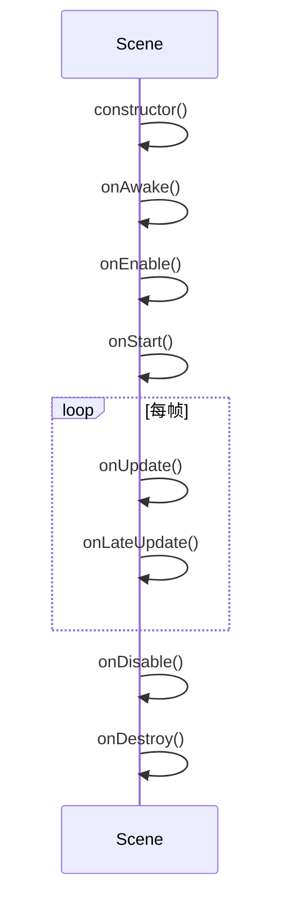
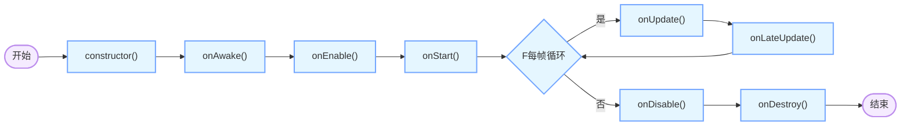

LayaAir提供Unity 3D的场景功能，但是在LayaAir 3中，`Laya.Scene` 类的功能更加丰富，并且与Unity 3D的场景功能有一些区别。在LayaAir 3中，`Laya.Scene` 类是一个场景类，它可以包含多个子节点（如游戏对象），并且可以添加组件（如脚本组件、动画组件等）。

先上LayaAir的官方文档：

[LayaAir官方文档](https://layaair.com/3.x/doc/)


## 1 Laya.Scene的函数调用顺序

下面是用 Mermaid 绘制的 LayaAir 3 中 `Laya.Scene` 生命周期函数调用顺序的时序图：

#### 解释

1. 首先调用 `constructor()` 进行场景实例的构造。
2. 接着依次调用 `onAwake()`、`onEnable()` 和 `onStart()` 完成初始化相关操作。
3. 之后进入每帧循环，每帧都会调用 `onUpdate()` 和 `onLateUpdate()` 进行场景更新。
4. 当场景被禁用时调用 `onDisable()`。
5. 最后在场景销毁时调用 `onDestroy()`。


以下是对应的 Mermaid 流程图：


#### 解释
1. 流程从开始节点进入，首先执行 `constructor()`。
2. 然后按顺序执行 `onAwake()`、`onEnable()` 和 `onStart()`。
3. 进入每帧循环判断，若处于循环中则依次执行 `onUpdate()` 和 `onLateUpdate()`，循环结束后继续执行后续步骤。
4. 场景禁用时执行 `onDisable()`。
5. 最后执行 `onDestroy()` 并结束流程。

这些图表清晰展示了 `Laya.Scene` 生命周期函数的调用顺序，有助于理解和使用这些函数。 


## 2 主要生命周期函数的具体说明

在 LayaAir 3 里，`Laya.Scene` 是场景类，它有一些重要的生命周期函数，下面为你详细介绍这些函数及其使用场景。

### 1. `constructor()`
- **说明**：这是类的构造函数，在创建 `Laya.Scene` 实例时会被调用。通常用于进行一些初始化操作，像初始化变量、绑定事件等。
- **示例代码**：
```typescript
import { Laya } from "Laya";
import { Scene } from "laya/display/Scene";

export class MyScene extends Scene {
    constructor() {
        super();
        // 初始化操作
        this.initData();
    }

    private initData() {
        // 初始化数据
    }
}
```

### 2. `onAwake()`
- **说明**：在场景实例被创建并且所有子节点和组件都初始化完成之后调用。此函数可用于完成一些依赖子节点和组件的初始化工作。
- **示例代码**：
```typescript
import { Laya } from "Laya";
import { Scene } from "laya/display/Scene";

export class MyScene extends Scene {
    constructor() {
        super();
    }

    onAwake() {
        // 获取子节点并进行操作
        const childNode = this.getChildByName("childNode");
        if (childNode) {
            // 对 childNode 进行操作
        }
    }
}
```

### 3. `onEnable()`
- **说明**：当场景被启用（激活）时调用。例如，当场景被添加到舞台或者从隐藏状态变为显示状态时，该函数会被触发。可用于启动一些与场景显示相关的逻辑，如播放动画、开始计时等。
- **示例代码**：
```typescript
import { Laya } from "Laya";
import { Scene } from "laya/display/Scene";

export class MyScene extends Scene {
    constructor() {
        super();
    }

    onEnable() {
        // 启动动画
        const anim = this.getComponent(Laya.Animator);
        if (anim) {
            anim.play("idle");
        }
    }
}
```

### 4. `onStart()`
- **说明**：在场景第一次被更新之前调用，且仅调用一次。通常用于进行一些只需要执行一次的初始化工作，如加载资源、设置初始状态等。
- **示例代码**：
```typescript
import { Laya } from "Laya";
import { Scene } from "laya/display/Scene";
import { Handler } from "laya/utils/Handler";

export class MyScene extends Scene {
    constructor() {
        super();
    }

    onStart() {
        // 加载资源
        Laya.loader.load(["res/image.png"], Handler.create(this, () => {
            // 资源加载完成后的操作
        }));
    }
}
```

### 5. `onUpdate()`
- **说明**：每帧都会调用，用于处理场景的更新逻辑，像角色移动、碰撞检测等。要注意避免在该函数中进行耗时操作，以免影响性能。
- **示例代码**：
```typescript
import { Laya } from "Laya";
import { Scene } from "laya/display/Scene";

export class MyScene extends Scene {
    constructor() {
        super();
    }

    onUpdate() {
        // 角色移动逻辑
        const player = this.getChildByName("player");
        if (player) {
            player.x += 1;
        }
    }
}
```

### 6. `onLateUpdate()`
- **说明**：在 `onUpdate()` 之后调用，同样每帧都会执行。一般用于处理一些需要在 `onUpdate()` 之后进行的操作，比如相机跟随角色等。
- **示例代码**：
```typescript
import { Laya } from "Laya";
import { Scene } from "laya/display/Scene";

export class MyScene extends Scene {
    constructor() {
        super();
    }

    onUpdate() {
        // 角色移动逻辑
        const player = this.getChildByName("player");
        if (player) {
            player.x += 1;
        }
    }

    onLateUpdate() {
        // 相机跟随角色
        const camera = this.getChildByName("camera");
        const player = this.getChildByName("player");
        if (camera && player) {
            camera.x = player.x;
        }
    }
}
```

### 7. `onDisable()`
- **说明**：当场景被禁用（隐藏或移除）时调用。可用于停止一些与场景显示相关的逻辑，如暂停动画、停止计时等。
- **示例代码**：
```typescript
import { Laya } from "Laya";
import { Scene } from "laya/display/Scene";

export class MyScene extends Scene {
    constructor() {
        super();
    }

    onDisable() {
        // 暂停动画
        const anim = this.getComponent(Laya.Animator);
        if (anim) {
            anim.pause();
        }
    }
}
```

### 8. `onDestroy()`
- **说明**：在场景被销毁时调用，用于释放资源、移除事件监听等操作，避免内存泄漏。
- **示例代码**：
```typescript
import { Laya } from "Laya";
import { Scene } from "laya/display/Scene";

export class MyScene extends Scene {
    constructor() {
        super();
    }

    onDestroy() {
        // 释放资源
        const anim = this.getComponent(Laya.Animator);
        if (anim) {
            anim.destroy();
        }
        // 移除事件监听
        this.offAll();
    }
}
```

### 总结
这些生命周期函数在不同的阶段被调用，你可以根据具体需求在相应的函数中编写逻辑，以实现场景的初始化、更新和销毁等操作。 


## 3 实战：为Laya.Scene增加点击事件

我们为Laya.Scene增加点击事件，即点击游戏主界面，并自动触发一个按钮。这个场景其实非常多，比如游戏首次打开的时候，如果没有用户交互，是不能自动播放声音和背景音乐的，而这个时候如果我们让用户点击指定的按钮去触发这个操作，用户体验就不好了，因为用户不一定会看到这个按钮。而这个时候我们假设用户点击了界面上的任何一个地方，都认为是用户想要播放声音和背景音乐的，这个时候我们就可以为Laya.Scene增加点击事件，即点击游戏主界面，并自动触发一个按钮。

在 `onSceneClick` 函数中，可以模拟点击 `Scene` 中的某个按钮或图片点击的实现方式举例。

### 模拟点击按钮
在 LayaAir 3 里，按钮通常是 `Laya.Button` 类型的实例。要模拟点击按钮，可调用按钮的 `event` 方法来触发 `Laya.Event.CLICK` 事件。

#### 示例代码
```typescript
import { Laya } from "Laya";
import { Scene } from "laya/display/Scene";
import { Button } from "laya/ui/Button";
import { Browser } from "laya/utils/Browser";

export class ClickDetectScene extends Scene {
    private myButton: Button;

    constructor() {
        super();
        this.init();
    }

    private init() {
        // 初始化舞台
        Laya.init(Browser.width, Browser.height);
        Laya.stage.scaleMode = Laya.Stage.SCALE_FULL;

        // 创建一个按钮
        this.myButton = new Button();
        this.myButton.label = "点击我";
        this.myButton.pos(100, 100);
        this.addChild(this.myButton);

        // 为按钮添加点击事件监听器
        this.myButton.on(Laya.Event.CLICK, this, this.onButtonClick);

        // 监听场景的点击事件
        this.on(Laya.Event.CLICK, this, this.onSceneClick);
    }

    private onSceneClick() {
        console.log("场景被点击了！");
        // 模拟点击按钮
        this.myButton.event(Laya.Event.CLICK);
    }

    private onButtonClick() {
        console.log("按钮被点击了！");
    }
}

// 在主程序中使用该场景
const scene = new ClickDetectScene();
Laya.stage.addChild(scene);

```

#### 代码解释
1. **创建按钮并添加事件监听器**：在 `init` 方法中，创建一个 `Laya.Button` 实例，并为其添加点击事件监听器 `onButtonClick`。
2. **监听场景点击事件**：为场景添加点击事件监听器 `onSceneClick`。
3. **模拟点击按钮**：在 `onSceneClick` 方法中，调用按钮的 `event` 方法触发 `Laya.Event.CLICK` 事件，从而模拟按钮被点击。

### 模拟点击图片
对于图片，通常是 `Laya.Image` 类型的实例。要模拟点击图片，同样可以调用图片的 `event` 方法来触发 `Laya.Event.CLICK` 事件。

#### 示例代码
```typescript
import { Laya } from "Laya";
import { Scene } from "laya/display/Scene";
import { Image } from "laya/ui/Image";
import { Browser } from "laya/utils/Browser";

export class ClickDetectScene extends Scene {
    private myImage: Image;

    constructor() {
        super();
        this.init();
    }

    private init() {
        // 初始化舞台
        Laya.init(Browser.width, Browser.height);
        Laya.stage.scaleMode = Laya.Stage.SCALE_FULL;

        // 创建一个图片
        this.myImage = new Image("res/image.png");
        this.myImage.pos(100, 100);
        this.addChild(this.myImage);

        // 为图片添加点击事件监听器
        this.myImage.on(Laya.Event.CLICK, this, this.onImageClick);

        // 监听场景的点击事件
        this.on(Laya.Event.CLICK, this, this.onSceneClick);
    }

    private onSceneClick() {
        console.log("场景被点击了！");
        // 模拟点击图片
        this.myImage.event(Laya.Event.CLICK);
    }

    private onImageClick() {
        console.log("图片被点击了！");
    }
}

// 在主程序中使用该场景
const scene = new ClickDetectScene();
Laya.stage.addChild(scene);

```

#### 代码解释
1. **创建图片并添加事件监听器**：在 `init` 方法中，创建一个 `Laya.Image` 实例，并为其添加点击事件监听器 `onImageClick`。
2. **监听场景点击事件**：为场景添加点击事件监听器 `onSceneClick`。
3. **模拟点击图片**：在 `onSceneClick` 方法中，调用图片的 `event` 方法触发 `Laya.Event.CLICK` 事件，从而模拟图片被点击。

### 注意事项
- **确保元素可点击**：要保证按钮或图片的 `mouseEnabled` 属性为 `true`，这样才能响应点击事件。
- **避免无限循环**：要避免在模拟点击的回调函数中再次触发场景的点击事件，以免造成无限循环。

通过以上方法，你可以在 `onSceneClick` 函数中模拟点击 `Scene` 中的按钮或图片。 

