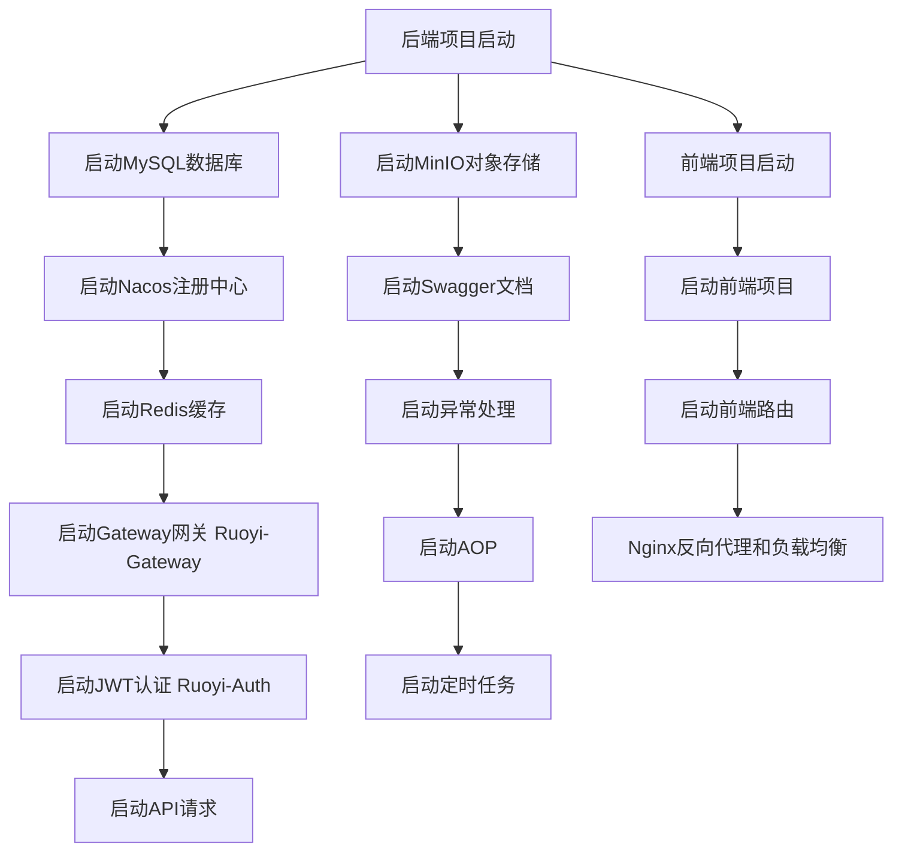

软件项目开发，不建议小公司用Java，并不是因为Java有多么难，其实从语法复杂度来说，C++甚至比Java复杂多了。主要还是因为Java的生态系统，尤其是SpringBoot框架，是一个非常复杂的系统，需要很多人来维护和扩展。

所以，如果你是一个小公司，没有那么多的资源来维护和扩展这个系统，那么Java可能并不是一个好的选择。

如果你是一个大公司，有很多的资源来维护和扩展这个系统，那么Java可能是一个好的选择。

从另外一个方面来说，Java项目的这种复杂度也带来了很多好处，其中最明显的特征就是丝滑集成了Docker容器化部署和Kubernetes微服务架构自动化编排。以SpringBoot为例，它的开发效率非常高，而且可以通过Docker容器化部署，快速地将应用部署到生产环境中；同时，SpringBoot也支持Kubernetes微服务架构自动化编排，这使得应用的部署和管理更加简单和高效。


## 1 预备知识

如果没有以下预备知识，不建议立即尝试：

（1）后端：
- Java 基础
- Spring Framework 框架
- Spring Boot 框架
- Maven 构建工具
- Spring Cloud 微服务架构
- MyBatis 持久层框架
- MinIO 对象存储
- JWT 认证

（2）前端：
- Vue 3 框架
- Element Plus 组件库
- Axios 网络请求

（3）数据库与配置：
- MySQL 数据库
- Redis 缓存
- Nacos 服务注册与发现

（4）中间件与容器化：
- Gateway 网关
- Nginx 反向代理
- Docker 容器化

（5）安全与测试：
- SSL/TLS 证书
- HTTPS 协议

（6）IDE和其他：
- Git 版本控制，建议SourceTree
- IntelliJ IDEA 集成开发环境
- Postman 接口测试工具
- VS Code 集成开发环境
- Vite 打包工具
- ESLint 代码规范
- Prettier 代码格式化

（7）可以扩展知识：
- Kubernetes 容器编排
- Swagger API文档
- JUnit 单元测试
- Mockito 模拟测试
- Jenkins 持续集成
- GitLab CI/CD
- SonarQube 代码质量管理
- Prometheus 监控系统


## 2 环境准备


要运行若依微服务框架，相关的支撑软件的版本如下：

```
JDK >= 1.8 (推荐1.8版本)
Mysql >= 5.7.0 (推荐5.7版本)
Redis >= 3.0
Maven >= 3.0
Node >= 12
nacos >= 2.0.4 (ruoyi-cloud < 3.0 需要下载nacos >= 1.4.x版本)
sentinel >= 1.6.0
```

作为程序员的工作电脑，建议安装这些开发环境：

- IDEA 或 VS Code
- Git （SourceTree）
- MySQL 数据库
- Redis 缓存
- Nacos 注册中心
- Nginx 反向代理
- Docker （可选）
- MinIO （可选）


与开发环境类似，生产环境还需要准备：

- 云服务器（如阿里云、腾讯云）
- 数据库服务器（如MySQL、PostgreSQL）
- Redis 服务器
- Nginx 反向代理的负载均衡
- SSL/TLS 证书
- 容器化工具（如Docker）
- 监控系统（如Prometheus、Grafana）
- 日志收集工具（如ELK）
- 安全工具（如Nginx、HAProxy）
- 备份与恢复工具（如Velero）
- 测试环境（如Postman、JMeter）

如果做弹性伸缩，还需要考虑：

- 自动扩容工具（如Kubernetes）
- 自动伸缩工具（如Kubernetes）
- 自动部署工具（如Jenkins、GitLab CI/CD）


由此不难看出，若依微服务框架的开发环境与生产环境的准备是非常复杂的，需要非常专业的人员来完成。如果没有这些预备知识，不建议立即尝试。因为这个跟PHP的一个Apache环境几乎可以走遍全流程不一样，跟NodeJS的一个Express环境也可以走全流程也不一样，即使是像Python的Flask框架，也是可以让程序员从骨架开始运行。但是Java的一个SpringBoot环境，是一个非常复杂的系统，需要很多人来维护和扩展。


## 3 Ruoyi Cloud的主要功能模块

按照官方文档的说明，若依微服务框架的微服务部分，打开运行的基础模块如下，启动没有先后顺序。

- RuoYiGatewayApplication （网关模块 必须）
- RuoYiAuthApplication （认证模块 必须）
- RuoYiSystemApplication （系统模块 必须）
- RuoYiMonitorApplication （监控中心 可选）
- RuoYiGenApplication （代码生成 可选）
- RuoYiJobApplication （定时任务 可选）
- RuoYFileApplication （文件服务 可选）

前端相对简单，只要可以通过NodeJS安装ruoyi-ui项目的相关依赖即可，官方推进通过npm安装，不建议用cnpm。

```bash
# 强烈建议不要用直接使用 cnpm 安装，会有各种诡异的 bug，可以通过重新指定 registry 来解决 npm 安装速度慢的问题。
npm install --registry=https://registry.npmmirror.com
```

具体的部署过程建议详细阅读官方文档：

[https://doc.ruoyi.vip/ruoyi-cloud/](https://doc.ruoyi.vip/ruoyi-cloud/)


主要配置工作的说明：

- 配置数据库连接，包括MySQL、Redis、Nacos等。
- 配置Swagger文档，方便API测试。
- 配置MinIO对象存储，用于文件上传和下载。
- 配置JWT认证，用于用户登录和权限管理。
- 配置CORS跨域，允许前端访问。
- 配置日志，包括文件日志和数据库日志。
- 配置异常处理，包括全局异常处理和自定义异常。
- 配置AOP，用于日志记录和性能监控。
- 配置定时任务，用于定时清理缓存和数据。

而对于前端来说，主要配置工作的说明：

- 配置路由，包括登录、首页、用户管理、角色管理等。
- 配置API请求，包括登录、用户列表、角色列表等。
- 配置状态管理，包括用户信息、权限信息等。
- 配置组件，包括表格、表单、对话框等。
- 配置布局，包括顶部导航、侧边栏、底部信息等。
- 配置样式，包括主题、颜色、字体等。

在部署与测试阶段，需要注意：

- 后端项目打包，上传到服务器。
- 前端项目打包，上传到服务器。
- 配置Nginx反向代理，实现HTTP/HTTPS重定向、静态资源代理、反向代理等。
- 配置Nginx负载均衡，实现请求分发。
- 配置Nginx缓存，实现静态资源缓存。
- 配置Nginx安全，实现IP访问控制、访问频率限制等。
- 配置Nginx压缩，实现静态资源压缩。
- 配置Nginx限流，实现请求限流。
- 配置Nginx监控，实现监控告警。
- 配置Nginx日志，实现日志记录。
- 配置Nginx错误处理，实现错误页面。
- 配置Nginx重定向，实现重定向规则。
- 配置Nginx重写，实现URL重写规则。
- 配置Nginx反向代理，实现反向代理规则。
- 配置Nginx负载均衡，实现负载均衡规则。

## 4 项目启动

以下是启动顺序的mermaid流程图：

