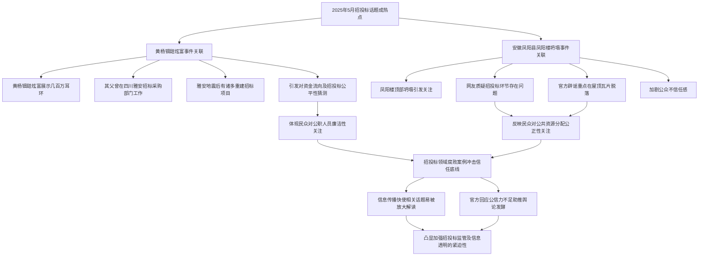

> - 2025年5月20日，最近几天的热点新闻，三句话不离招投标，为什么?是有人在故意炒作吗？
> - （1）18岁演员黄杨钿甜炫富几百万的耳环，关联其老爸曾经在四川雅安的招标采购部门工作，而且正值雅安地震之后没几年，个中有没有故事，却留给读者猜。
> - （2）安徽凤阳县，就是惩治贪官最厉害的皇帝朱元璋的老家，凤阳楼顶部坍塌，网友质疑招投标的同时，官方的辟谣重点不在这里，而是强调屋顶的瓦片脱落。

上周刚写了一篇文章《当招投标沦为“提款机”：重庆某学院的操作真的撕了行业遮羞布》，这几天发现招投标居然成了公众敏感的话题。2025年5月，招投标话题如同漩涡般席卷舆论场，成为社交平台与新闻报道中高频出现的关键词。从娱乐明星的家庭背景到历史名城的建筑修缮，看似毫无关联的事件背后，都隐约浮现出招投标的影子。这种密集的舆论聚焦，不禁让人发问：这究竟是社会矛盾的集中爆发，还是有人刻意引导的舆论炒作？

18岁演员黄杨钿甜在社交平台展示价值数百万的奢华耳环，这一炫富行为本属于个人生活范畴，却因家庭背景迅速发酵。其父亲曾任职于四川雅安招标采购部门，而雅安作为经历过地震灾后重建的城市，大量基建、民生项目依赖招标采购完成。灾后重建资金的使用向来是社会关注的焦点，此时炫富行为与公职身份的叠加，自然引发公众对资金流向、招投标公平性的质疑。虽然目前没有确凿证据证明存在违规操作，但这种“巧合”无疑在公众心中埋下了怀疑的种子，也折射出民众对公职人员廉洁性的高度关注。

安徽凤阳县，这座以朱元璋故乡闻名的历史名城，近期因“凤阳楼顶部坍塌”事件陷入舆论风波。网友第一时间将矛头指向招投标环节，质疑工程质量问题是否源于招投标过程中的违规操作，如围标串标、低价中标后偷工减料等。然而，官方的辟谣声明重点强调“屋顶瓦片脱落”，刻意回避招投标争议，这种避重就轻的回应方式，非但没有平息质疑，反而加剧了公众的不信任感。历史上，凤阳曾是朱元璋推行“重典治贪”的象征，如今却因建筑质量问题陷入争议，这种反差进一步放大了舆论的关注度。

这两起事件虽然性质不同，但都将招投标推上风口浪尖，背后反映出的是民众对公共资源分配公正性的强烈关切。近年来，招投标领域的腐败案例时有曝光，“天价路由器”“劣质工程”等事件不断冲击公众的信任底线。在信息传播高度发达的今天，任何与招投标相关的蛛丝马迹都可能被放大解读。此外，官方回应的公信力不足、信息披露不及时不透明，也助推了舆论的发酵。

至于是否存在“故意炒作”，目前尚无定论。但可以肯定的是，招投标作为涉及巨额资金与公共利益的关键环节，早已成为社会矛盾的敏感点。无论这些热点事件最终走向如何，都为我们敲响了警钟：加强招投标领域的监管，提升信息透明度，重塑公众信任，已刻不容缓。唯有如此，才能真正消解舆论场中的质疑声浪，维护社会公平正义的基石。 