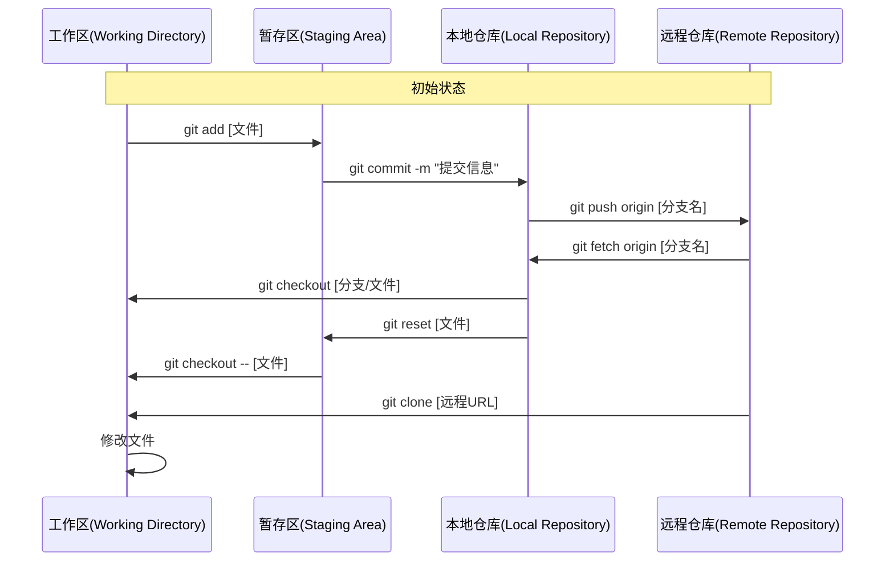
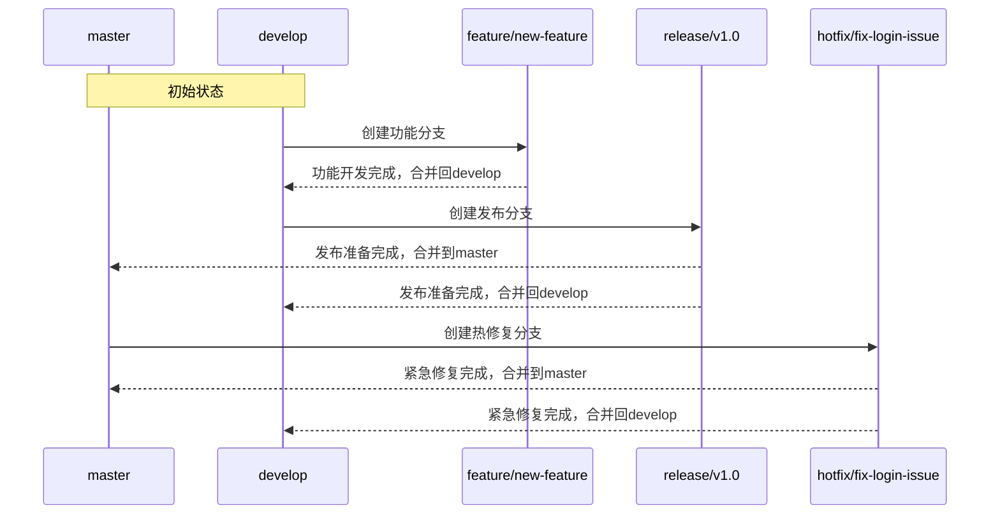

在讲解Git版本分支的管理之前，我们先复习一下Git中版本控制的几个仓库以及他们之间的关系：

1. **工作区（Working Directory）**：这是你在本地计算机上进行文件编辑的地方。你可以在工作区中创建、修改和删除文件。

2. **暂存区（Stage）**：暂存区是一个中间状态，用于暂存即将提交到仓库的文件。你可以使用`git add`命令将工作区中的文件添加到暂存区。

3. **本地仓库（Local Repository）**：本地仓库是你在本地计算机上的Git仓库，它存储了你的项目文件和版本历史。你可以使用`git commit`命令将暂存区中的文件提交到本地仓库。

4. **远程仓库（Remote Repository）**：远程仓库是托管在服务器上的Git仓库，通常是托管在GitHub、GitLab等平台上。你可以使用`git push`命令将本地仓库中的文件推送到远程仓库，也可以使用`git pull`命令从远程仓库拉取文件到本地仓库。



对以上几个仓库的操作，我们可以通过以下几个命令来实现：

1. **克隆（Clone）**：克隆是将远程仓库中的项目复制到本地计算机上的操作。你可以使用`git clone`命令将远程仓库克隆到本地计算机上。

2. **分支（Branch）**：分支是Git版本控制中的一个重要概念，它允许你在不影响其他分支的情况下进行开发和实验。可以使用`git branch`命令创建新的分支，使用`git checkout`命令切换到不同的分支。

3. **fetch（Fetch）**：fetch是从远程仓库中获取最新的文件，但不会合并到本地仓库中。你可以使用`git fetch`命令从远程仓库中获取最新的文件。

4. **合并（Merge）**：合并是将不同分支中的文件合并到一个分支中的操作。你可以使用`git merge`命令将一个分支合并到当前分支。

5. **拉取（Pull）**：拉取是从远程仓库中获取最新的文件并合并到本地仓库中的操作。`git pull`命令相当于`git fetch`和`git merge`的组合。

6. **推送（Push）**：推送是将本地仓库中的文件推送到远程仓库中的操作。你可以使用`git push`命令将本地仓库中的文件推送到远程仓库。

7. **标签（Tag）**：标签是Git版本控制中的一个重要概念，它允许你在特定的提交点上打上标签。你可以使用`git tag`命令创建标签。

8. **提交（Commit）**：提交是将暂存区中的文件提交到本地仓库中的操作。你可以使用`git commit`命令将暂存区中的文件提交到本地仓库。


关键操作说明：

> git add：将工作区的修改添加到暂存区
> git commit：将暂存区内容提交到本地仓库
> git push：将本地仓库的提交推送到远程仓库
> git fetch：从远程仓库获取最新提交但不合并
> git checkout：切换分支或恢复工作区文件
> git reset：取消暂存区的文件
> git clone：从远程仓库克隆到本地

有了以上内容基础，我们再看Git Flow工作流程就容易理解了。


### **1. 功能分支（`feature/`）**

#### **创建功能分支**

```bash
git checkout -b feature/new-login develop
```
- **参数解释**：
  - `-b`：创建并切换到新分支（`--branch` 的简写）。
  - `feature/new-login`：新分支名称，使用 `feature/` 前缀标识功能开发。
  - `develop`：源分支，即从哪个分支创建新分支（这里从 `develop` 分支创建）。

#### **合并功能分支**
```bash
# 切换回 develop 分支
git checkout develop
# 合并 feature/new-login 分支
git merge --no-ff feature/new-login
```
- **参数解释**：
  - `--no-ff`：禁用快进式合并（Fast-forward），强制创建一个新的合并提交（即使可以快进）。这会保留分支的历史记录，便于追踪功能开发过程。


### **2. 发布分支（`release/`）**
#### **创建发布分支**
```bash
git checkout -b release/v1.0 develop
```
- **参数解释**：
  - `release/v1.0`：新分支名称，使用 `release/` 前缀标识发布准备，`v1.0` 是版本号。
  - `develop`：从 `develop` 分支创建，确保包含所有待发布的功能。

#### **发布到生产环境**
```bash
# 切换到 master 分支
git checkout master
# 合并 release/v1.0 分支
git merge --no-ff release/v1.0
# 打标签记录版本
git tag v1.0
```
- **参数解释**：
  - `git tag v1.0`：在 `master` 分支上标记当前提交为 `v1.0` 版本，便于后续回溯和部署。


### **3. 热修复分支（`hotfix/`）**
#### **创建热修复分支**
```bash
git checkout -b hotfix/fix-login-issue master
```
- **参数解释**：
  - `hotfix/fix-login-issue`：新分支名称，使用 `hotfix/` 前缀标识紧急修复。
  - `master`：从 `master` 分支创建（因为紧急修复通常针对生产环境问题）。

#### **合并热修复分支**
```bash
# 切换到 master 分支
git checkout master
# 合并 hotfix/fix-login-issue 分支
git merge --no-ff hotfix/fix-login-issue
# 打标签记录修复版本
git tag v1.0.1

# 切换到 develop 分支
git checkout develop
# 同步修复到 develop 分支
git merge --no-ff hotfix/fix-login-issue
```
- **参数解释**：
  - 两次合并：分别将修复同步到 `master`（生产环境）和 `develop`（开发环境），确保所有分支一致。


### **4. 高级参数补充**

#### **`--ff-only`：仅允许快进式合并**
```bash
git merge --ff-only feature/new-feature
```
- **作用**：如果目标分支（如 `develop`）自创建 `feature/new-feature` 以来没有其他提交，则直接将指针前移（快进）；否则合并失败。  
- **场景**：用于强制要求功能分支在合并前必须更新到最新 `develop` 状态（避免冲突）。

#### **`-m`：指定合并提交信息**
```bash
git merge -m "Merge release v1.0 into master" release/v1.0
```
- **作用**：自定义合并提交的描述信息，便于后续查看历史记录。


### **5. 与 SourceTree 结合的参数**

在 SourceTree 中使用 Git Flow 时，部分参数会被图形界面自动处理：
- **`--no-ff`**：SourceTree 的 Git Flow 操作默认启用 `--no-ff`，确保保留分支历史。
- **源分支选择**：通过下拉菜单选择（如从 `develop` 创建功能分支），无需手动输入分支名。


### **6. 参数对比表**
| 参数         | 作用                                                                 | 适用场景                          |
|--------------|----------------------------------------------------------------------|-----------------------------------|
| `-b`         | 创建并切换到新分支                                                   | 创建功能/发布/热修复分支          |
| `--no-ff`    | 禁用快进式合并，强制生成合并提交                                       | 保留分支历史，便于追踪开发过程    |
| `--ff-only`  | 仅允许快进式合并，否则失败                                             | 确保分支在合并前已更新到最新状态  |
| `-m`         | 指定提交信息                                                         | 自定义合并提交的描述              |


### **总结**


