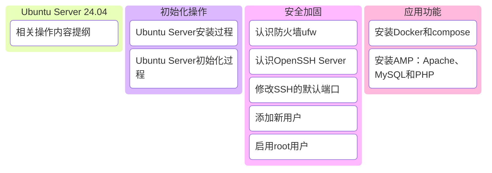

我们以Ubuntu Server 24.04为例，介绍Ubuntu Server的初始化操作，包括安装、配置和安全加固。




Ubuntu Server 24.04是一个基于Debian的服务器操作系统，适用于需要稳定运行的服务器环境。Ubuntu的产品体系主要包括：

- Ubuntu Desktop：提供桌面环境的Ubuntu版本，适用于个人用户和桌面应用。
- Ubuntu Server：服务器版本，适用于需要在服务器上运行应用的企业用户。
- Ubuntu Core：适用于物联网和边缘计算设备，提供轻量级的操作系统。

如果你没有机会使用Server版本，也可以使用Ubuntu Desktop版本，它提供了与Server版本相似的功能和工具。

## Ubuntu Server安装过程

Ubuntu Server 24.04的安装步骤：

1. 下载Ubuntu Server 24.04镜像文件
2. 创建可引导的USB安装介质
3. 从USB启动服务器
4. 选择语言和键盘布局
5. 配置网络连接（安装过程中可选择自动获取IP）
6. 配置存储设备
7. 设置用户账户和密码
8. 选择安装OpenSSH Server（关键步骤，确保远程访问）
9. 完成安装并重启


## Ubuntu Server初始化过程

Ubuntu Server 24.04安装完成后，需要进行一些初始化操作，以确保服务器的安全性和功能正常运行。以下是一些常见的初始化步骤：

### 1. 验证SSH服务是否运行

安装完成后，你可以通过以下方式验证SSH服务是否正在运行：

```bash
# 检查SSH服务状态
sudo systemctl status ssh

# 如果服务未运行，启动它
sudo systemctl start ssh

# 设置SSH服务开机自启
sudo systemctl enable ssh
```

### 2. 安装网络工具检查端口状态

Ubuntu Server默认不安装`netstat`命令，需要手动安装`net-tools`包：

```bash
# 安装net-tools包以获取netstat命令
sudo apt update
sudo apt install net-tools

# 使用netstat检查SSH端口状态
netstat -anotp | grep :22
```

### 3. 配置静态IP地址

为服务器配置静态IP地址，确保网络连接稳定：

```bash
# 编辑网络配置文件
sudo nano /etc/netplan/00-installer-config.yaml
```

文件内容通常类似于：

```yaml
network:
  ethernets:
    enp0s3:  # 网卡名称，根据实际情况调整
      dhcp4: true
  version: 2
```

修改为静态IP配置：

```yaml
network:
  ethernets:
    enp0s3:  # 网卡名称，根据实际情况调整
      dhcp4: false
      addresses: [192.168.0.84/24]
      routes:
        - to: default
          via: 192.168.0.1  # 网关地址，根据实际情况调整
      nameservers:
        addresses: [8.8.8.8, 8.8.4.4]  # DNS服务器，可根据需要调整
  version: 2
```

应用配置更改：

```bash
# 应用网络配置
sudo netplan apply

# 验证IP地址是否已更改
ip addr show
```

### 4. 其他常用初始化步骤

完成基本配置后，还可以进行以下初始化操作：

```bash
# 更新系统
sudo apt update
sudo apt upgrade -y

# 安装防火墙并开放SSH端口
sudo apt install ufw
sudo ufw allow 22
sudo ufw enable

# 设置时区
sudo timedatectl set-timezone Asia/Shanghai  # 根据实际时区调整

# 创建普通用户并添加到sudo组（可选）
sudo adduser username
sudo usermod -aG sudo username
```

通过以上步骤，我们已经完成了Ubuntu Server 24.04的安装和基本初始化配置，包括验证SSH服务、安装网络工具、配置静态IP地址等。


## 安全加固Ubuntu Server

### 认识防火墙ufw

Ubuntu默认使用的是`iptables`作为防火墙，但是`iptables`配置较为复杂，容易出错。为了简化防火墙配置，Ubuntu提供了`ufw`（Uncomplicated Firewall）工具，它提供了简单易用的命令行界面来管理防火墙规则。


#### 查看已开放端口列表

要查看UFW当前已开放的端口和服务：

```bash
# 显示已开放的端口（简洁模式）
sudo ufw status

# 显示已开放的端口（详细模式）
sudo ufw status verbose

# 显示已开放的端口（包含编号）
sudo ufw status numbered
```

输出示例：
```
Status: active

To                         Action      From
--                         ------      ----
22/tcp                     ALLOW       Anywhere                  
80/tcp                     ALLOW       Anywhere                  
443/tcp                    ALLOW       Anywhere                  
32000:32999/tcp            ALLOW       Anywhere                  
22/tcp (v6)                ALLOW       Anywhere (v6)             
80/tcp (v6)                ALLOW       Anywhere (v6)             
443/tcp (v6)               ALLOW       Anywhere (v6)             
32000:32999/tcp (v6)       ALLOW       Anywhere (v6)
```

#### 添加端口规则

##### 1. 开放单个端口
```bash
# 开放TCP端口21（FTP）
sudo ufw allow 21/tcp

# 开放TCP端口80（HTTP）
sudo ufw allow 80/tcp

# 开放TCP端口443（HTTPS）
sudo ufw allow 443/tcp
```

##### 2. 开放端口范围
```bash
# 开放TCP端口范围32000-32999
sudo ufw allow 32000:32999/tcp

# 开放UDP端口范围32000-32999（如果需要）
sudo ufw allow 32000:32999/udp
```

##### 3. 从特定IP地址开放端口
```bash
# 只允许IP 192.168.1.100访问端口22（SSH）
sudo ufw allow from 192.168.1.100 to any port 22
```

#### 删除端口规则

删除规则有两种方式：通过端口号或通过规则编号。

##### 1. 通过端口号删除
```bash
# 删除端口21的规则
sudo ufw delete allow 21/tcp

# 删除端口范围规则
sudo ufw delete allow 32000:32999/tcp
```

##### 2. 通过规则编号删除

先查看带编号的规则列表：
```bash
sudo ufw status numbered
```

输出示例：
```
Status: active

     To                         Action      From
     --                         ------      ----
[ 1] 22/tcp                     ALLOW IN    Anywhere                  
[ 2] 80/tcp                     ALLOW IN    Anywhere                  
[ 3] 443/tcp                    ALLOW IN    Anywhere                  
[ 4] 32000:32999/tcp            ALLOW IN    Anywhere
```

然后根据编号删除规则：
```bash
# 删除编号为4的规则
sudo ufw delete 4
```

#### 端口转发配置

要配置端口转发，需要先启用IP转发并创建相应规则：

##### 1. 启用IP转发

编辑 `/etc/sysctl.conf` 文件：
```bash
sudo nano /etc/sysctl.conf
```

取消以下行的注释（删除前面的 `#`）：
```
net.ipv4.ip_forward=1
```

保存文件后应用更改：
```bash
sudo sysctl -p
```

##### 2. 配置端口转发规则

```bash
# 转发端口8080到80（内部服务器）
sudo ufw route allow proto tcp from any to any port 8080 redirect-to-port 80

# 转发特定IP的端口（例如转发192.168.1.100:80到本地8080）
sudo ufw route allow proto tcp from any to 192.168.1.100 port 80 redirect-to-port 8080
```

#### 丢弃特定端口请求

要丢弃来自端口25的所有请求（通常用于SMTP服务）：
```bash
# 丢弃所有TCP端口25的流量
sudo ufw deny 25/tcp

# 或者，如果想完全阻止，使用reject（会向客户端发送拒绝消息）
sudo ufw reject 25/tcp
```

#### 保存和恢复规则

```bash
# 保存当前规则（默认会自动保存）
sudo ufw reload

# 禁用UFW（不推荐，除非必要）
sudo ufw disable

# 启用UFW
sudo ufw enable
```

#### 查看规则文件

UFW规则存储在以下位置：
```bash
# 主要规则文件
cat /etc/ufw/user.rules

# IPv6规则
cat /etc/ufw/user6.rules
```

#### 重置UFW（谨慎使用）

这将删除所有规则并重置UFW：
```bash
sudo ufw reset
```

### 认识OpenSSH Server

OpenSSH Server是一个开源的SSH服务器实现，用于提供安全的远程登录和文件传输功能。它是Linux和Unix系统中最常用的SSH服务器之一。

在Ubuntu上，OpenSSH Server通常已经默认安装。可以通过以下命令检查是否已安装：

```bash
# 检查 SSH 服务状态
sudo systemctl status ssh

# 如果未安装，尝试安装 OpenSSH 服务器
sudo apt update
sudo apt install openssh-server


# 使用正确的服务名称重启
sudo systemctl restart ssh

# 验证服务状态
sudo systemctl status ssh

# 检查 SSH 服务是否在开机启动
sudo systemctl is-enabled ssh

# 设置 SSH 服务开机自启
sudo systemctl enable ssh
```

与防火墙相关的命令：

```bash
# 确保防火墙允许 SSH 连接
sudo ufw allow ssh
# 或者使用端口号
sudo ufw allow 22/tcp

# 重新加载防火墙规则
sudo ufw reload

```

配置相关的指令：

```bash

# 查看 SSH 配置文件是否存在
ls -l /etc/ssh/sshd_config

# 如果配置文件不存在，重新安装 OpenSSH
sudo apt purge openssh-server
sudo apt install openssh-server


# 本地检查 SSH 服务是否监听
ss -tulpn | grep :22

# 从另一台机器测试连接
ssh username@server_ip


```

### 修改SSH的默认端口

默认情况下，SSH服务使用的是22端口，这往往是黑客攻击的目标和对象，是暴力破解的主要入口。为了提高安全性，我们可以将SSH服务的默认端口修改为其他端口，如2233。

修改SSH的默认端口为2233，需要进行以下步骤：

1. 编辑SSH配置文件：

 ```bash
 sudo nano /etc/ssh/sshd_config
 ```

2. 找到并修改`Port`参数，将其值改为2233：

 ```bash
 Port 2233
 ```

3. 保存文件并退出编辑器。


跟普通的端口不同，还需要以下操作：

```bash
# 1. 重新加载 systemd 守护进程配置
sudo systemctl daemon-reload

# 2. 重启 SSH socket 服务（这会重新生成配置）
sudo systemctl restart ssh.socket

# 3. 最后重启 SSH 服务
sudo systemctl restart ssh

# 4. 验证新端口是否生效
sudo ss -tulpn | grep sshd
```

这个时候不要急于重启服务器，因为刚才设置的防火墙中你还没有打开新的SSH端口：

```bash
sudo ufw allow 2233/tcp
```

这项配置好之后重启服务器即可，这样就可以通过2233端口来访问SSH服务了。


### 添加新用户

假设您要创建用户 developer：

```bash

# 创建用户（会提示设置密码）
sudo adduser developer

# 添加到 sudo 组
sudo usermod -aG sudo developer

# 验证组 membership
groups developer

# 切换用户测试
su - developer
sudo whoami  # 应显示 root
exit  # 返回原始用户

```

### 启用root用户

在Ubuntu Server中启用root用户，可按以下步骤进行：
1. 使用sudo命令切换到root用户：`sudo su`。
2. 更改root用户的密码：`passwd root`，按照提示输入新密码并确认。
3. 编辑`/etc/ssh/sshd_config`文件，找到`PermitRootLogin prohibit - password`这一行，将其修改为`PermitRootLogin yes`。
4. 重启ssh服务：`sudo service ssh restart`或`sudo systemctl restart ssh`。

完成以上步骤后，就可以使用root用户登录Ubuntu Server了。不过，root用户拥有最高权限，使用时需格外谨慎，以免因误操作导致系统出现问题。


## Ubuntu Server的应用功能

### 安装Docker和compose（阿里云）

如果是本地安装Docker，一般都是在安装操作系统的过程中选择安装的。

在云服务器上，我们以阿里云为例，可以参考文档：
[https://help.aliyun.com/zh/ecs/use-cases/install-and-use-docker](https://help.aliyun.com/zh/ecs/use-cases/install-and-use-docker)

主要的操作命令如下：

```bash
#更新包管理工具
sudo apt-get update

#添加Docker软件包源
sudo apt-get -y install apt-transport-https ca-certificates curl software-properties-common

sudo curl -fsSL http://mirrors.cloud.aliyuncs.com/docker-ce/linux/ubuntu/gpg | sudo apt-key add -

sudo add-apt-repository -y "deb [arch=$(dpkg --print-architecture)] http://mirrors.cloud.aliyuncs.com/docker-ce/linux/ubuntu $(lsb_release -cs) stable"

#安装Docker社区版本，容器运行时containerd.io，以及Docker构建和Compose插件

sudo apt-get -y install docker-ce docker-ce-cli containerd.io docker-buildx-plugin docker-compose-plugin

#启动Docker
sudo systemctl start docker

#设置Docker守护进程在系统启动时自动启动
sudo systemctl enable docker
```

以上过程安装了Docker和Docker compose，你可以使用以下命令来验证：

```bash
#验证Docker是否安装成功
docker --version

#显示 Docker version 28.2.2, build e6534b4

#验证Docker compose是否安装成功
docker compose version

#显示 Docker Compose version v2.36.2

```

在阿里云服务器上可以使用阿里云的Docker镜像加速服务，
需要设置的文件：/etc/docker/daemon.json
内容为：
```json
{
  "registry-mirrors": ["https://xxxxxxx.mirror.aliyuncs.com"],
  "debug": true,
  "experimental": false
}
```
或者
```json
{
  "registry-mirrors": ["https://xxxxxxx.mirror.aliyuncs.com"],
}
```

如果加速镜像没有生效，在pull镜像的时候，还是会走默认的Docker 官方（registry-1.docker.io），
需要在控制台开启相关服务：
[https://cr.console.aliyun.com/](https://cr.console.aliyun.com/)

更新镜像源文件后，重启服务使镜像源生效：

```Bash
sudo systemctl daemon-reload
sudo systemctl restart docker

#在阿里云的环境下，确认镜像仓库使用的是阿里云的
docker info

#显示类似：
#Registry Mirrors:
# https://xxxxxxx.mirror.aliyuncs.com
#即代表仓库已经使用阿里云的 

``` 


在Docker基础上组网和部署服务的过程我们在后续文章中介绍。


### 安装AMP：Apache、MySQL和PHP

如果你希望通过Docker解决PHP和MySQL的问题，那么你可以考虑使用Docker Compose来管理它们。我们这里讨论的是在Ubuntu Server上直接安装AMP（Apache、MySQL和PHP）的方法。

1. **安装Apache**：

```bash
sudo apt-get update
sudo apt-get install apache2
```

对应的配置文件在： `/etc/apache2/apache2.conf`。
配置多个网站和扩展配置的文件在目录： `/etc/apache2/sites-available`。

网站目录文件在： `/var/www/html`。

2. **安装MySQL**：

```bash
sudo apt-get update
sudo apt-get install mysql-server
```

对应的配置文件在： `/etc/mysql/mysql.conf.d/mysqld.cnf`。
在配置文件中，你可以设置MySQL的数据文件目录、日志文件目录、端口号等，不然不做特殊设置，他们的默认值分别是：
（1）数据文件目录： `/var/lib/mysql`。
（2）日志文件目录： `/var/log/mysql`。
（3）端口号： `3306`。

3. **安装PHP**：

```bash
sudo apt-get update
sudo apt-get install php libapache2-mod-php php-mysql
```

对应的配置文件在： `/etc/php/8.2/apache2/php.ini`。

4. **管理Apache和MySQL**：

```bash
#启动Apache
sudo systemctl start apache2
#启动MySQL
sudo systemctl start mysql
#重启Apache
sudo systemctl restart apache2
#重启MySQL
sudo systemctl restart mysql
#停止Apache
sudo systemctl stop apache2
#停止MySQL
sudo systemctl stop mysql

#设置Apache和MySQL开机自启动
sudo systemctl enable apache2
sudo systemctl enable mysql
```

5. **安装Nginx**：

```bash
sudo apt-get update
sudo apt-get install nginx
```

对应的配置文件在： `/etc/nginx/nginx.conf`。


