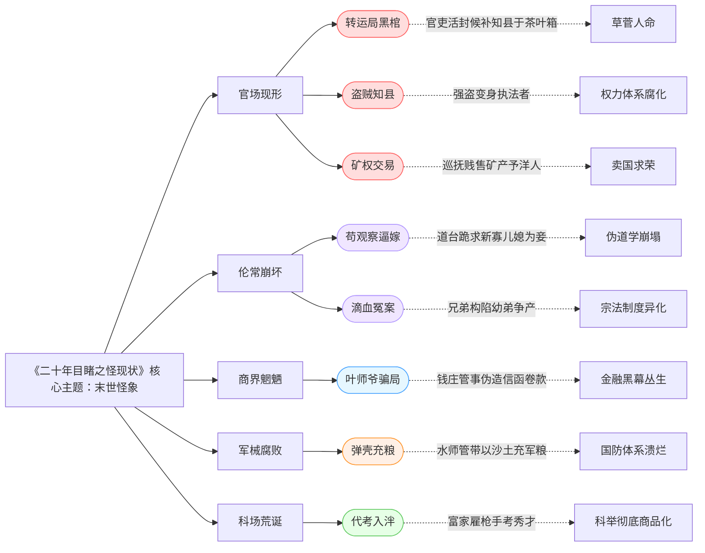

《二十年目睹之怪现状》 描写的是1884年中法之战到1904年前后20年间，社会上的种种怪现状。本书借主角“九死一生”二十年间宦海沉浮的亲历见闻，以白描笔法勾勒出晚清光怪陆离的社会群像，阅读的主要故事索引如下：

1.  **《官场现形》：转运局黑棺**
    江苏候补知县化装苦力逃亡，后竟被官吏活封于茶叶箱充作“柩”运出，只为遮掩丑闻。（暴露官场草菅人命、虚伪遮丑）  
2.  **《伦常乖舛》：苟观察逼嫁**
    道台苟才为巴结权贵，竟携幼子长跪新寡儿媳闺房前，痛哭哀求其委身总督为妾，尽毁人伦。（鞭挞伪道学下的道德崩溃）  
3.  **《商界魍魉》：叶师爷骗局**
    钱庄管事监守自盗，伪造假信卷款数万两潜逃，揭穿金融业内部倾轧与贪婪本性。（透视商行黑幕丛生）  
4.  **《洋奴嘴脸》：矿权交易**
    江苏巡抚暗将国家矿产贱售洋人，亲信直言：“中饱私囊何必顾及后人？”（痛斥买办官僚卖国行径）  
5.  **《科场荒诞》：代考入泮**
    富家子弟公然雇枪手考取秀才，考官收贿默许，秀才功名成集市商品。（讽刺科举制度彻底腐化）  
6.  **《军械丑闻》：弹壳充粮**
    水师管带私吞军费，遇巡查竟以沙土塞炮弹冒充军粮，军械库堆积废铁。（揭示军队腐败致国防空虚）  
7.  **《医卜星相》：符水乱命**
    道士画符售“神水”治瘟疫敛财，病家因延误致死不计其数，妖言惑众却横行市井。（批判愚昧迷信盛行）  
8.  **《家庭崩坏》：滴血冤案**
    巨商诸子为争产构陷幼弟“非亲生”，滴血验亲闹剧终致家破人亡。（反映宗法制度下的亲情异化）  
9.  **《江湖险恶》：盗贼知县**
    强盗杀人劫财摇身变为州县官吏，堂皇坐衙审案，真凶与执法者浑然一体。（喻示权力体系根基本质）  
10. **《世情浇薄》：伯父夺产**
    “九死一生”之父客死他乡，其伯父鲸吞孤儿寡母家财，反诬陷母子不孝。（主线贯穿：至亲尚且如此，世道焉能不怪？）

全书以一百八十九件奇案串联，如手术刀般剖开晚清肌理。吴趼人自述：“遍地魑魅，救世之情竭而愤世之意生！”这面照妖镜下，非人之境恰是人寰真相。

