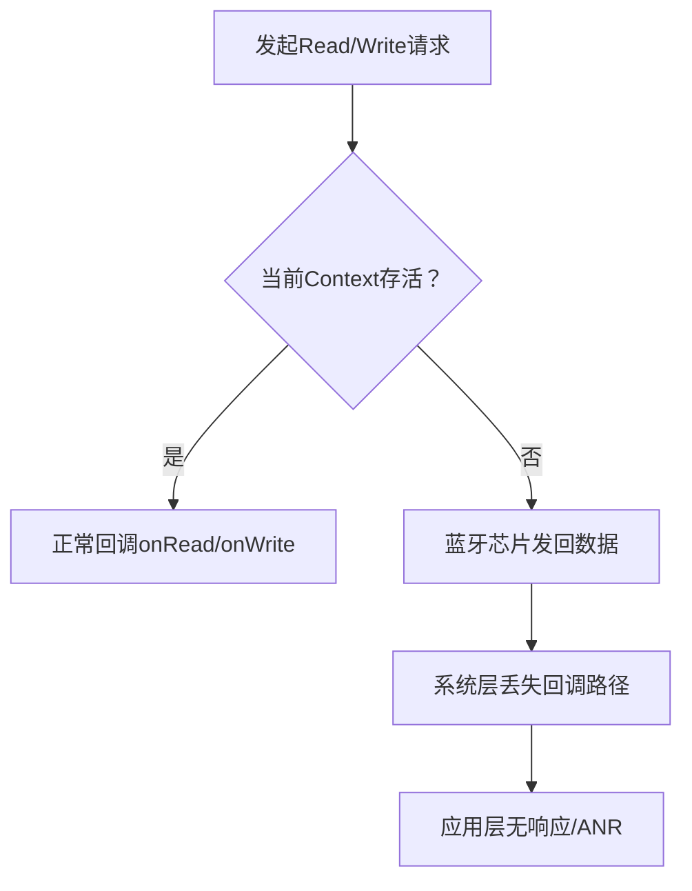

说一个AI编程也忽略的Android低功耗蓝牙通信问题：这几天被Android低功耗蓝牙通信搞死，先说结论，低功耗蓝牙通信在android中一定要绑定activity，不这样，在做连接和接收通知的时候没有问题，但是接收客户端的读写则会遇到问题，这主要是因为onread和onwrite两个操作会找不到事件，从而造成蓝牙通信不稳定。

虽然蓝牙通信依赖不同的设备和芯片，硬件环境非常复杂，但是不注意事件触发条件，或者对Android中的activity和service不理解，容易踩到的坑还是很多的。对于Trae、通义灵码、Copilot甚至ChatGPT，开发环境的反复切换，在解释这类问题的时候，更多的关注在软硬件开发环境，这主要是因为AIGC的核心是attention，这种现象跟“AI幻想”不同，注意力的集中反而让其忽略了Android底层的context原理。

在Android低功耗蓝牙（BLE）开发中，一个常被AI生成代码忽略的细节，却可能成为通信稳定性的致命隐患——**Context的绑定逻辑**。最近调试一款BLE设备通信模块时，频繁遇到"读写操作无响应"的诡异现象：连接成功、通知接收正常，但只要触发客户端的onRead或onWrite回调，数据就像沉入黑洞，日志里找不到任何事件痕迹。排查多日后发现，症结竟藏在Context与Activity的绑定关系里：BLE通信的核心回调，必须与Activity的生命周期深度绑定，否则就会陷入"事件丢失"的泥潭。




### 一、Context：Android世界的"环境通行证"

要理解BLE通信的Context依赖，先得厘清Context在Android中的本质。简单说，Context是"上下文环境"的抽象，包含了当前组件的运行状态、资源访问权限和生命周期信息。在Android中，Context主要有三种形态：  
- **Application Context**：全局唯一，伴随应用进程全程存在，不依赖任何组件生命周期；  
- **Activity Context**：与Activity绑定，随Activity的创建而存在、销毁而消亡，包含页面相关的资源和配置；  
- **Service Context**：与Service绑定，生命周期独立于UI，但缺乏Activity的页面交互能力。  

BLE通信的核心组件`BluetoothGatt`及其回调`BluetoothGattCallback`，本质上是"事件驱动"的：当设备完成读写操作后，系统会通过回调方法（如`onCharacteristicRead`、`onCharacteristicWrite`）通知应用，而**回调的触发必须依赖一个"活跃"的Context**。如果Context失效（如Activity已销毁），系统会认为"事件接收者已不存在"，直接丢弃回调事件——这正是onRead/onWrite无响应的根源。


### 二、BLE通信中的Context陷阱：为什么必须绑定Activity？

低功耗蓝牙的通信流程中，`BluetoothGattCallback`是处理所有设备交互的"神经中枢"。当我们通过`BluetoothGatt`发起`readCharacteristic`或`writeCharacteristic`请求时，系统会将请求放入队列，待设备响应后，通过回调方法返回结果。这个过程有两个关键前提：  
1. 发起请求的`BluetoothGatt`实例必须持有有效的Context；  
2. 回调对象`BluetoothGattCallback`必须能被Context关联的组件（如Activity）正常引用。  

如果将`BluetoothGatt`与Application Context或Service Context绑定，看似能避免Activity销毁的影响，实则埋下隐患： 

- **Application Context生命周期过长**：若Activity销毁后，`BluetoothGatt`仍持有Application Context，会导致`BluetoothGatt`实例无法被回收，造成内存泄漏；更严重的是，Application Context没有页面生命周期，系统可能优先释放其关联的回调事件，导致onRead/onWrite事件丢失。  

- **Service Context缺乏UI交互能力**：Service虽能后台运行，但BLE通信常需配合UI展示（如实时显示读写数据），若回调在Service中处理，再传递到Activity，可能因线程同步问题导致数据延迟或丢失。  

而Activity Context的优势正在于此：它与页面生命周期同步，`BluetoothGatt`的创建、使用、销毁可与Activity的`onCreate`、`onResume`、`onDestroy`绑定，既能保证回调事件被及时接收，又能在页面关闭时主动释放资源，避免内存泄漏。


### 三、问题场景复现：当BLE回调与Activity脱节

假设我们用以下错误方式实现BLE通信（使用Application Context）：

```java
// 错误示例：使用Application Context初始化BluetoothGattCallback
public class BadBleActivity extends AppCompatActivity {
    private BluetoothGatt mGatt;
    private BluetoothGattCallback mGattCallback = new BluetoothGattCallback() {
        @Override
        public void onCharacteristicRead(BluetoothGatt gatt, BluetoothGattCharacteristic characteristic, int status) {
            super.onCharacteristicRead(gatt, characteristic, status);
            // 此处可能永远不会被调用：Application Context已与Activity脱节
            Log.d("BLE", "读取到数据：" + new String(characteristic.getValue()));
        }
    };

    @Override
    protected void onCreate(Bundle savedInstanceState) {
        super.onCreate(savedInstanceState);
        // 错误：使用getApplicationContext()绑定Context
        mGatt = device.connectGatt(getApplicationContext(), false, mGattCallback);
    }

    // 未在Activity销毁时释放资源
    @Override
    protected void onDestroy() {
        super.onDestroy();
        // 遗漏mGatt.close()，导致资源泄漏
    }
}
```

在这个例子中，`BluetoothGatt`绑定了Application Context，当Activity因旋转或跳转被销毁重建时，新的Activity实例无法关联到旧的`mGattCallback`，此时发起的read请求，其回调会因"接收者不存在"而丢失——表现为日志中看不到`onCharacteristicRead`的输出，设备端显示数据已发送，但App无响应。


### 四、正确实现：让BLE通信与Activity生命周期绑定

正确的做法是将`BluetoothGatt`与Activity的生命周期深度绑定，在`onCreate`中初始化，`onDestroy`中释放，确保回调始终能被当前Activity实例捕获：

```java
// 正确示例：BLE通信与Activity绑定
public class GoodBleActivity extends AppCompatActivity {
    private BluetoothGatt mGatt;
    private BluetoothGattCallback mGattCallback = new BluetoothGattCallback() {
        @Override
        public void onConnectionStateChange(BluetoothGatt gatt, int status, int newState) {
            super.onConnectionStateChange(gatt, newState, newState);
            if (newState == BluetoothProfile.STATE_CONNECTED) {
                // 连接成功后发现服务
                gatt.discoverServices();
            }
        }

        @Override
        public void onServicesDiscovered(BluetoothGatt gatt, int status) {
            super.onServicesDiscovered(gatt, status);
            if (status == BluetoothGatt.GATT_SUCCESS) {
                // 获取目标特征值，发起读请求
                BluetoothGattService service = gatt.getService(UUID.fromString(SERVICE_UUID));
                BluetoothGattCharacteristic characteristic = service.getCharacteristic(UUID.fromString(CHARACTERISTIC_UUID));
                gatt.readCharacteristic(characteristic); // 发起读请求
            }
        }

        @Override
        public void onCharacteristicRead(BluetoothGatt gatt, BluetoothGattCharacteristic characteristic, int status) {
            super.onCharacteristicRead(gatt, characteristic, status);
            if (status == BluetoothGatt.GATT_SUCCESS) {
                // 读取成功，更新UI（需在主线程）
                runOnUiThread(() -> {
                    String data = new String(characteristic.getValue());
                    tvData.setText("读取到数据：" + data);
                });
            }
        }

        @Override
        public void onCharacteristicWrite(BluetoothGatt gatt, BluetoothGattCharacteristic characteristic, int status) {
            super.onCharacteristicWrite(gatt, characteristic, status);
            if (status == BluetoothGatt.GATT_SUCCESS) {
                Log.d("BLE", "写入成功");
            }
        }
    };

    @Override
    protected void onCreate(Bundle savedInstanceState) {
        super.onCreate(savedInstanceState);
        setContentView(R.layout.activity_ble);
        // 关键：使用Activity Context初始化
        mGatt = device.connectGatt(this, false, mGattCallback);
    }

    @Override
    protected void onDestroy() {
        super.onDestroy();
        // 释放资源，避免内存泄漏
        if (mGatt != null) {
            mGatt.close();
            mGatt = null;
        }
    }
}
```

上述代码的核心在于：  
- 用`this`（即Activity实例）作为`connectGatt`的Context参数，确保`BluetoothGatt`与Activity生命周期绑定；  
- 在`onDestroy`中主动调用`mGatt.close()`，释放BLE连接资源，避免Context失效后回调事件丢失；  
- 回调中通过`runOnUiThread`更新UI，保证数据交互与页面状态同步。  


### 四、总结：BLE开发的Context使用准则

低功耗蓝牙通信的稳定性，很大程度上依赖对Context生命周期的理解。AI生成的代码可能仅实现基础功能，却忽略Context与组件的绑定逻辑，导致实际运行中出现"连接正常、读写失效"的诡异问题。记住这三条准则，可有效规避陷阱：  

1. **优先使用Activity Context**：BLE回调需实时响应且常关联UI，Activity Context能保证事件不丢失、数据可及时展示；  
2. **严格同步生命周期**：在`onCreate`初始化`BluetoothGatt`，`onDestroy`中关闭连接，避免资源泄漏；  
3. **避免跨Context传递回调**：不要将`BluetoothGattCallback`实例从Activity传递到Service或Application，保持回调与发起请求的Context一致。  

BLE通信的硬件环境本就复杂，设备兼容性、信号强度等问题已足够棘手，若再因软件层的Context绑定失误导致不稳定，实属得不偿失。理解Context的本质，让BLE操作与Activity"同生共死"，才是保证通信可靠的基础。

