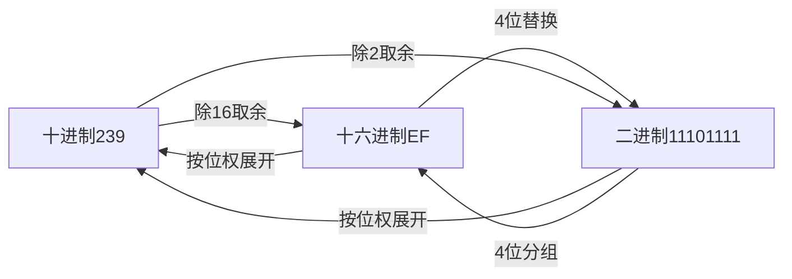

在计算机编程和底层开发中，二进制、十进制、十六进制的转换是基础中的基础。很多新手会困惑：为什么计算机偏爱二进制？为什么用`0x`加两位字符表示一个字节？本文结合`239（十进制）`、`11101111（二进制）`、`0xEF（十六进制）`的实例，把这些问题讲透。

## 一、三种进制的核心定义
首先明确三种进制的本质：**不同的计数规则**，核心区别是“逢几进一”。

| 进制       | 基数 | 计数规则       | 字符集                | 示例（对应同一个值） |
|------------|------|----------------|-----------------------|----------------------|
| 十进制     | 10   | 逢10进1        | 0-9                   | 239                  |
| 二进制     | 2    | 逢2进1         | 0、1                  | 11101111             |
| 十六进制   | 16   | 逢16进1        | 0-9 + A-F（对应10-15）| 0xEF                 |

> 注：十六进制中A-F不区分大小写，0xEF和0xef表示同一个值。

## 二、核心换算关系（以239为例）
### 1. 十进制 ↔ 二进制（基础方法）
#### （1）十进制转二进制：除2取余法
以`239`为例，反复除以2直到商为0，余数倒序排列：
```
239 ÷ 2 = 119 余 1
119 ÷ 2 = 59  余 1
59 ÷ 2 = 29   余 1
29 ÷ 2 = 14   余 1
14 ÷ 2 = 7    余 0
7 ÷ 2 = 3     余 1
3 ÷ 2 = 1     余 1
1 ÷ 2 = 0     余 1
```
倒序取余数 → `11101111`。

#### （2）二进制转十进制：按位权展开
二进制`11101111`的每一位对应`2^7`到`2^0`的权值，求和：
```
1×2^7 + 1×2^6 + 1×2^5 + 0×2^4 + 1×2^3 + 1×2^2 + 1×2^1 + 1×2^0
= 128 + 64 + 32 + 0 + 8 + 4 + 2 + 1
= 239
```

### 2. 十进制 ↔ 十六进制（简化方法）
#### （1）十进制转十六进制：除16取余法
```
239 ÷ 16 = 14 余 15 （15对应十六进制F）
14 ÷ 16 = 0  余 14 （14对应十六进制E）
```
倒序取余数 → `EF`，规范写法加前缀`0xEF`。

#### （2）十六进制转十进制：按位权展开
```
0xEF = 14×16^1 + 15×16^0 = 224 + 15 = 239
```

### 3. 二进制 ↔ 十六进制（最快捷径）
核心原理：**1位十六进制 = 4位二进制**（因为`2^4=16`），这是效率最高的转换方式，推荐优先使用。

#### （1）二进制转十六进制：4位分组
将`11101111`从右往左每4位分组（不足补0）：
```
1110 1111
↓    ↓
E    F
```
结果 → `EF`。

#### （2）十六进制转二进制：查表替换
记住4位二进制对照表，直接替换：

| 十六进制 | 二进制 | 十六进制 | 二进制 |
|----------|--------|----------|--------|
| 0        | 0000   | 8        | 1000   |
| 1        | 0001   | 9        | 1001   |
| 2        | 0010   | A        | 1010   |
| 3        | 0011   | B        | 1011   |
| 4        | 0100   | C        | 1100   |
| 5        | 0101   | D        | 1101   |
| 6        | 0110   | E        | 1110   |
| 7        | 0111   | F        | 1111   |

示例：`0xEF` → `E(1110)` + `F(1111)` → `11101111`。

### 4. 换算流程可视化


## 三、为什么用`0x+两位字符`表示一个字节？
### 1. 先明确：什么是“字节”？
计算机最小的可寻址存储单位是**字节（Byte）**，1字节 = 8位二进制（bit）。  
8位二进制的取值范围：`00000000`（0）~ `11111111`（255）。

### 2. 核心原因：十六进制是二进制的“精简表示”
- 8位二进制 → 拆分为2组4位二进制 → 对应2位十六进制（`00`~`FF`）。
- 十进制需要3位（0~255），二进制需要8位，而十六进制仅需2位，书写和阅读最简洁。

### 3. `0x`前缀的作用
`0x`是编程领域的**十六进制标识**，目的是避免混淆：
- 比如`239`是十进制，`0x239`是十六进制（对应十进制569）；
- 比如`EF`可能被误解为字符串，`0xEF`明确是十六进制数值。

### 4. 代码示例：验证换算关系
以Python为例，直观验证三种进制的转换：
```python
# 十进制239转二进制、十六进制
decimal_num = 239
binary_num = bin(decimal_num)  # 二进制，前缀0b
hex_num = hex(decimal_num)     # 十六进制，前缀0x

print(f"十进制 {decimal_num} → 二进制：{binary_num}")  # 输出：0b11101111
print(f"十进制 {decimal_num} → 十六进制：{hex_num}")    # 输出：0xef

# 十六进制0xEF转十进制、二进制
hex_str = "0xef"
decimal_from_hex = int(hex_str, 16)
binary_from_hex = bin(int(hex_str, 16))

print(f"十六进制 {hex_str} → 十进制：{decimal_from_hex}")  # 输出：239
print(f"十六进制 {hex_str} → 二进制：{binary_from_hex}")    # 输出：0b11101111

# 二进制转十进制、十六进制
binary_str = "11101111"
decimal_from_bin = int(binary_str, 2)
hex_from_bin = hex(int(binary_str, 2))

print(f"二进制 {binary_str} → 十进制：{decimal_from_bin}")  # 输出：239
print(f"二进制 {binary_str} → 十六进制：{hex_from_bin}")    # 输出：0xef
```

## 四、总结
1. **换算核心技巧**：十进制转二进制优先走“十进制→十六进制→二进制”捷径，利用“1位十六进制=4位二进制”减少计算量；
2. **字节表示原理**：1字节=8位二进制，恰好对应2位十六进制，`0x`前缀明确标识十六进制，是计算机中表示字节最简洁的方式；
3. **记忆关键点**：记住4位二进制与十六进制的对照表，能大幅提升换算效率。

掌握这些规则后，你就能快速在三种进制间切换，理解计算机底层的数值表示逻辑。


