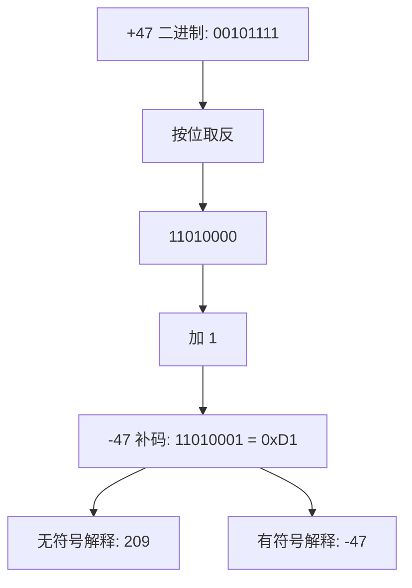

> 本文通过具体数字 **-47**、**0xD1** 和 **209** 的关系，深入剖析计算机如何用二进制表示正负数，揭示原码、反码、补码的设计原理与演进历程。

---

## 1. 问题的提出

在 C++ 中，一个字节 `0xD1` 既可以表示 **209**（无符号），也可以表示 **-47**（有符号）。  
为什么同一个二进制模式 `11010001` 会有两种截然不同的值？  
这背后是计算机表示有符号数的三种历史方案：**原码**、**反码**、**补码**。

---

## 2. 直观理解

想象一个 **圆环时钟**（模 256）：  
- 从 0 点顺时针走 47 步到达 47  
- 从 0 点逆时针走 47 步也到达同一个位置  
- 逆时针 47 步 = 顺时针 `(256 - 47) = 209` 步  

因此，在 8 位系统中：  
```
-47 ≡ 209 (mod 256)
```
`209` 的二进制正是 `11010001` = `0xD1`。  
这就是补码的**模运算本质**：负数 = 模 - 绝对值。

---

## 3. 三种编码方式的演进

### 3.1 原码（Sign-Magnitude）

最高位为符号位（0 正，1 负），其余位表示数值的绝对值。

**8 位原码范围**：-127 到 +127  
**问题**：存在 `+0` 和 `-0` 两种零，浪费编码，且加减法需判断符号，电路复杂。

### 3.2 反码（Ones' Complement）

负数 = 符号位 1 + 数值位按位取反。

**8 位反码范围**：-127 到 +127  
**问题**：仍然有两个零（+0 = 00000000，-0 = 11111111）。

### 3.3 补码（Two's Complement）

负数 = 反码 + 1。  
**解决了双零问题**，统一了加减法运算，成为现代计算机标准。

---

## 4. 从 +47 到 -47 的补码计算

以 8 位系统为例：

1. **+47 的二进制**  
   47 = 32 + 8 + 4 + 2 + 1 → `00101111`

2. **取反（反码）**  
   `00101111` → `11010000`

3. **加 1（补码）**  
   `11010000 + 1 = 11010001` = `0xD1`

验证：  
`0xD1` 作为无符号数 = 209  
`209 - 256 = -47` ✅

---

## 5. 完整的对比表

| 数值 | 原码       | 反码       | 补码（现代使用） |
|------|------------|------------|------------------|
| +0   | 00000000   | 00000000   | 00000000         |
| -0   | 10000000   | 11111111   | 不存在！         |
| +1   | 00000001   | 00000001   | 00000001         |
| -1   | 10000001   | 11111110   | 11111111         |
| +47  | 00101111   | 00101111   | 00101111         |
| -47  | 10101111   | 11010000   | 11010001 (=0xD1) |

---

## 6. 为什么补码没有 "-0"？

在反码中：  
- `-0 = 11111111` → 取反 → `00000000 = +0` ❌ 逻辑混乱  

在补码中：  
- `10000000` 按补码规则反向推导：  
  先减 1：`10000000 - 1 = 01111111`  
  取反：`10000000` = 128  
  所以该数为 **-128**，不是 -0！  

**结论**：补码中 0 只有一种表示 `00000000`，范围 -128 到 +127。

---

## 7. Mermaid 图示：补码计算流程



---

## 8. C++ 代码演示

### 8.1 类型解释决定数值意义

```cpp
#include <iostream>
#include <iomanip>
#include <cstdint>

int main() {
    uint8_t byte = 0xD1;  // 二进制 11010001
    
    std::cout << "十六进制: 0x" << std::hex << std::uppercase 
              << static_cast<int>(byte) << std::endl;  // 0xD1
    
    std::cout << "作为 uint8_t (无符号): " << std::dec 
              << static_cast<int>(byte) << std::endl;  // 209
    
    int8_t signed_byte = static_cast<int8_t>(byte);
    std::cout << "作为 int8_t (有符号): " << static_cast<int>(signed_byte) 
              << std::endl;  // -47
    
    return 0;
}
```

### 8.2 补码反向推导验证

```cpp
// 验证 0xD1 是 -47
uint8_t hex_d1 = 0xD1;
int back_to_signed = static_cast<int8_t>(hex_d1);
std::cout << "0xD1 作为 int8_t: " << back_to_signed << std::endl;  // -47
```

---

## 9. 内存视角与类型系统

在内存中，`0xD1` 的二进制模式固定为 `11010001`：  
- 程序 A 读取为 `uint8_t` → 解释为 **209**  
- 程序 B 读取为 `int8_t` → 解释为 **-47**  

**类型决定解释方式**，这是计算机系统的强大之处。

---

## 10. 实际应用

- **网络协议**：字节流常按无符号解释（如校验和 0xD1 = 209）  
- **音频/传感器**：按有符号解释（如温度 -47°C）  
- **位运算**：`& 0xFF` 可截取低字节，与补码表示无关，是纯位操作

---

## 11. 总结

- **原码**：直观但有 ±0 问题  
- **反码**：改进但仍存双零  
- **补码**：通过“取反加一”消除双零，统一加减法，成为现代标准  
- **-47**、**0xD1**、**209** 是同一二进制在不同类型下的三种身份  
- 理解补码是掌握计算机算术、类型系统和底层编程的关键

> 补码不仅是技术妥协，更是人类为机器设计的优雅数学映射。

