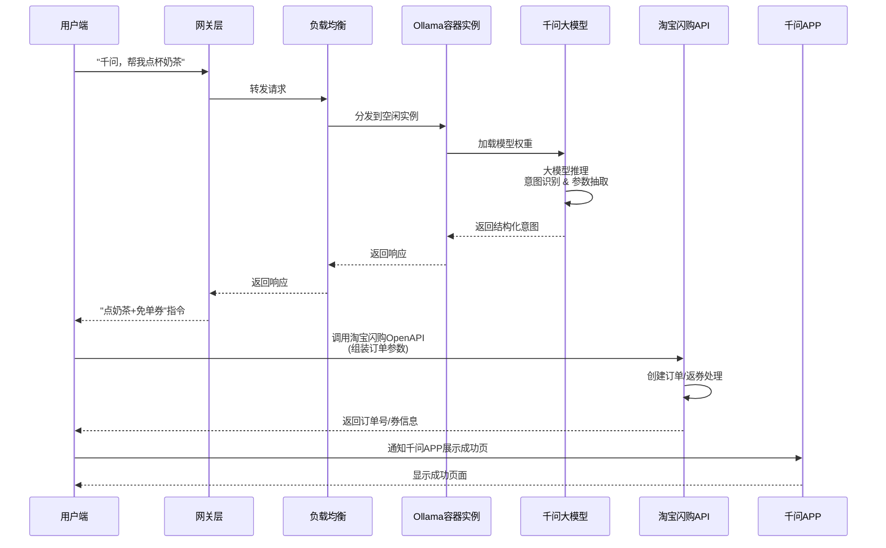

2026年2月，阿里千问APP推出“春节30亿免单”奶茶促销活动，以“千问，帮我点杯奶茶”的自然语言交互的形式，搭配25元无门槛免单卡福利，瞬间引爆市场，上线4小时订单量便突破200万单。然而，这场旨在抢占AI生活化场景、提升用户活跃度的营销活动，最终却沦为全网热议的“翻车现场”——APP卡顿报错、服务器宕机、订单混乱、用户“吞券”等问题频发，即便官方紧急延长福利有效期、扩容服务器，也难以挽回用户体验的滑坡。这场翻车并非偶然，而是大模型工程化部署短板与大厂思维惯性共同作用的结果，背后折射出的行业共性问题，值得所有AI产品团队深思。

## 一、大模型并发请求的核心瓶颈：并非“无限算力”，而是“加载与扩展的边界”

要理解此次翻车的技术根源，首先要厘清大模型的基础运行逻辑。很多人将大模型神化为“无所不能的智能大脑”，但从工程部署层面来看，它更像是一个**数据高度结构化的巨型数据库文件**——其核心是海量的参数权重，这些参数需要通过特定程序加载到服务器内存中，才能实现对外交互。千问大模型的运行过程，与我们熟悉的Docker容器化部署有着极高的相似度，而Ollama正是这类用于加载、运行大模型的轻量级工具之一。

Ollama的核心价值的是简化大模型的本地部署和运行，它通过模块化架构将模型权重、运行依赖与环境配置统一打包为容器化单元，无需复杂的底层配置，仅需单条命令即可启动模型服务，这与Docker“封装环境、快速部署”的逻辑完全一致。千问大模型正是通过类似Ollama的程序加载运行，再对外提供Web接口，接收用户的自然语言请求（如“千问，帮我点杯奶茶”），经过模型推理后，将指令转化为可执行信号，联动淘宝闪购完成下单流程。

这种运行模式的核心瓶颈，就在于**并发请求的处理能力**。大模型的推理过程需要消耗大量的CPU、GPU算力和内存资源，尤其是当用户请求瞬时激增时，单实例大模型的处理能力会迅速达到上限——就像一辆装满货物的货车，无法同时承载远超其载重的乘客。而大模型的参数规模越大，单次推理的资源消耗就越高，并发处理的瓶颈就越明显，这也是为何高并发场景下，大模型的推理延迟会显著上升的核心原因。

## 二、翻车的直接诱因：并发过载与资源调用的“脱节”

在日常场景中，大模型处理多用户并发请求的常规解决方案，与Docker容器的扩展逻辑完全一致：当并发请求增加时，通过不断添加模型实例（即“水平扩展”），将请求分散到多个实例中，减少每个实例需要处理的并发数量，从而保证服务的稳定性。这种方式在日常用户量平稳时完全可行，因为请求增长速度平缓，实例扩展有足够的时间响应。

但千问此次奶茶促销活动，恰恰打破了这种“平稳增长”的平衡。活动以“30亿免单”为噱头，规则简单直接，用户仅需发送一句自然语言即可领取福利，极低的参与门槛带来了瞬时爆发的流量——上线4小时订单量突破200万单，用户并发请求数量呈指数级增长，远远超过了千问团队预设的承载能力，也远超模型实例的扩展速度。当大量请求同时涌入，单个模型实例被过度挤压，推理速度急剧下降，最终导致整个系统卡顿、报错，甚至出现AI异常回复等极端情况。

更关键的是，很多人疑惑：阿里巴巴坐拥支付宝、淘宝等巨量互联网资源，拥有成熟的高并发处理经验，为何不调动这些资源紧急救场？答案很简单：**远水救不了近火，且这些资源并非千问团队可以随意调用**。支付宝、淘宝的服务器资源的是为自身业务（如支付、购物）量身定制的，其架构、算力分配与大模型的推理需求并不兼容；同时，大厂内部各业务线相对独立，资源调用需要经过复杂的审批流程，在瞬时爆发的流量面前，这种审批流程的延迟足以让“救场”失去意义。最终，千问团队只能在自身有限的资源范围内紧急扩容，却难以应对这场突如其来的“流量海啸”。

## 三、翻车的根本原因：大厂思维惯性下的“认知缺失”

如果说并发过载是直接诱因，那么背后的根本原因，则是千问团队（乃至很多大厂AI团队）的思维惯性，具体体现在两个核心认知的缺失上，这也是大厂从业者的共性问题。

第一个核心认知缺失，是**对大模型单次请求资源消耗的深刻认知不足**，这也是最主要的原因。在大厂环境中，运营、技术、产品等各个岗位的从业者，长期处于“计算资源充足”的环境中——日常工作中，服务器算力、内存资源按需分配，很少会面临“资源短缺”的困境。这种“锦衣玉食”的工作状态，让他们逐渐丧失了对“资源消耗”的敏感度，就像过惯了富足生活的人，无法准确判断一顿饭需要吃几两大米一样。千问团队在策划活动时，大概率只预估了参与人数，却没有精准测算每一句“帮我点杯奶茶”的自然语言请求，需要消耗多少算力、多少内存，更没有意识到，百万级的并发请求，会带来几何级增长的资源消耗，最终导致资源调配严重不足。

要知道，即便是小参数的大模型，单次推理也需要消耗可观的资源，而千问作为阿里旗下的主流大模型，参数规模庞大，单次自然语言处理的显存占用和算力消耗不容小觑。正如大模型部署实践中所显示的，即便是使用H100这种顶级GPU，并发数超过一定阈值后，延迟也会呈指数级上升，甚至出现显存溢出（OOM）的情况，而千问团队显然忽视了这一核心痛点。

第二个核心认知缺失，是**对推广活动参与人数的预估偏差，或预估到位但资源调配不足**。一方面，千问团队可能低估了“免费奶茶”这一福利对用户的吸引力，也低估了自然语言交互这种便捷方式的传播力，导致预设的并发承载能力与实际流量差距巨大；另一方面，即便团队预估到了可能出现的高并发，也会因为第一个认知缺失（对资源消耗预估不足），而调配不足够的计算资源——他们可能认为，“日常够用的资源，加上临时扩容，应该能应对”，却没想到，大模型的资源消耗远超他们的预期，最终陷入“预估到位但资源不够用”的困境。

## 四、事后优化方案：精准拆分解耦，把“复杂请求”交给“轻量方案”

一场翻车的价值，在于为后续的实践提供借鉴。我们不妨做一次“事后诸葛亮”，结合此次活动的流程，找到计算资源被卡住的瓶颈，提出可落地的优化方案。

首先要明确此次活动的流程瓶颈：千问大模型在整个活动中，承担的核心任务其实非常简单——仅需处理“千问，帮我点杯奶茶”这句自然语言，识别用户的需求是“点奶茶、领免单券”，而后续的奶茶推荐、订单生成、支付核销等核心逻辑，依然是由淘宝闪购的系统完成的。也就是说，大模型在此次活动中，本质上只是一个“指令识别工具”，而非“全流程处理工具”。

找到了瓶颈，优化方向就非常清晰了：**将大模型从“高频重复的简单指令处理”中解放出来，通过轻量方案拦截简单请求，仅让大模型处理复杂请求**。具体来说，对于“千问，帮我点杯奶茶”这种固定句式、固定需求的推广类语句，完全不需要动用千问大模型的全部算力——可以通过小模型，甚至简单的字符串匹配技术做拦截，直接将用户的请求跳转至淘宝闪购的接口系统，跳过大模型的推理环节。这样一来，绝大多数的用户请求都不会占用大模型的计算资源，仅当用户提出复杂需求（如“千问，帮我点一杯少糖少冰、适合减脂的奶茶”）时，再调用大模型进行推理分析，既保证了服务的稳定性，也节约了计算资源。

这种优化思路，其实已经有成熟的行业案例可以借鉴——腾讯元宝的红包促销活动，就巧妙地避开了这一坑点。在元宝APP的送红包活动中，整个流程的核心逻辑（红包领取、分享、核销）均由自身业务系统完成，大模型全程没有参与其中。腾讯元宝的运营团队深刻理解：推广活动的核心意义是“拉新、促活”，而非“展示大模型能力”，因此他们将宝贵的LLM计算资源，留给了新用户的核心体验（如问答交互、智能陪伴），既保证了促销活动的顺畅，也实现了“推广”与“产品体验”的双赢。

除此之外，结合大模型部署的优化经验，千问团队还可以引入类似vLLM的推理框架，通过FP8 KV Cache等技术减少显存占用，提升单实例的并发处理能力；同时，在活动前进行充分的压测，模拟百万级并发场景，精准测算资源消耗，提前调配足够的实例资源，设置网关层限流策略，避免并发过载导致系统崩溃。

## 五、总结：前车之覆，未必能成后车之鉴的AI行业困境

总而言之，千问大模型奶茶促销活动的翻车，并非阿里千问的技术水平不行——作为国内顶尖的大模型之一，千问的自然语言处理能力、推理能力均处于行业前列，此次翻车，本质上是一场“非技术层面”的失误，是大厂思维惯性下的认知缺失导致的必然结果。

更值得警惕的是，这种错误并非千问独有，而是AI行业的共性问题。在AI营销日益普及的当下，头部企业纷纷加码AI大模型营销，试图通过“AI+促销”的模式抢占市场份额，但很多团队都陷入了“为了用AI而用AI”的误区，忽视了大模型的工程化部署瓶颈和资源消耗特性。腾讯元宝此次虽然避开了坑，但不代表未来不会在其他类型的促销活动中犯类似的错误；字节豆包等其他大厂的AI产品，在追求“不走寻常路”的AI营销创新时，也有可能重蹈千问的覆辙。

在AI时代，所有团队都在争先恐后地探索新场景、新玩法，试图通过“差异化”实现突破，这本身无可厚非。但千问的翻车提醒我们：**AI的创新，永远不能脱离工程化的现实**。无论大模型的技术多先进，最终都要落地到具体的产品和活动中，而落地的核心，就是对资源消耗的精准认知、对用户流量的合理预估，以及对“技术工具”与“业务需求”的清晰定位。

遗憾的是，在“内卷式创新”的行业环境中，千问的这场翻车，未必能成为所有同行的“后车之鉴”。但至少对于千问团队而言，这场翻车是一次宝贵的教训——它提醒着所有大厂AI团队：脱离现实的技术炫耀，终究会被市场反噬；唯有放下“大厂优越感”，正视自身的认知短板，才能让先进的AI技术，真正服务于用户，服务于业务。

