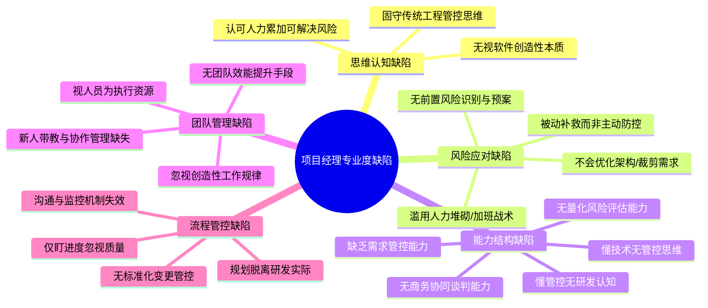
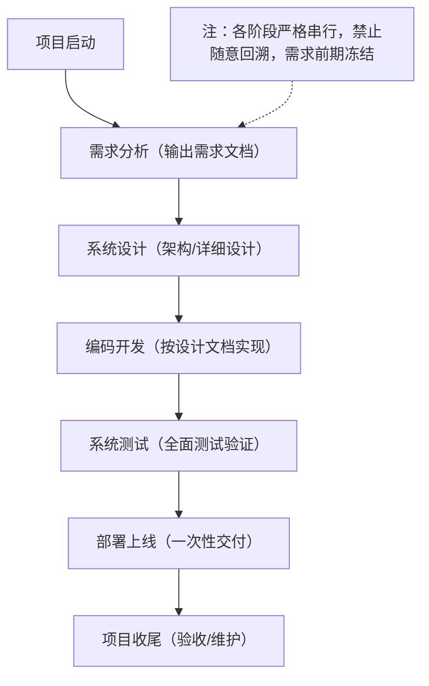
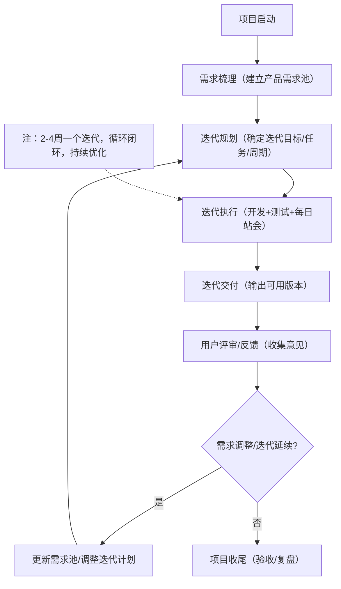

在数字化转型全面渗透产业的当下，软件项目已成为企业核心竞争力的载体，但项目延期、成本超支、需求失控、交付质量不达标等问题依旧普遍存在。相较于成熟度极高的传统工程类项目管理，软件项目管理因**创造性、不确定性、知识密集型**的核心属性，无法照搬流水线式的管控逻辑。<u>当前行业内大量项目经理仍沿用传统工程思维应对软件风险，将人力堆砌当作万能解法，进一步放大了项目失控的概率。</u>唯有厘清两类项目管理的本质差异，精准定位风险源头，重构项目经理的专业能力体系，才能实现有效的软件项目风险控制。

## 一、软件项目管理与传统工程类项目管理：同源而异质

软件项目管理与建筑、机械、化工等传统工程类项目管理，同属项目管理体系范畴，共享**整合、范围、进度、成本、质量、资源、沟通、风险、采购、干系人**十大知识领域，遵循启动、规划、执行、监控、收尾的全生命周期流程，核心目标均为在约束条件下完成交付、实现价值。但在生产逻辑、成果形态、变更属性、人力价值上，二者存在本质差异，这也是传统管控逻辑失效的根源。

[//]: <! --   -->

| 知识领域| 启动过程组| 规划过程组   | 执行过程组   | 监控过程组  | 收尾过程组 |
| --- | ---------- | ------------ | ------------ | -------- | ---- |
| **项目整体管理**| 1、制定项目章程| 2、制定项目管理计划 | 3、指导与管理项目工作| 4、监控项目工作 5、实施整体变更控制 | 6、结束项目或阶段|
| **项目范围管理**|| 7、规划范围管理 8、收集需求 9、定义范围 10、创建工作分解结构WBS |  | 11、确认范围 12、控制范围 ||
| **项目进度管理**|| 13、规划进度管理 14、定义活动 15、排列活动顺序 16、估算活动资源 17、估算活动持续时间 18、制定进度计划 |  | 19、控制进度||
| **项目成本管理**|| 20、规划成本管理 21、估算成本 22、制定预算 |  | 23、控制成本||
| **项目质量管理**|| 24、规划质量管理   | 25、实施质量保证   | 26、控制质量||
| **项目人力资源管理** || 27、规划人力资源管理| 28、组建项目团队 29、建设项目团队 30、管理项目团队| ||
| **项目沟通管理**|| 31、规划沟通管理| 32、管理沟通| 33、控制沟通||
| **项目风险管理**|| 34、规划风险管理 35、识别风险 36、实施定性风险分析 37、实施定量风险分析 38、规划风险应对 |  | 39、控制风险||
| **项目采购管理**|| 40、规划采购管理| 41、实施采购| 42、控制采购| 43、结束采购|
| **项目干系人管理**  | 44、识别干系人 | 45、规划干系人管理  | 46、管理干系人参与 | 47、控制干系人参与 ||

传统工程类项目具备**标准化、可量化、物理化、低变更**的特征。以建筑工程为例，设计图纸一经确定，施工流程、物料标准、人力配比、工期节点均可精准测算，施工过程是对既定方案的**物理落地**，人力投入与产出呈线性相关，增加施工人员可直接缩短工期，成果具备实体形态且可直观校验，需求变更成本极高、频率极低，整个过程偏向**执行型管控**。

软件项目则是**知识创造型**工作，核心产出是无形的代码、架构与功能逻辑，不具备物理实体，无法通过简单的人力累加提升效率。软件开发不存在标准化的“施工图纸”，需求本身伴随用户认知、市场环境、技术迭代持续动态调整，代码编写、架构设计、测试优化高度依赖开发者的专业判断与创造性思考，**1名资深架构师的价值远高于10名初级开发者的简单叠加**。在软件项目中，盲目增加人力不仅无法提速，反而会带来沟通成本激增、代码风格冲突、协作效率下降、新人上手周期损耗等问题，最终加剧项目风险。简言之，传统工程是**按图施工的复制过程**，软件项目是**从无到有的创造过程**，这一本质区别，决定了风险控制的逻辑必须彻底重构。

## 二、软件项目风险的核心源头：商务、需求与项目管理

软件项目的风险并非随机产生，而是集中爆发于**商务端、需求端、项目管理端**三大核心环节，三类风险相互传导、叠加放大，最终导致项目走向失控。

### （一）商务风险

商务风险是项目启动阶段的**源头性风险**，也是极易被忽视的隐性风险。

其一表现为**合同边界模糊**，部分项目为促成签约，刻意模糊需求范围、验收标准、变更条款、违约责任，将“模糊需求”打包签约，为后期范围蔓延埋下隐患；

其二是**商务承诺超出现实能力**，销售团队为拿下订单，过度承诺交付周期、功能范围、技术指标，将不合理的工期与成本压力转嫁给项目团队，导致项目从启动便处于高风险状态；

其三是**客户方决策机制缺失**，合作方无固定对接人、决策链条过长、高层频繁更迭，导致沟通无效、确认滞后，项目推进节奏完全被动；其四是**资金与付款风险**，预付款不到位、进度款拖欠、尾款结算争议，直接影响团队稳定性与资源投入，引发连锁性执行风险。

### （二）需求风险

需求风险是贯穿项目全周期的**核心变量风险**，也是软件项目区别于传统工程的典型风险。

首先是**需求不明确、不完整**，客户仅能描述模糊的业务场景，无法输出标准化需求文档，项目团队基于片面理解开展开发，导致成果与预期偏差；其次是**需求频繁变更且无管控**，客户在开发过程中随意新增功能、调整逻辑，而项目方未建立变更评审、成本核算、工期调整机制，最终引发范围蔓延、工期拉长、成本失控；再次是**需求传递失真**，产品、开发、测试、客户之间信息不对称，需求经多层转述后偏离初衷，形成“执行偏差-返工修正-再次偏差”的恶性循环；最后是**需求与技术可行性脱节**，未充分评估技术门槛、第三方接口稳定性、系统兼容性，导致开发过程中出现技术瓶颈，被迫推翻原有方案。

### （三）项目管理风险

项目管理风险是风险失控的**直接推手**，也是当前行业最突出的问题。

其一为**规划脱离实际**，项目经理未基于软件创造性属性制定计划，照搬传统工程的甘特图模式，过度压缩研发、测试、迭代周期，未预留缓冲时间；

其二是**资源配置僵化**，不区分人员技术等级、擅长领域，简单按人数分配任务，忽视核心岗位的不可替代性；

其三是**监控机制失效**，仅关注进度表完成率，不关注代码质量、技术债务、团队效能，风险暴露后已无挽回空间；

其四是**沟通管理缺失**，内部团队、客户、第三方供应商之间缺乏标准化沟通机制，问题隐瞒、推诿扯皮现象频发；

其五是**风险应对被动**，无前置风险识别与预案，仅在问题爆发后被动补救，进一步扩大损失。

### 三类软件项目风险常用场景整理表

|风险类别|核心风险类型|常用具体场景|风险传导后果|
|---|---|---|---|
|**商务风险**|合同边界模糊|需求范围、验收标准、变更计费条款未书面明确，仅口头约定|后期范围无限蔓延，结算出现纠纷|
||过度承诺交付指标|商务签约时承诺超团队技术能力、超合理周期的交付目标|项目启动即逾期，技术方案被迫妥协|
||客户决策机制混乱|客户对接人频繁更换、多层审批无终审权限、决策滞后|需求确认周期拉长，关键节点反复延误|
||资金付款违约|预付款未按期到账、进度款拖欠、尾款设置不合理门槛|团队资源缩减，核心人员流失，项目停滞|
||第三方合作风险|外包服务商、接口提供方履约能力不足，未约定违约条款|核心功能卡壳，项目进度不可控|
|**需求风险**|需求模糊不完整|客户仅描述业务场景，无标准化PRD、原型、用例文档|开发成果与预期偏差，大规模返工|
||无管控需求变更|客户随意新增功能、调整逻辑，无变更评审/工期/成本核算|范围蔓延，成本超支，工期持续延后|
||需求传递失真|产品、开发、测试、客户信息不对称，多层转述偏离初衷|接口不兼容、功能逻辑错误，测试通过率低|
||技术可行性不足|未评估技术门槛、第三方接口稳定性、系统兼容/并发能力|开发遇技术瓶颈，架构推翻重构|
||需求与业务脱节|需求设计未贴合实际业务流程，上线后无法落地使用|项目验收失败，需要二次定制开发|
|**项目管理风险**|规划脱离研发实际|照搬传统工程甘特图，压缩研发/测试/缓冲周期|研发压力过载，技术债务堆积，质量下滑|
||资源配置僵化|按人数简单分配任务，不区分技术等级与擅长领域|核心任务无人承接，低效人力浪费成本|
||风险监控失效|仅跟踪进度表，忽视代码质量、技术债务、团队效能|风险隐性累积，爆发后无补救空间|
||沟通机制缺失|内外部无标准化沟通流程，问题隐瞒、推诿扯皮|小问题扩大化，跨团队协作彻底瘫痪|
||被动应急式管理|无前置风险预案，风险爆发后仅被动补救|修复成本倍增，项目陷入恶性循环|

## 三、行业反思：当前软件项目经理专业度的结构性缺陷

在软件项目风险频发的背后，项目经理的能力错位是核心症结。当前大量软件项目经理源自传统工程管理转型、技术岗转岗或行政岗提拔，**缺乏对软件创造性本质的认知，固守传统工程的人力调配思维**，形成了“风险出现-增加人力-效率下降-风险加剧”的恶性循环，专业度短板集中暴露。

最突出的问题是**将人力累加当作风险解决的唯一手段**。面对进度滞后、功能卡壳等风险，项目经理第一反应是增派开发人员、延长加班时长，完全忽视软件开发的创造性属性。新人加入需要熟悉代码架构、业务逻辑、协作规范，上手周期通常长达数周，在此期间不仅无法贡献产能，还会占用资深员工的带教时间，拉低整体效率；多团队并行开发还会引发接口冲突、代码冗余、测试复杂度提升等问题，最终导致进度进一步滞后。这种“人海战术”，是对软件项目规律的根本性误读。

与此同时，软件项目经理普遍存在**能力结构失衡**问题：懂技术的缺乏项目管控思维，懂管控的不理解软件研发逻辑，既无法精准识别技术风险，也无法制定适配软件特性的管控方案；缺乏**需求管控与商务协同能力**，无法在前期对接中明确合同边界、约束需求变更，只能被动承接客户的不合理要求；缺乏**量化风险评估能力**，依赖经验判断而非数据支撑，无法建立风险预警机制；缺乏**团队效能管理能力**，将团队视为可随意调配的执行资源，忽视创造性工作对工作环境、技术积累、团队稳定性的要求。

这种专业度的缺失，本质是行业对软件项目管理的定位偏差：将项目经理等同于“进度跟踪员”“沟通联络员”，而非兼具技术认知、风险预判、需求管控、团队赋能的复合型管理者。在风险应对上，传统工程思维的路径依赖，让项目经理放弃了**优化架构、裁剪需求、迭代交付、提升技术效能**等更有效的解决方案，最终让项目在高风险中持续内耗。

### 软件项目经理专业度缺陷（思维导图）

## 四、敏捷开发对软件项目管理的挑战：瀑布流与迭代模式的差异博弈

随着软件需求不确定性提升，以敏捷为代表的**迭代式开发**逐步取代瀑布流成为主流模式，但这一转型也给固守传统思维的项目经理带来全新挑战，两种模式在流程逻辑、风险控制、适配场景上存在本质差异，直接决定项目管控的有效性。

瀑布流模式是**线性、阶段化、文档驱动**的传统开发模式，完全对标传统工程管理逻辑，将项目划分为需求分析、设计、开发、测试、部署、维护六个严格串行阶段，前一阶段输出物作为后一阶段输入依据，全程禁止或严格限制阶段回溯。该模式优势在于流程规范、文档完整、节点清晰，适配需求高度稳定、范围明确、合规性要求高的项目，如军工、金融核心系统定制开发。但其缺陷与软件创造性属性高度冲突：需求冻结机制无法适配市场变化，后期发现问题需回溯全流程，返工成本呈指数级上升；交付周期长，用户无法提前感知产品形态，最终成果与实际需求脱节风险极高；全程依赖前期规划，对项目经理的预判能力要求极端苛刻，任何前期疏漏都会引发后期系统性风险。

以Scrum、XP为代表的敏捷迭代模式，采用**增量、迭代、用户驱动**的开发逻辑，将项目拆分为2-4周的短周期迭代，每个迭代完成“需求梳理-开发-测试-交付-评审”全闭环，持续接收用户反馈并动态调整需求。该模式高度契合软件创造性与不确定性特征：通过小步快跑降低单次交付风险，提前暴露需求偏差与技术问题；拥抱需求变更，将变更转化为竞争优势；高频交付让用户持续参与，提升验收匹配度；团队自组织运作，释放研发创造性。但迭代模式对项目经理提出颠覆性挑战：要求放弃线性进度管控，转向迭代目标、团队效能、产品价值的综合管理；需要建立需求池管理、迭代规划、回顾复盘的标准化机制；必须平衡变更自由与范围失控，避免陷入“无限迭代、永不上线”的困境；对团队协作能力、客户配合度、工具支撑体系提出更高要求。

当前大量项目经理在敏捷转型中陷入**形式化误区**：仅保留站会、燃尽图等表层仪式，沿用瀑布流思维做迭代拆解，将迭代当作压缩工期的工具；依旧采用人力堆砌应对迭代滞后，破坏自组织团队协作；缺乏需求优先级排序能力，导致迭代目标混乱；忽视技术债务管理，让快速迭代沦为低质量交付的温床。这种“伪敏捷”不仅无法控制风险，反而会引发需求混乱、进度失控、质量崩塌的多重问题，放大项目管理风险。

### 瀑布流与敏捷迭代模式对比

|对比维度|瀑布流模式|敏捷迭代模式|
|---|---|---|
|核心逻辑|线性串行、阶段化推进，前一阶段完成方可进入下一阶段|增量迭代、循环闭环，2-4周为一个迭代，持续交付与优化|
|需求管理|前期冻结需求，后期变更成本高、流程复杂|拥抱需求变更，建立变更评审机制，动态调整迭代目标|
|交付方式|项目末期一次性交付全部成果，用户后期才能感知产品|每个迭代交付可用版本，高频接收用户反馈、快速调整|
|文档要求|文档驱动，前期需输出完整需求、设计、测试文档，繁琐且固定|轻文档、重交付，仅保留核心文档，聚焦产品价值与团队协作|
|风险控制|风险隐性累积，后期集中爆发，回溯成本高、难度大|小步快跑，每个迭代暴露风险、快速解决，降低单次风险影响|
|团队管理|层级分明、指令驱动，项目经理主导所有决策|自组织团队，成员自主分工，项目经理侧重引导、协调、赋能|
|适配场景|需求稳定、范围明确、合规性要求高（如军工、金融核心系统）|需求不确定、市场变化快、需快速验证价值（如互联网产品、创新项目）|
|项目经理要求|擅长前期规划、进度管控、文档审核，侧重执行监督|擅长需求排序、团队赋能、风险预判、协同沟通，侧重价值把控|

### 瀑布流与敏捷迭代模式流程图

#### （1）瀑布流模式流程图

#### （2）敏捷迭代模式流程图

### 敏捷场景下的风险控制优化建议

针对当前“伪敏捷”泛滥、敏捷转型失败的痛点，结合软件创造性属性，从项目经理能力、流程机制、团队管理三个维度，提出可落地的风险控制建议，规避迭代失控、质量下滑、范围蔓延等问题。

第一，项目经理转型：从“进度管控者”转向“价值赋能者”。摒弃传统人力堆砌思维，聚焦迭代目标拆解与团队效能提升：一是提升需求优先级排序能力，采用MoSCoW（必须有、应该有、可以有、暂不需要）法则，明确每个迭代的核心交付价值，杜绝“什么都想做、什么都做不好”；二是建立迭代缓冲机制，每个迭代预留10%-15%的弹性时间，应对突发问题、技术瓶颈，避免迭代延期后盲目加班；三是强化风险预判能力，每个迭代启动前，组织团队识别技术、需求、协作类风险，制定针对性预案（如技术瓶颈提前对接资深架构师、需求模糊提前与客户确认）；四是放弃“指令式管理”，赋能自组织团队，让成员自主分工、主动暴露问题，项目经理重点协调资源、解决跨团队障碍。

第二，规范敏捷流程：杜绝形式化，建立标准化闭环机制。一是完善需求池管理，明确需求录入、评审、排序、归档流程，避免需求混乱、重复录入，每个需求需明确负责人、交付标准、优先级；二是严格迭代边界管控，迭代启动后禁止随意新增需求，若确需变更，需经客户、产品、研发三方评审，评估成本与工期影响，调整迭代目标或纳入下一个迭代；三是强化迭代复盘机制，每个迭代结束后，组织团队复盘“做得好的地方、存在的问题、改进措施”，形成复盘报告并落地优化，避免同类风险重复出现；四是搭建敏捷工具支撑体系，借助Jira、Trello等工具，跟踪迭代进度、任务状态、风险点，实现可视化管控，减少沟通成本。

第三，强化团队与质量管控：平衡“快速迭代”与“质量稳定”。一是优化团队配置，避免人力冗余或核心岗位缺失，按“1名资深开发者+1-2名中级开发者+1名初级开发者”的梯度配置，发挥核心人员的技术引领作用，减少新人带教损耗；二是建立技术债务管控机制，明确迭代中“重构时间”占比（建议不低于10%），定期清理冗余代码、优化架构，避免技术债务累积导致后期迭代效率下降；三是推行“测试左移”，测试人员提前介入需求分析、设计阶段，同步制定测试用例，迭代开发过程中同步开展单元测试、集成测试，避免后期集中返工；四是加强客户协同，明确客户对接人、反馈时限，每个迭代交付后，组织客户快速评审，及时确认需求匹配度，避免后期验收分歧。

第四，适配混合模式：拒绝“非此即彼”，灵活应对项目差异。并非所有项目都适合纯敏捷或纯瀑布流，项目经理需结合项目场景，采用混合模式：对于需求稳定的核心模块，采用瀑布流模式，保障流程规范、质量可控；对于需求不确定的创新模块，采用敏捷迭代模式，快速验证价值、动态调整；同时，建立模式切换的标准化流程，避免流程混乱引发风险。

## 五、结语：回归创造本质，重构软件项目风险控制逻辑

软件项目的风险控制，无法复制传统工程的标准化范式，必须回归**创造性工作**的本质，打破人力堆砌的错误思维。从项目启动阶段明确商务边界与需求规范，建立全周期风险预警机制；更要推动项目经理能力体系升级，摒弃传统工程管控惯性，建立适配软件研发的规划、监控、应对逻辑。

在模式选择上，需依据项目需求稳定性、合规要求、团队成熟度，合理选用瀑布流、迭代或混合模式，杜绝形式化敏捷与僵化瀑布流的极端路径。唯有承认软件开发的知识密集属性，尊重技术创造的内在规律，以专业能力替代人海战术，以前置管控替代被动补救，以适配模式替代僵化流程，才能真正化解软件项目风险，实现高质量、高效率、低成本的稳定交付，让软件项目真正成为企业价值增长的核心引擎。

